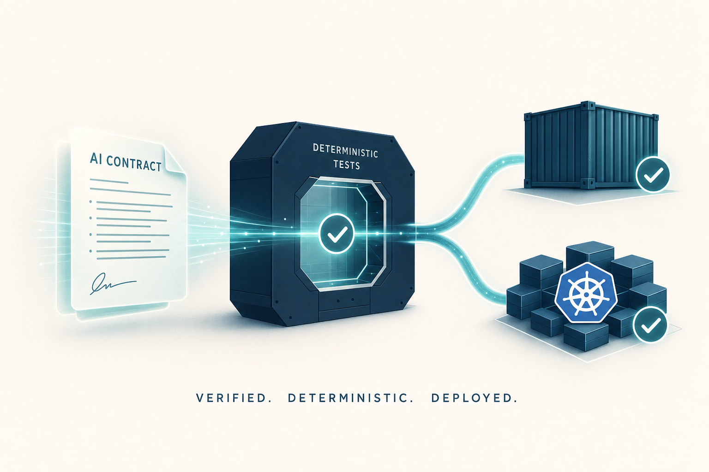
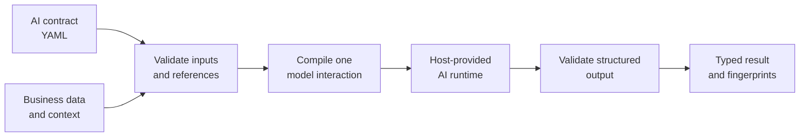
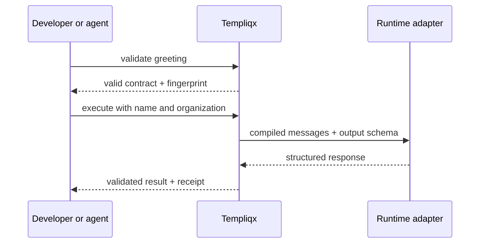
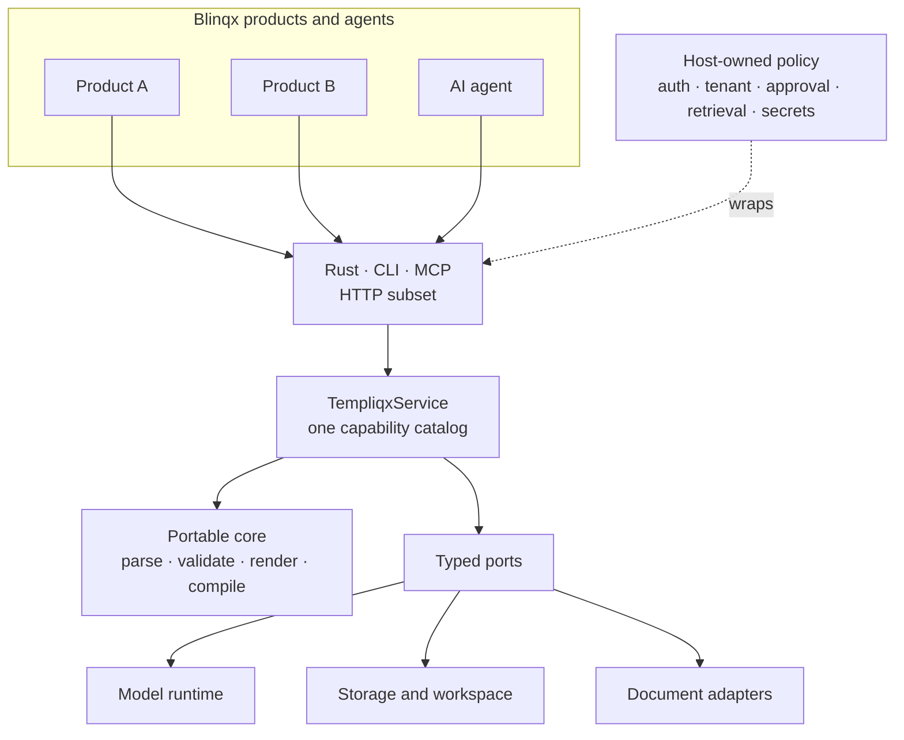

<p align="center">
  
</p>

<h1 align="center">Templiqx</h1>

<p align="center">
  Typed, reusable templates for reliable AI interactions.
</p>

<p align="center">
  <a href="https://ryanlisse.github.io/templiqx/"></a>
  <a href="https://github.com/RyanLisse/templiqx/actions/workflows/ci.yml"></a>
  
  
  
</p>

Templiqx is an AI-native template engine written in Rust. It lets teams describe an AI interaction once—in readable YAML—and use it from different Blinqx products, runtimes, and agents.

A normal template engine combines a template with data to produce text or a document. Templiqx applies the same idea to AI: a contract defines the input, prompt, required model features, and expected output. Templiqx checks the contract, builds the model request, validates the response, and records fingerprints so the result can be tested and traced.



## Why Templiqx?

- **Reuse AI behavior across Blinqx.** Keep prompts, schemas, examples, and runtime requirements in portable packages instead of rebuilding them in every product.
- **Catch mistakes before a model call.** Inputs, references, capabilities, and output shapes are checked against explicit schemas.
- **Keep providers at the edge.** The core does not depend on a model vendor, credentials, tenant policy, or a specific Blinqx product.
- **Give humans and agents the same tools.** Rust, CLI, and MCP share the full capability catalog. HTTP exposes a growing subset through the same service and structured envelopes.
- **Make changes testable.** Contracts, packages, requests, and outputs have stable fingerprints, and execution receipts carry the relevant identities; deterministic eval fixtures can run without a live model.
- **Use bounded template logic.** Components, includes, conditions, loops, and fixed filters are supported without executing arbitrary template code.

## What can you build with it?

A Blinqx product can package interactions for tasks such as:

- extracting typed fields from a document or message;
- drafting a customer communication from approved facts;
- summarizing a case, dossier, or workflow state;
- classifying and routing incoming work;
- validating an AI result before another system uses it.

The product supplies its own authorized data and policy. The reusable contract describes how that data becomes a checked AI interaction.

## A small example

This contract accepts a name and organization, creates one AI interaction, and requires a JSON object with a `greeting` string:

```yaml
api_version: templiqx/v1alpha1
id: greeting
version: 0.1.0

inputs:
  name:
    schema: { type: string, minLength: 1 }
    required: true

context:
  organization:
    schema: { type: string }
    required: true

capabilities: [structured_output]

messages:
  - role: system
    content:
      - kind: text
        value: You write concise greetings.
  - role: user
    content:
      - kind: text
        value: "Write a greeting for "
      - kind: interpolate
        expression: { kind: ref, path: inputs.name }
      - kind: text
        value: " from "
      - kind: interpolate
        expression: { kind: ref, path: context.organization }

output_schema:
  type: object
  additionalProperties: false
  required: [greeting]
  properties:
    greeting: { type: string }
```

The full executable example also contains a deterministic eval fixture: [`examples/packages/demo/contracts/greeting.yaml`](examples/packages/demo/contracts/greeting.yaml).

Its included fixture supplies:

```yaml
inputs:
  name: Ryan
context:
  organization: Blinqx
```

and checks a structured result:

```json
{
  "greeting": "Hello Ryan"
}
```

The flow is deliberately small:



## Try the included example

You need a recent Rust toolchain. From the repository root:

```bash
# See the available operations and example packages
cargo run -q -p templiqx-cli -- catalog
cargo run -q -p templiqx-cli -- --root examples/packages discover

# Inspect and validate the greeting contract
cargo run -q -p templiqx-cli -- --root examples/packages inspect demo greeting
cargo run -q -p templiqx-cli -- --root examples/packages validate demo greeting

# Run its deterministic fixture; no model credentials are needed
cargo run -q -p templiqx-cli -- --root examples/packages \
  run-eval demo greeting ryan --capability structured_output
```

Every command returns an operation envelope with an `ok` flag, diagnostics, results, and fingerprints. Use `--json` for compact JSON. Run `cargo run -q -p templiqx-cli -- --help` for the complete command list.

## Where it fits

Templiqx owns the portable definition and deterministic handling of an AI interaction. The product using Templiqx remains responsible for product and customer policy.



This boundary keeps the engine reusable. Templiqx does not decide who may access customer data, which model a tenant may use, or when human approval is required. A host supplies those decisions and connects the required adapters.

## Core concepts

| Concept | Plain-language meaning |
|---|---|
| **Contract** | One versioned AI interaction: typed input, messages, capabilities, and output schema. |
| **Package** | A reusable group of contracts, components, evals, templates, and dependency pins. |
| **Compile** | Turn a checked contract plus values into a provider-neutral model request. |
| **Runtime adapter** | Host-owned code that sends the compiled request to an AI runtime. |
| **Eval** | A repeatable example with inputs and an expected fixture output. |
| **Fingerprint** | A content identity used to compare, cache, sign, and safely update artifacts. |
| **Operation envelope** | The shared result shape used by every interface, including diagnostics and fingerprints. |

## More examples

- **Simple greeting:** [`examples/packages/demo`](examples/packages/demo) shows the smallest package, a reusable component, and a deterministic eval.
- **Cross-product portability:** [`examples/packages/synthetic-opco`](examples/packages/synthetic-opco) shows HR extraction and validation contracts that are not tied to one product.
- **Document rendering:** [`examples/legacy-corpus`](examples/legacy-corpus) contains measured DOCX compatibility fixtures and expected reports.
- **CRM3 conformance:** [`examples/crm3`](examples/crm3) remains a synthetic proof for grounded extraction, drafting, failure handling, and document output. It is one consumer example, not the scope of the engine.

## How it differs from Jinja or Nunjucks

[Jinja](https://jinja.palletsprojects.com/en/stable/) and [Nunjucks](https://mozilla.github.io/nunjucks/) are excellent general-purpose text template engines: data goes in and rendered text comes out. Templiqx borrows their emphasis on readable templates, reuse, filters, and examples, but targets a different unit of work.

| Traditional template engine | Templiqx |
|---|---|
| Usually renders text, HTML, or another document | Compiles and validates one AI interaction |
| Variables are often accepted dynamically | Inputs and context have explicit JSON Schemas |
| Template output is mostly free-form text | Model output can be checked against a JSON Schema |
| Rich expressions or user extensions may execute code | Expressions and filters are deliberately bounded |
| Runtime behavior lives mainly in application code | Runtime requirements and evals travel with the contract |

For a broader view of the template-engine ecosystem, see [awesome-template-engine](https://github.com/sshailabh/awesome-template-engine). Templiqx complements these engines; it is not intended to become a Jinja-compatible HTML renderer.

## Interfaces

All interfaces are thin layers over `TempliqxService`:

- **Rust:** embed the application service and provide the ports your host needs.
- **CLI:** use Templiqx in local development, scripts, and CI.
- **MCP:** let agents discover and run the same operations without a separate agent-only path.
- **HTTP:** expose a growing subset of the shared operations to products written in other languages.

Use the CLI or MCP `catalog` operation to discover the full capability list. For the current HTTP subset, use the checked-in [`openapi/templiqx-operations-v1.yaml`](openapi/templiqx-operations-v1.yaml) contract.

## Repository map

| Path | Responsibility |
|---|---|
| `crates/templiqx-contracts` | Shared DTOs, diagnostics, fingerprints, and envelopes |
| `crates/templiqx-core` | Deterministic parsing, validation, rendering, and compilation |
| `crates/templiqx-ports` | Traits implemented by host-owned adapters |
| `crates/templiqx-application` | `TempliqxService` and the canonical capability catalog |
| `crates/templiqx-local` | Local filesystem composition and safe package writes |
| `crates/templiqx-cli`, `crates/templiqx-mcp`, `crates/templiqx-http` | CLI, agent, and HTTP access layers |
| `adapters/` | Runtime, observability, and document integrations |
| `examples/` | Executable packages, fixtures, and conformance scenarios |

The portable core never imports provider SDKs or product vocabulary. Boundary checks protect that rule, and mock runtimes stay outside the default product composition.

## Development

```bash
just verify        # format, lint, tests, and architecture boundaries
just docs-build    # build the documentation site
just verify-all    # full local gate, including docs and deployment checks
```

Before a pull request, also run:

```bash
qlty fmt
qlty check --fix --level=low
just verify
```

Use `just verify-all` for Docker, Kubernetes, chart, image, or supply-chain changes. See [`docs/guides/releasing.md`](docs/guides/releasing.md) for releases.

## Project status

Templiqx currently uses the evolving `templiqx/v1alpha1` contract format. It is a standalone proof of concept with local composition, full CLI and MCP catalogs, a growing HTTP operations layer, deterministic conformance fixtures, container images, and Helm deployment assets. Product-specific production wiring—such as tenant authorization, retrieval, approval, secrets, and provider selection—belongs in each Blinqx host and is intentionally outside the portable core.

## Documentation

| Start here | Use it for |
|---|---|
| [Documentation site](https://ryanlisse.github.io/templiqx/) | Guides and browsable project documentation |
| [`docs/contracts/v1alpha1.md`](docs/contracts/v1alpha1.md) | Contract syntax and validation rules |
| [`docs/guides/cli.md`](docs/guides/cli.md) | CLI commands and agent workflows |
| [`docs/guides/host-integration.md`](docs/guides/host-integration.md) | Integrating Templiqx into a product host |
| [`docs/architecture/`](docs/architecture/) | Architecture, deployment, and observability decisions |
| [`docs/README.md`](docs/README.md) | Full documentation index |
| [`openwiki/quickstart.md`](openwiki/quickstart.md) | Generated codebase guide |

## License

Apache-2.0.
