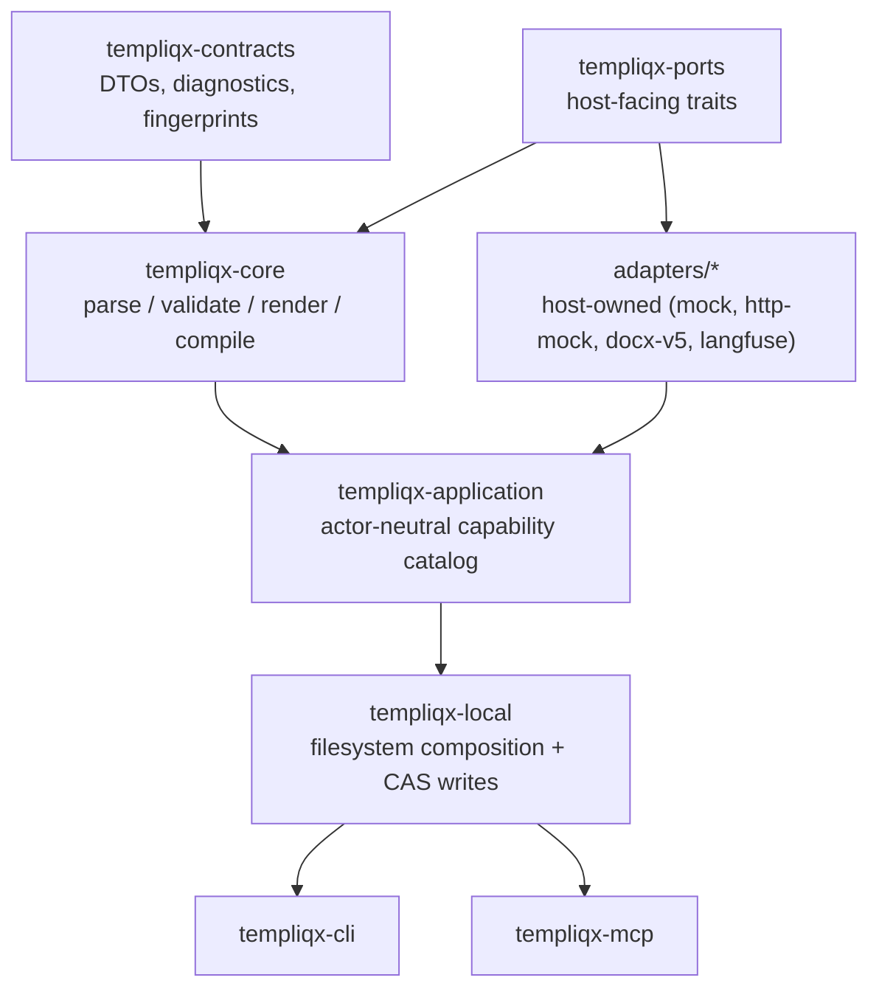
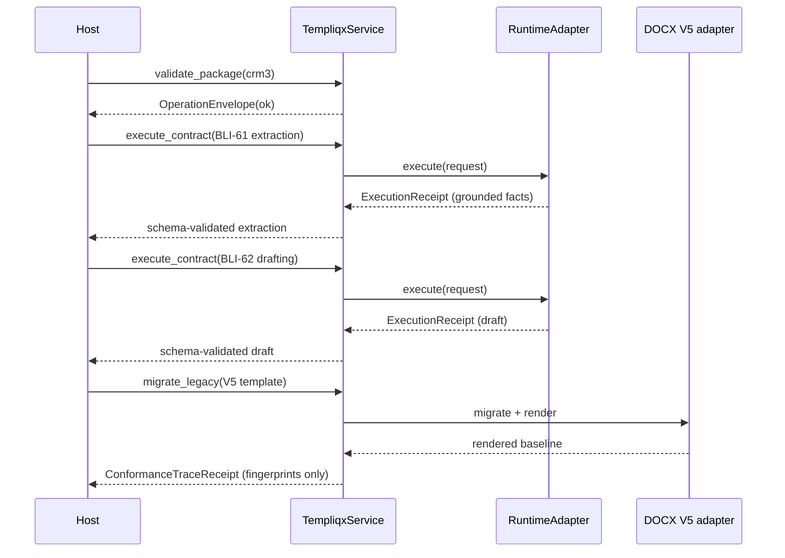
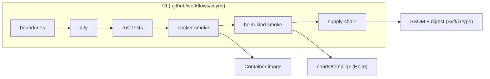

<p align="center">
  
</p>

<h1 align="center">Templiqx</h1>

<p align="center">
  A standalone, provider-neutral AI interaction contract compiler.
</p>

<p align="center">
  <a href="https://github.com/RyanLisse/templiqx/actions/workflows/ci.yml"></a>
  
  
  
</p>

Templiqx turns portable `templiqx/v1alpha1` contracts (strict YAML) into deterministic, fingerprinted AI interactions — one contract, one model interaction, no invented facts. A single actor-neutral service (`TempliqxService`) backs the CLI, an MCP server, and any Rust host, so humans and agents get identical validation, diagnostics, and compare-and-swap package writes. It ships as the current pre-CRM3 readiness proof-of-concept for Basenet CRM3 (`BLI-*`).

## Why it's structured this way

- **Portable core, host-owned edges.** `templiqx-contracts` / `templiqx-ports` / `templiqx-core` never import a model-provider SDK, CRM3 vocabulary, or credentials — those live in adapters the host wires in explicitly. `scripts/check-boundaries.sh` enforces this in CI and in `just verify`.
- **One capability catalog, every transport.** CLI commands and MCP tools are thin facades over the same `templiqx_application::CAPABILITY_CATALOG` methods — no agent-only or human-only path.
- **Determinism is provable, not assumed.** Contract identity is a SHA-256 over canonically-ordered JSON; package identity hashes every manifest-listed artifact's exact bytes. Same contract + inputs + capability profile + compiler version → same compiled interaction, every time.

## Quick start

```bash
just verify                              # fmt, clippy, tests, boundary checks — run before any PR
just verify-deploy                       # docker/kind/supply-chain smoke + boundaries

qlty fmt                                 # format (CI + pre-commit expectation)
qlty check --fix --level=low             # lint fixes before commit

cargo test -p templiqx-conformance --test crm3   # CRM3 end-to-end conformance
./scripts/check-boundaries.sh            # after touching Cargo.toml or adapter wiring
```

CLI usage: `cargo run -p templiqx-cli -- <command> --root <package-dir> [--json]`. Commands map 1:1 to `TempliqxService` capabilities — run `--help` for the current list. Exit codes: `0` = ok envelope, `2` = product/diagnostic failure, `1` = CLI/IO failure.

## Architecture



| Crate / path | Role |
|--------------|------|
| `templiqx-contracts` | DTOs, diagnostics, fingerprints, envelopes — no policy |
| `templiqx-core` | Parsing, validation, rendering, compilation — deterministic |
| `templiqx-ports` | Host-facing traits (storage, workspace, runtime, legacy import, document render) |
| `templiqx-application` | Actor-neutral operations + capability catalog |
| `templiqx-local` | Filesystem composition; path safety + CAS contract writes |
| `templiqx-cli`, `templiqx-mcp` | Transport surfaces; tool names match catalog exactly |
| `templiqx-conformance` | Synthetic CRM3 scenario, transport, and failure-semantics proof; excluded from product images |
| `templiqx-mock`, `adapters/templiqx-runtime-http-mock` | Conformance adapters only |
| `adapters/templiqx-docx-v5` | Measured V1/V2 detection and V5 DOCX compatibility over a deterministic synthetic corpus — not general DOCX |
| `adapters/templiqx-runtime-langfuse` | Host-owned production `RuntimeAdapter`: real chat completion + best-effort Langfuse tracing |
| `tools/templiqx-mock-gateway`, `tools/templiqx-http-conformance` | Operational readiness tooling |

## Capability catalog

All 26 canonical `TempliqxService` operations are exposed identically over the CLI and MCP. A catalog-derived conformance test fails when an operation is added without a Rust/CLI/MCP behavior case:

| Operation | CLI | MCP tool |
|-----------|-----|----------|
| `catalog` | `templiqx catalog` | `catalog` |
| `discover_packages` | `templiqx discover` | `discover_packages` |
| `create_package` | `templiqx create <name>` | `create_package` |
| `update_package` | `templiqx update-package <package>` | `update_package` |
| `delete_package` | `templiqx delete-package <package>` | `delete_package` |
| `export_package_identity` | `templiqx export-package-identity <package>` | `export_package_identity` |
| `sign_package` | `templiqx sign-package <package>` | `sign_package` |
| `verify_package_trust` | `templiqx verify-package-trust <package>` | `verify_package_trust` |
| `inspect_contract` | `templiqx inspect <package> <contract>` | `inspect_contract` |
| `put_contract` | `templiqx put <package> <contract> <source>` | `put_contract` |
| `delete_contract` | `templiqx delete <package> <contract>` | `delete_contract` |
| `validate_contract` | `templiqx validate <package> <contract>` | `validate_contract` |
| `validate_package` | `templiqx validate <package>` | `validate_package` |
| `compile_contract` | `templiqx compile <package> <contract>` | `compile_contract` |
| `render_contract` | `templiqx render <package> <contract>` | `render_contract` |
| `execute_contract` | `templiqx execute <package> <contract>` | `execute_contract` |
| `migrate_legacy` | `templiqx migrate <package> <dialect> <source>` | `migrate_legacy` |
| `render_document` | `templiqx render-document <package> <template> <data> <output>` | `render_document` |
| `list_workspace_artifacts` | `templiqx list-workspace-artifacts <package>` | `list_workspace_artifacts` |
| `read_artifact` | `templiqx read-artifact <package> <path>` | `read_artifact` |
| `delete_workspace_artifact` | `templiqx delete-workspace-artifact <package> <path>` | `delete_workspace_artifact` |
| `test_package` | `templiqx test <package>` | `test_package` |
| `list_evals` | `templiqx list-evals <package>` | `list_evals` |
| `run_eval` | `templiqx run-eval <package> <contract> <fixture-id>` | `run_eval` |
| `diff_contract` | `templiqx diff <left-package> <left-contract> <right-package> <right-contract>` | `diff_contract` |
| `explain_contract` | `templiqx explain <package> <contract>` | `explain_contract` |

A host may wrap approval, authorization, or automated policy around any of these — it must not implement a second semantic path to the same artifacts.

## CRM3 conformance

`examples/crm3` is a standalone, synthetic package proving the BLI-61 → BLI-62 interaction boundary plus explicit DOCX compatibility. It imports no Basenet code and contains no customer data. BLI-62's draft is grounded in BLI-61's schema-validated extraction — the conformance test fails if a fact isn't traceable back to a source fragment. The inventory-driven HTTP matrix runs all 8 checked-in success and expected-failure scenarios and validates status, diagnostic code, schema validity, output fingerprint, and receipt fingerprint.



Run the in-process proof with `cargo test -p templiqx-conformance --test crm3`; the Docker and kind smoke scripts run the 8/8 HTTP matrix through the real mock-gateway transport.

## Deployment



- **Docker:** separate minimal `templiqx-cli` and `templiqx-mcp` product images plus the explicitly synthetic `templiqx-conformance` image; `deploy/compose.yml` and `./scripts/docker-smoke.sh` exercise the 8/8 matrix and assert mocks are absent from product images.
- **Kubernetes:** `charts/templiqx/` renders one conformance Job per inventory scenario (lint with `helm lint charts/templiqx -f charts/templiqx/values-mock.yaml`); `./scripts/kind-smoke.sh` retains per-scenario evidence.
- **Supply chain:** `./scripts/supply-chain-smoke.sh` checks SBOM/digest policy; the tag-gated release workflow builds amd64/arm64 indexes with BuildKit SBOM/provenance, verifies and keylessly signs immutable digests, packages/checksums/signs the chart, and creates a GitHub Release.

These artifacts establish Templiqx-owned standalone compiler, packaging, and synthetic-conformance readiness. Real CRM3 ModelGateway wiring, tenant/auth/retrieval/approval/audit policy, production customer data, and host acceptance remain explicitly host-blocked.

## Enforced boundaries

Checked in CI and by `just verify` — run `./scripts/check-boundaries.sh` explicitly after touching `Cargo.toml` or adapter wiring:

- **Portable core** (`templiqx-contracts`, `templiqx-ports`, `templiqx-core`): no model-provider SDKs, no CRM3/rmcp-specific crates, no host-owned vocabulary (approval, tenant, retrieval, …).
- **Default composition** (`templiqx-application`, `templiqx-cli`, `templiqx-mcp`): no `templiqx-mock`, `templiqx-runtime-http-mock`, or `templiqx-mock-gateway`.
- **HTTP mocks** stay out of core/contracts/ports/application/CLI/MCP — edge concern only.

## Documentation

| Need | Location |
|------|----------|
| Navigation hub | [`docs/README.md`](docs/README.md) |
| Contract format | [`docs/contracts/v1alpha1.md`](docs/contracts/v1alpha1.md) |
| Architecture / deployment detail | [`docs/architecture/`](docs/architecture/) |
| Pre-CRM3 readiness | [`docs/guides/pre-crm3-readiness.md`](docs/guides/pre-crm3-readiness.md) |
| Release procedure | [`docs/guides/releasing.md`](docs/guides/releasing.md) |
| CRM3 scenarios | [`examples/crm3/scenarios/`](examples/crm3/scenarios/) |
| Generated code docs | [`openwiki/quickstart.md`](openwiki/quickstart.md) |
| Agent operating guide | [`CLAUDE.md`](CLAUDE.md) |
