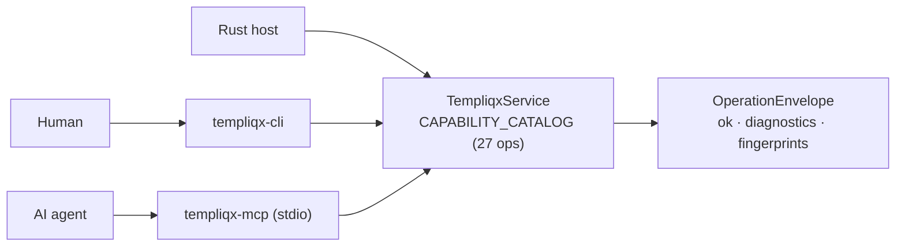

Templiqx is **agent-native by construction**, not by a bolted-on agent mode. Humans (CLI) and agents (MCP) call the *same* canonical service — `TempliqxService` — and get identical envelopes, diagnostics, fingerprints, and compare-and-swap package writes. There is deliberately no second "agent path" with different semantics.

This page is the entry point to the AI-facing surface. For the exhaustive operation table see the [actor-neutral capability map](../architecture/capability-map), and for why the layering enforces this, see the [POC architecture](../architecture/poc) and the agent-native audits ([v1](../audits/2026-07-12-agent-native-architecture-review), [v2](../audits/2026-07-13-agent-native-architecture-review-v2)).

## One catalog, two actors



The CLI and MCP server are thin transports. Every MCP tool name matches its CLI command and application method exactly (`validate_contract`, `compile_contract`, `run_eval`, …), so an operation can be traced across all three surfaces without translation. The full 1:1 mapping lives in the [capability map](../architecture/capability-map).

Because both actors resolve to the same `OperationEnvelope`, a host can enforce approval, tenancy, or automated policy *around* an operation — but it must not implement a second semantic path. Auth, tenant policy, approval, retries, retrieval, and secrets stay host-owned (see [deployment boundary](../architecture/deployment)).

## Connect an agent over MCP

`templiqx-mcp` is an MCP **stdio** server (built on `rmcp`) over the same capability catalog.

```sh
# From source: arg 1 = packages root, arg 2 = workspace root (optional)
cargo run -p templiqx-mcp -- ./packages ./.templiqx-workspace

# Or via env vars
export TEMPLIQX_PACKAGES_ROOT=./packages
export TEMPLIQX_WORKSPACE_ROOT=./.templiqx-workspace
cargo run -p templiqx-mcp
```

A prebuilt MCP image is available as the `templiqx-mcp` target in the repo `Dockerfile` (agent stdio transport — see [host integration](host-integration#deployment-artifacts)).

Point any MCP client at the stdio command. Example client entry:

```json
{
  "mcpServers": {
    "templiqx": {
      "command": "cargo",
      "args": ["run", "-p", "templiqx-mcp", "--", "./packages"]
    }
  }
}
```

The server exposes the catalog operations as tools; signing keys are never accepted through MCP requests, arguments, logs, receipts, or envelopes ([package trust handoff](host-integration#package-trust-handoff)).

## Deterministic, provider-neutral contracts

The unit an agent works with is a `templiqx/v1alpha1` contract: **one contract = one model interaction**, strict YAML, unknown fields rejected. This is what makes agent output reproducible instead of vibes-based:

- **Fingerprinted** — every `OperationEnvelope` carries a `fingerprints` map; identical inputs produce identical fingerprints, so a run is verifiable and cache-safe.
- **Evidence-grounded** — CRM3 conformance asserts drafted output is traceable to source fragments; the model **cannot invent facts** that aren't in the inputs. See [domain model](/wiki/domains) and [mock scenario format](../contracts/mock-scenarios-v1alpha1).
- **Capability profiles** — compilation requires an explicit target profile; a contract needing an unsupported capability *fails* rather than silently degrading, so runtime adapters can't quietly drop features.
- **Provider-neutral** — the portable core carries no model-provider SDKs (enforced by `scripts/check-boundaries.sh`); the provider is a host-wired `RuntimeAdapter`.

Contract syntax and the full node/expression grammar: [contract format](../contracts/v1alpha1).

### Evals

Two catalog operations make evaluation first-class for agents and CI:

| Operation | CLI | MCP tool |
| --- | --- | --- |
| `list_evals` | `templiqx list-evals <package>` | `list_evals` |
| `run_eval` | `templiqx run-eval <package> <contract> <fixture-id>` | `run_eval` |

Fixtures are checked in with the package, so an agent can discover and run the same evals a human or CI job would.

## Observability

Tracing is a **host-owned seam**, never baked into the portable core. The optional `templiqx-runtime-langfuse` adapter implements `RuntimeAdapter`: after each real model call it best-effort posts a trace (prompt, completion, usage) to Langfuse. A failed trace post never fails the underlying `ExecutionReceipt` — tracing is observability, not a correctness gate.

```rust
// Host-owned composition root (not in this repo's default binaries)
let adapter = LangfuseTracedRuntime::new(
    ModelConfig { base_url, api_key, model, timeout },
    LangfuseConfig { host, public_key, secret_key },
)?;
let service = TempliqxService::new(storage, adapter, /* ... */);
```

Because the adapter's `descriptor()` reports into the same `AdapterDescriptor` every `ExecutionReceipt` already carries, a Langfuse trace and its receipt correlate by `request_fingerprint` with no extra plumbing. The CLI/MCP/application layer never imports a tracing SDK — `check-boundaries.sh` enforces it. Full rationale: [observability seam](../architecture/observability).

## AI-assisted docs

This site is built with [Blume](https://useblume.dev) and exposes AI-friendly surfaces:

- **`llms.txt` / `llms-full.txt`** — generated at build time (`ai.llmsTxt` in `blume.config.ts`) so agents can ingest the docs directly. This is the supported agent-ingestion path for the published site.
- **Ask AI** — Blume can serve an in-page assistant over these docs, but it needs a server deployment (it serves `POST /api/ask`). This site ships as a static GitHub Pages build, so Ask AI is intentionally off. To enable it, serve the docs from a server host (e.g. Vercel with `output: "server"`) and set `ai.ask` in `blume.config.ts`.

## See also

- [Actor-neutral capability map](../architecture/capability-map) — all 27 operations, CLI ↔ MCP ↔ service
- [Host integration](host-integration) — ownership matrix, ModelGateway consumer contract, deployment artifacts
- [Contract format](../contracts/v1alpha1) — `templiqx/v1alpha1` grammar
- [Code docs: workflows](/wiki/workflows) and [architecture](/wiki/architecture) — generated from the source tree
