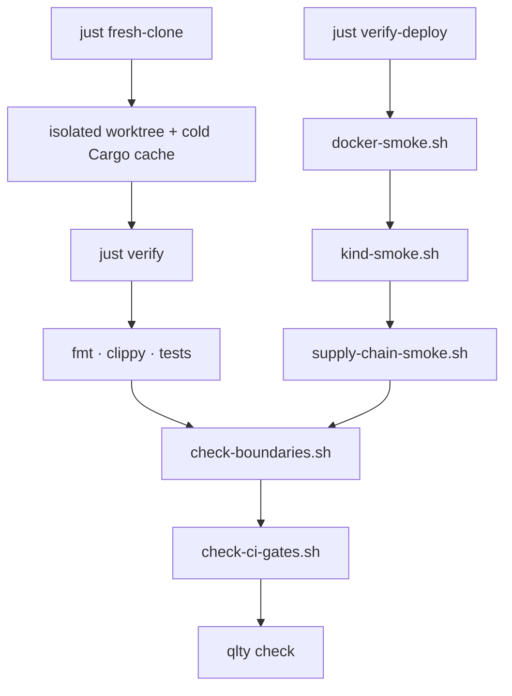

# Pre-CRM3 Readiness

Templiqx keeps CRM3-shaped proof work in conformance fixtures and deployment smoke paths. Core crates remain provider-neutral and CRM3-neutral.

## Readiness boundary

The repository-owned target is a releasable standalone compiler, identical
27-operation Rust/CLI/MCP behavior, and reproducible synthetic conformance.
Templiqx does not claim that CRM3 itself is production-ready: a real
ModelGateway, tenant/auth/retrieval/approval/audit policy, customer-data
validation, and host deployment acceptance are owned by the Basenet host.

## Verification ladder



```text
Local PR gate     →  just verify
Docs confidence   →  just docs-build
Deploy confidence →  just verify-deploy  (needs Docker)
Reproducibility   →  just fresh-clone
```

## Workspace Contract

Packages are read-only inputs. Runtime artifacts are written to a separate workspace:

```sh
templiqx --root examples render-document crm3 templates/v5-contract-template.docx merge-data.json rendered.docx --workspace /tmp/templiqx-workspace
```

If `--workspace` is omitted, local composition uses `.templiqx-workspace` under the package collection root. Artifact references returned by Rust, CLI, and MCP remain portable paths relative to the selected workspace package directory.

## Failure Semantics

Runtime adapters report typed failures with stable diagnostic codes:

- `TQX_RUNTIME_TIMEOUT`
- `TQX_RUNTIME_RATE_LIMITED`
- `TQX_RUNTIME_UNAVAILABLE`
- `TQX_RUNTIME_INVALID_RESPONSE`
- `TQX_RUNTIME_PERMANENT`
- `TQX_HOST_RETRY_EXHAUSTED`

Failure envelopes have `ok=false` and no successful `ExecutionReceipt`.

## Mock and legacy proof

`examples/crm3/scenarios/inventory.json` is the authority for 8 scenarios. Each
entry declares the expected success/failure status, diagnostic code, schema
validity, output fingerprint, and receipt fingerprint. The in-process tests and
the real HTTP mock-gateway matrix fail closed on drift; malformed, oversized,
unknown, and path-escaping requests are rejected. The mock crates, gateway, and
fixtures are conformance-only and boundary checks keep them out of the default
application, CLI, and MCP graphs.

The deterministic corpus under `examples/legacy-corpus/` covers V1 BeanShell
detection, V2 marker detection, supported V5 nested-table/header/footer/alias
cases, unresolved data, and hostile corrupt/oversized/traversal ZIPs. It defines
a measured compatibility surface, not general DOCX or production-template
support.

## Deploy Checks

Always-required local gates:

```sh
just verify
```

`just verify` runs formatting, clippy, workspace tests, boundary checks,
`scripts/check-ci-gates.sh`, and `qlty check --level=low` — matching CI policy.

Fresh-clone reproducibility:

```sh
just fresh-clone
```

Environment-dependent deploy gates:

```sh
just verify-deploy
```

Docker/Compose and kind enumerate the same 8 inventory scenarios. Product-image
inspection also proves that the CLI and MCP images do not contain mock binaries
or fixtures. Golden fixture updates require a `GOLDEN_REVIEW:` commit marker or
`ALLOW_GOLDEN_UPDATE=1` in CI.

The release workflow publishes separate CLI, MCP, and explicitly synthetic
conformance images. Package-manifest `sha256-keyed` trust is only a local/CI
tamper-evidence contract; OCI distribution trust is a separate Cosign-verified
immutable digest. See [releasing.md](releasing.md).

## Performance baseline (local)

Record compile/document baselines before designing caches or render optimizations:

```sh
cargo run -p templiqx-bench
cargo test -p templiqx-bench
```

The harness emits `templiqx-bench/v1` JSON with median latencies and functional
fingerprints. It is tooling-only — not part of package identity or receipts.

Host integration guidance lives in [host-integration.md](host-integration.md).
