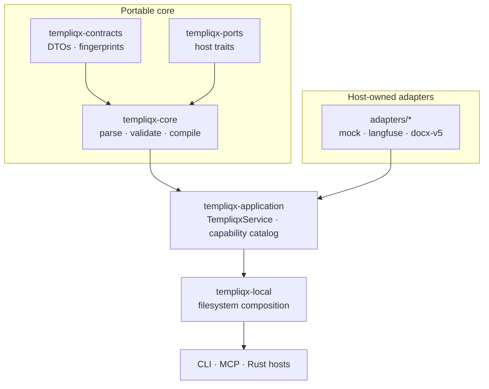
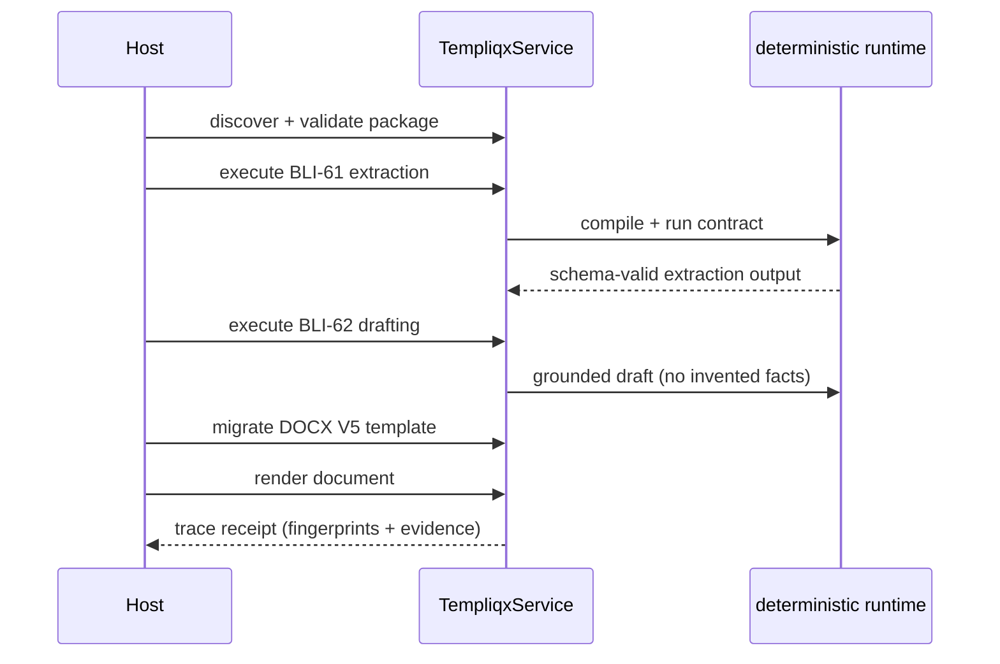

Templiqx is a standalone, provider-neutral **AI interaction contract compiler**. It turns portable `templiqx/v1alpha1` contracts (strict YAML) into deterministic, fingerprinted model interactions — one contract, one model interaction, no invented facts.

A single actor-neutral service (`TempliqxService`) backs the CLI, MCP server, and any Rust host, so humans and agents get identical validation, diagnostics, and compare-and-swap package writes.

:::note
**Handbook** pages are curated specs and guides under `docs/`. **Code docs** (OpenWiki tab) are generated from the codebase through the on-demand OpenWiki workflow when a refresh is needed.
:::

## Architecture at a glance



## One catalog, every transport

```text
Human (CLI) ──┐
              ├──► TempliqxService ──► same envelopes · diagnostics · fingerprints
Agent (MCP) ──┘
```

## CRM3 conformance trace



## Quick start

```bash
just verify                              # fmt, clippy, tests, boundary checks
just verify-deploy                       # docker/kind/supply-chain smoke

cargo test -p templiqx-conformance --test crm3   # CRM3 end-to-end conformance
./scripts/check-boundaries.sh            # after touching Cargo.toml or adapter wiring
```

CLI usage: `cargo run -p templiqx-cli -- <command> --root <package-dir> [--json]`. Exit codes: `0` = ok envelope, `2` = product/diagnostic failure, `1` = CLI/IO failure.

## Where to go next

| Topic | Page |
| ----- | ---- |
| AI & agent surface | [Agent-native & AI](guides/agent-native) |
| Contract format | [v1alpha1](contracts/v1alpha1) |
| CLI and agent workflows | [CLI guide](guides/cli) |
| Host integration | [Host integration](guides/host-integration) |
| Pre-CRM3 readiness | [Pre-CRM3 readiness](guides/pre-crm3-readiness) |
| Architecture | [POC architecture](architecture/poc) |
| Code docs (OpenWiki) | [Quickstart](/wiki/quickstart) |
