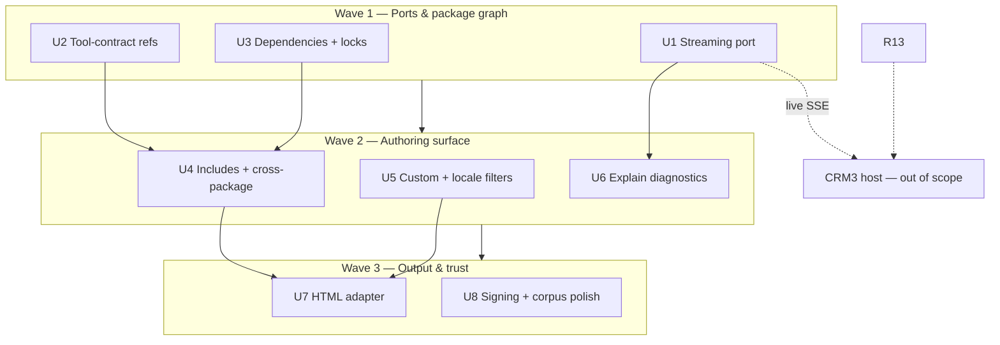

# Template engine parity (standalone wave)

## Summary

**NL:** Na de ~99% pre-CRM3 readiness-wave sluit dit plan de belangrijkste **template-engine-parity** gaten die Templiqx wél zelfstandig kan doen: streaming-port implementatie, tool-contract refs, package dependencies, cross-package compositie, bounded custom filters, file-includes, sterkere diagnostics, en een minimale HTML-renderadapter — zonder Handlebars-clone te worden of op CRM3-host te wachten.

**EN:** After the ~99% pre-CRM3 readiness wave, this plan closes the highest-value **template-engine parity** gaps Templiqx can do standalone: streaming port implementation, tool-contract refs, package dependencies, cross-package composition, bounded custom filters, file includes, stronger diagnostics, and a minimal HTML render adapter — without becoming a Handlebars clone or waiting on the CRM3 host.

**Estimated scope:** 8 implementation units · ~30–45 files · **Complexity: MEDIUM–HIGH**

---

## Problem Frame

The POC and production-readiness plan proved deployment trust, synthetic portability, DOCX V5 slice, signing stub, and product-direction ADRs. Best-in-class comparison (see origin brainstorm) shows Templiqx leads on typed AI contracts and conformance but lacks composition, streaming execution, tool-schema reuse, dependency locks, custom filters, i18n foundation, and non-DOCX output. CRM3 host work (ModelGateway, tenant auth, production fixtures) remains blocked; this plan targets **Tier-1 gaps** from the gap analysis that advance CRM3 readiness without host coupling.

| Gap | Current | Target |
|-----|---------|--------|
| Streaming | ADR only | Trait + `StreamEvent` + mock + CLI flag |
| Tool-contract refs | ADR only | Manifest field + compile resolution |
| Package deps | None | Declared deps + lock verification |
| Includes / cross-package | `component` in-file only | `include` node + dep-scoped components |
| Custom filters | 4 builtins | Schema-bounded registry |
| Diagnostics | Stable codes | Explain traces + fix hints |
| HTML output | None | Thin `DocumentRenderer` adapter |
| Signing | Stub | CI round-trip verify (unsigned dev OK) |

---

## Requirements

| ID | Requirement | Origin | CRM3 blocked? |
|----|-------------|--------|---------------|
| **R1** | Streaming port per ADR with receipt parity | gap R1 | No (mock proof) |
| **R2** | Tool-contract refs compile-time resolution | gap R2 | No |
| **R3** | Package `dependencies` + lock fingerprint verify | gap R3 | No |
| **R4** | Cross-package component/include resolution | gap R4, R6 | No |
| **R5** | Bounded custom filter registry | gap R5 | No |
| **R6** | Locale-aware date/number format filters via `context` | gap R9 | No |
| **R7** | Enhanced `explain_contract` diagnostic graph | gap R7 | No |
| **R8** | Signing verify hardening in CI | gap R8 | No |
| **R9** | HTML/plain-text document adapter | gap R10 | No |
| **R10** | DOCX corpus edge-case expansion | gap R11 | No |
| **R11** | ODT import-detection ADR only | gap R12 | No |
| **R12** | No Jinja/Handlebars syntax layer | gap R13 | No |
| **R13** | CRM3 ModelGateway live adapter | — | **Yes** (host) |
| **R14** | Real second opco package gate | prod plan R13 | **Yes** |

---

## Key Technical Decisions

| KTD | Decision | Rationale |
|-----|----------|-----------|
| **KTD1** | Implement accepted ADRs before new surface area | Streaming and tool refs are specced; reduces design churn |
| **KTD2** | Dependencies are content-addressed lock files, not a registry | Matches brainstorm R16/R17 portable-package model |
| **KTD3** | `include` is a new content node, not a preprocessor | Keeps rendering in `templiqx-core` with same diagnostics |
| **KTD4** | Custom filters register via manifest `filters:` table with JSON Schema IO | Extends formatting without arbitrary code (gap R5) |
| **KTD5** | HTML adapter uses simple field interpolation, not full contract content AST | Smaller scope; AI content already compiles to messages |
| **KTD6** | Streaming default in mock: replay fixture `StreamEvent`s then `Complete` | Preserves deterministic conformance; live streaming proof stays host-owned |
| **KTD7** | Unsigned packages remain valid; `TEMPLIQX_STRICT_TRUST=1` enables fail-closed | Matches package-trust ADR backward compatibility |
| **KTD8** | ODT = ADR + detect-only in migrate; no render adapter in this plan | Fixture discipline before parity claims |

---

## High-Level Technical Design

---

## Scope Boundaries

### In scope

- U1–U8 as defined below
- Conformance extensions for streaming, tool refs, deps, HTML golden
- `docs/contracts/v1alpha1.md` additive updates for new nodes and manifest fields

### Out of scope — requires CRM3 / host

- Live ModelGateway `RuntimeAdapter` (R13)
- Production DOCX templates and real opco package (R14)
- PDF renderer, full ODT render, visual editor, hosted registry
- Agent orchestration, RAG, tenant retrieval

### Deferred to follow-up work

- Compile artifact incremental cache
- PDF adapter
- ODT render (post ADR)
- Full V1/V2 migration execution
- LSP/IDE extension (diagnostics JSON is preparatory only)

---

## Implementation Units

### U1. Streaming `RuntimeAdapter` port

**Goal:** Implement ADR streaming extension with deterministic mock parity.

**Requirements:** R1

**Dependencies:** None

**Files:**
- `crates/templiqx-contracts/src/lib.rs`
- `crates/templiqx-ports/src/lib.rs`
- `crates/templiqx-mock/src/lib.rs`
- `crates/templiqx-application/src/lib.rs`
- `crates/templiqx-cli/src/main.rs`
- `crates/templiqx-mcp/src/lib.rs`
- `docs/architecture/adr-streaming-runtime-port.md`
- `docs/contracts/mock-scenarios-v1alpha1.md`
- `crates/templiqx-conformance/tests/streaming.rs` (new)

**Approach:** Add `StreamEvent` to contracts. Extend `RuntimeAdapter` with `execute_streaming` defaulting to `execute`. Mock replays scenario fixture events. Application `execute_contract` accepts `stream: bool`; CLI/MCP pass `--stream` / `stream` param. Final receipt fingerprints must match non-streaming path.

**Test scenarios:**
- Covers AE1. Mock scenario with 3 `Delta` + `Complete`: streaming and non-streaming receipts equal for fingerprints
- Adapter without override: default emits single `Complete`
- Invalid mid-stream failure emits `Failed` with stable code

**Verification:** `cargo test -p templiqx-conformance --test streaming` green; boundaries script passes.

---

### U2. Tool-contract references

**Goal:** Resolve shared tool schemas from package manifest at compile time.

**Requirements:** R2

**Dependencies:** None

**Files:**
- `crates/templiqx-contracts/src/lib.rs`
- `crates/templiqx-core/src/lib.rs`
- `crates/templiqx-application/src/lib.rs`
- `examples/packages/demo/templiqx.yaml`
- `docs/architecture/adr-tool-contract-refs.md`
- `docs/contracts/v1alpha1.md`
- `crates/templiqx-core/tests/tool_contract_refs.rs` (new)

**Approach:** Add optional `tool_contracts` map to `PackageManifest`. `ExtensionSpec` accepts `$ref: tool_contract:<name>` with fingerprint pin. Compile resolves or fails `TQX_TOOL_CONTRACT_REF_UNRESOLVED`. Demo package gets one shared tool fixture.

**Test scenarios:**
- Covers AE2. Two contracts share resolved schema; bad fingerprint fails
- Missing name fails closed
- Unsigned legacy manifests without field parse unchanged

**Verification:** Core tests + `validate_package` inventory includes tool contracts.

---

### U3. Package dependencies and lock verification

**Goal:** Declare dependent packages and verify lock fingerprints at validation.

**Requirements:** R3

**Dependencies:** None

**Files:**
- `crates/templiqx-contracts/src/lib.rs`
- `crates/templiqx-application/src/lib.rs`
- `crates/templiqx-local/src/lib.rs`
- `examples/packages/synthetic-opco/templiqx.yaml`
- `examples/packages/demo/templiqx.lock` (new)
- `docs/architecture/adr-package-trust.md`
- `crates/templiqx-application/tests/package_dependencies.rs` (new)

**Approach:** Add `dependencies:` name → fingerprint map and optional `templiqx.lock` with resolved paths relative to workspace. `validate_package` checks lock matches manifest and dependency roots exist. No network fetch.

**Test scenarios:**
- Lock drift fails `validate_package` with stable diagnostic
- Missing dependency root fails
- Package without deps unchanged

**Verification:** Portability test still passes; synthetic-opco can depend on demo component stub.

---

### U4. File includes and cross-package composition

**Goal:** Modular authoring via `include` nodes and dependency-scoped components.

**Requirements:** R4

**Dependencies:** U2, U3

**Files:**
- `crates/templiqx-contracts/src/lib.rs`
- `crates/templiqx-core/src/lib.rs`
- `crates/templiqx-core/tests/includes.rs` (new)
- `examples/packages/demo/contracts/` (new partials)
- `docs/contracts/v1alpha1.md`
- `crates/templiqx-conformance/tests/portability.rs`

**Approach:** New `include` content node with package-relative path and optional `from_dependency`. Cycle detection across includes/components. Reuse path-safety from `templiqx-local`.

**Test scenarios:**
- Covers AE3. Cross-package component invocation succeeds with valid dep
- Cyclic include fails validation
- Path traversal rejected

**Verification:** CRM3 scenarios remain green; new include fixtures in demo package.

---

### U5. Bounded custom and locale filters

**Goal:** Extend formatting without arbitrary code execution.

**Requirements:** R5, R6

**Dependencies:** U4 (optional sequencing)

**Files:**
- `crates/templiqx-contracts/src/lib.rs`
- `crates/templiqx-core/src/lib.rs`
- `crates/templiqx-core/tests/filters.rs` (new)
- `docs/contracts/v1alpha1.md`

**Approach:** Manifest `filters:` registry declaring builtin extensions (`format_date`, `format_number`) with input/output schema. Filters may read `context.locale`. Unknown filters fail at validate. Builtins implemented in core deterministically.

**Test scenarios:**
- Covers AE4. `nl-NL` date formatting matches fixture
- Invalid locale or type fails validation
- Unknown filter name rejected

**Verification:** Filter tests pass; no new dependencies in portable core.

---

### U6. Enhanced explain and diagnostic graph

**Goal:** Agent- and IDE-friendly explanation of validation and render failures.

**Requirements:** R7

**Dependencies:** U1, U4

**Files:**
- `crates/templiqx-application/src/lib.rs`
- `crates/templiqx-core/src/lib.rs`
- `crates/templiqx-cli/src/main.rs`
- `crates/templiqx-mcp/src/lib.rs`
- `crates/templiqx-application/tests/explain.rs` (new)
- `docs/guides/host-integration.md`

**Approach:** `explain_contract` returns structured graph: component/include tree, unresolved refs, capability gaps, suggested fixes mirroring diagnostic codes. JSON envelope field stable for agents.

**Test scenarios:**
- Missing context slot returns graph node + fix hint
- Include cycle surfaces path trace
- CLI/MCP JSON shape matches Rust API

**Verification:** Actor-boundary tests include explain parity.

---

### U7. HTML / plain-text document adapter

**Goal:** Minimal non-DOCX render path for email and web snippets.

**Requirements:** R9

**Dependencies:** U5

**Files:**
- `adapters/templiqx-html-plain/` (new crate)
- `crates/templiqx-ports/src/lib.rs`
- `crates/templiqx-local/src/lib.rs`
- `examples/crm3/templates/` (new HTML fixture)
- `crates/templiqx-conformance/tests/html_render.rs` (new)
- `scripts/check-boundaries.sh`

**Approach:** New optional adapter implementing `DocumentRenderer` with `{{field}}` and simple `{{#each}}` subset mapped from merge JSON — not full contract AST. Wire in local composition behind feature flag or explicit adapter id. Golden HTML tests.

**Test scenarios:**
- Covers AE5. CRM3 draft JSON renders to golden HTML
- Traversal in template path fails
- Adapter absent from default core-only composition

**Verification:** Boundary check passes; DOCX CRM3 path unaffected.

---

### U8. Signing hardening, DOCX corpus, ODT ADR

**Goal:** Close trust and document parity polish without host deps.

**Requirements:** R8, R10, R11

**Dependencies:** U3

**Files:**
- `crates/templiqx-application/src/lib.rs`
- `crates/templiqx-application/tests/package_signing.rs`
- `.github/workflows/ci.yml`
- `examples/legacy-corpus/`
- `adapters/templiqx-docx-v5/src/lib.rs`
- `docs/architecture/adr-odt-compatibility.md` (new)
- `docs/architecture/adr-package-trust.md`

**Approach:** CI signs demo + synthetic-opco packages; smoke verifies tamper detection. Add 2–3 DOCX edge fixtures (nested section, image placeholder). ODT ADR specifies detect-only migrate reporting.

**Test scenarios:**
- Tampered signed manifest fails in strict mode
- New DOCX fixtures assert migration categories
- ODT file yields `unsupported`/`detected` diagnostic without render

**Verification:** `just verify` green; legacy corpus README updated.

---

## Risks & Dependencies

| Risk | Mitigation |
|------|------------|
| Include/graph cycles complicate validation | Central cycle detector shared by components and includes |
| Custom filters become arbitrary-code vector | Schema-bounded registry only; no WASM/JS |
| HTML adapter scope creep | Explicit simple interpolation subset; defer full AST |
| Dependency lock format churn | Single additive v1; unsigned packages stay valid |
| Streaming breaks fingerprint parity | AE1 enforced in conformance suite |

**Prerequisites:** Production-readiness plan complete (U1–U9). No CRM3 host required for U1–U8.

---

## System-Wide Impact

- **Contracts:** Additive `v1alpha1` fields; strict unknown-field policy preserved elsewhere
- **Conformance:** New tests must not weaken CRM3 evidence-grounding
- **CI:** Signing job extends existing supply-chain workflow
- **Hosts:** `host-integration.md` updated for streaming and dependency consumption

---

## Open Questions

| Question | Blocks | Default if unresolved |
|----------|--------|------------------------|
| HTML: field-only vs mini-AST? | U7 shape | Field-only per KTD5 |
| Lock file name: `templiqx.lock` vs embedded in manifest | U3 | Separate lock file |
| Which locale filters in v1 | U5 scope | `format_date`, `format_number` only |

---

## Sources & Research

| Source | Use |
|--------|-----|
| `docs/brainstorms/2026-07-12-templiqx-best-in-class-template-engine-gap-analysis.md` | Tier classification, R1–R14 |
| `docs/plans/2026-07-12-templiqx-production-readiness-without-crm3.md` | Completed baseline, deferred items |
| `docs/architecture/adr-streaming-runtime-port.md` | U1 spec |
| `docs/architecture/adr-tool-contract-refs.md` | U2 spec |
| `docs/architecture/adr-package-trust.md` | U3/U8 signing |
| `docs/contracts/v1alpha1.md` | Current content model |
| `adapters/templiqx-docx-v5/README.md` | Measured DOCX scope |

---

## Acceptance Checklist (plan-level)

- [ ] U1: Streaming mock conformance + CLI/MCP `--stream`
- [ ] U2: Tool-contract refs compile and fail closed
- [ ] U3: Dependency lock validation
- [ ] U4: Includes + cross-package components with cycle detection
- [ ] U5: Locale format filters registered and tested
- [ ] U6: Explain graph JSON stable across surfaces
- [ ] U7: HTML golden render + boundary-clean adapter
- [ ] U8: CI signing round-trip + expanded DOCX corpus + ODT ADR
- [ ] CRM3 grounded-evidence tests remain green
- [ ] `./scripts/check-boundaries.sh` passes
