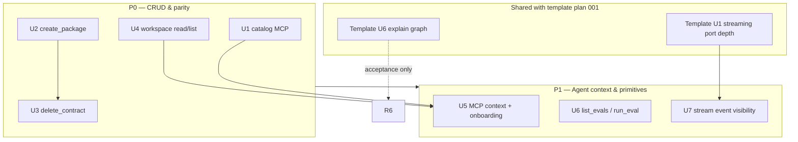

# Agent-native parity (MCP / CLI compiler surface)

## Summary

**NL:** Dit plan sluit de agent-native architectuurgaten uit de audit van 66% naar ~88% na P0+P1 door MCP/CLI-pariteit, CRUD-compleetheid, context-injectie, discovery en zichtbaarheid van workspace-artefacten — binnen de Templiqx-identiteit als compiler/MCP, zonder host direct-commit of CRM3 ModelGateway.

**EN:** This plan closes agent-native architecture gaps from the 66% audit baseline toward ~88% after P0+P1 by improving MCP/CLI parity, CRUD completeness, context injection, capability discovery, and workspace artifact visibility — within Templiqx's compiler/MCP identity, without host direct-commit or CRM3 ModelGateway.

**Estimated scope:** 7 implementation units · ~25–35 files · **Complexity: MEDIUM** (20 catalog ops after delivery)

---

## Problem Frame

The 2026-07-12 agent-native audit scored Templiqx **66% overall**: excellent shared workspace (100%) and CLI/MCP envelope parity on the existing 13-op catalog, but weak context injection (33%), CRUD (38%), and capability discovery (29%). Agents cold-start MCP with a one-line instruction, cannot bootstrap packages, delete contracts, or read workspace outputs, and lack a `catalog` tool. `create_package` exists only as a Rust helper in `templiqx-local`. Streaming port work is partially landed (`RuntimeAdapter::execute_streaming`, CLI/MCP `stream` flag) but stream deltas are not surfaced to agents.

This plan targets **agent-native surface parity**, not template-engine depth. Overlap with `docs/plans/2026-07-12-001-feat-template-engine-parity-plan.md` is explicit below.

| Principle | Baseline | P0 target | P1 target |
|-----------|----------|-----------|-----------|
| Action Parity | 93% | 100% | 100% |
| Tools as Primitives | 92% | 92% | ~100% |
| Context Injection | 33% | 50% | 80%+ |
| Shared Workspace | 100% | 100% | 100% |
| CRUD | 38% | 65% | 80%+ |
| UI Integration | 75% | 80% | 90%+ |
| Capability Discovery | 29% | 55% | 80%+ |
| Prompt-Native | 64% | 64% | 70%+ |
| **Overall (avg.)** | **66%** | **~76%** | **~88%** |

---

## Requirements

Traceability to audit recommendations **R1–R10** (`docs/audits/2026-07-12-agent-native-architecture-review.md`).

| ID | Requirement | Audit R | Principle lift |
|----|-------------|---------|----------------|
| R1 | `list_workspace_artifacts` + `read_artifact` primitives with path confinement | R1 | CRUD, Context, UI |
| R2 | `delete_contract` with CAS fingerprint + manifest line removal | R2 | CRUD |
| R3 | `catalog` exposed on MCP (14th tool) with same envelope as CLI | R3 | Parity, Discovery |
| R4 | Dynamic MCP context: packages under root, workspace path, capability vocabulary | R4 | Context |
| R5 | Agent onboarding: suggested flows, enriched MCP instructions, empty-state guidance | R5 | Discovery |
| R6 | `explain_contract` diagnostic graph + fix hints (shared with template plan U6) | R6 | Discovery, Prompt |
| R7 | `create_package` in capability catalog (CLI + MCP) | R7 | Parity, CRUD |
| R8 | Post-execution artifact visibility in envelopes (receipt + workspace path hints) | R8 | UI Integration |
| R9 | `list_evals` + `run_eval` primitives; `test_package` remains convenience wrapper | R9 | Tools |
| R10 | Stream event visibility when `stream: true` (receipt fingerprint parity preserved) | R10 | UI Integration |

---

## Key Technical Decisions

| KTD | Decision | Rationale |
|-----|----------|-----------|
| KTD1 | Add new ops to `CAPABILITY_CATALOG`; keep `catalog` as introspection that does not require compose | Matches `docs/architecture/capability-map.md`; `catalog` today is stateless |
| KTD2 | `catalog` becomes catalog op #14 on MCP; CLI keeps `catalog` subcommand | Closes 13/14 action parity without inventing agent-only semantics |
| KTD3 | `delete_contract` requires `expected_fingerprint` (CAS) and updates `templiqx.yaml` contract list | Mirrors `put_contract` safety; no silent orphan manifest entries |
| KTD4 | Workspace read/list extends `ArtifactWorkspace` port, not `PackageStore` | Workspace outputs live outside package identity per `docs/architecture/poc.md` |
| KTD5 | MCP context via `get_info().with_instructions` + optional MCP Resources (`templiqx://packages`, `templiqx://workspace`) | Resources are read-only bootstrap; no session state in stdio MCP |
| KTD6 | `test_package` stays; `list_evals`/`run_eval` are finer primitives | Avoids breaking CRM3 parity tests; improves primitive score |
| KTD7 | Stream deltas returned in envelope `stream_events` field when `stream: true`; terminal receipt unchanged | Application already drains noop sink; surfaces transport without second receipt shape |
| KTD8 | Explain graph implementation owned by template plan U6; this plan adds agent-native acceptance only | Single implementation, dual traceability (audit R6 + template R7) |
| KTD9 | No `complete_task` host orchestration tool in catalog | Host boundary preserved; R8 satisfied via envelope hints + artifact read-back |
| KTD10 | Host direct-commit, tenant auth, receipt composition stay out of catalog | Per audit architecture notes and `docs/architecture/poc.md` |

---

## High-Level Technical Design

### Overlap with template-engine parity plan (001)

| Topic | Owner plan | Sequence |
|-------|------------|----------|
| `create_package`, `delete_contract`, workspace read/list, `catalog` MCP | **002 (this plan)** | P0 — no dependency on 001 |
| Agent onboarding docs + MCP instructions | **002** | P1 — after U1/U4 |
| `list_evals` / `run_eval` | **002** | P1 |
| Stream event collection in envelope | **002 U7** | After template **U1** mock replay (001 may land first; partial port already exists) |
| Explain diagnostic graph | **001 U6** | Implement once; **002** adds MCP/CLI parity tests + instruction references |
| Package deps, includes, filters, HTML adapter | **001 only** | Out of scope here |
| Live ModelGateway streaming | Host | Out of scope |

**Recommended execution order:** P0 of this plan (U1–U4) → template plan U1/U6 in parallel where staffed → P1 of this plan (U5–U7) → template plan U2–U8 as capacity allows.

---

## Scope Boundaries

### In scope

- U1–U7 as defined below
- Conformance parity extension for new catalog operations
- `docs/guides/cli.md` agent onboarding section
- `docs/architecture/capability-map.md` updates

### Out of scope — host / CRM3

- CRM3 ModelGateway live adapter
- Agent direct-commit or approval bypass
- Trace receipt composition catalog op
- Session history / recent-activity persistence (host-owned)
- Web UI, LSP, file watching

### Deferred to follow-up work (P2)

- `delete_workspace_artifact` (audit did not require; list/read sufficient for 80% CRUD)
- Dedicated `complete_task` orchestration primitive
- MCP prompt templates / slash-command surface
- Full dynamic resource subscription (push on `put_contract`)

---

## Phased Delivery

### P0 — CRUD and action parity (~66% → ~76%)

| Unit | Expected lift |
|------|---------------|
| U1 catalog MCP | Action Parity +7pp, Discovery +15pp |
| U2 create_package | Action Parity, CRUD +15pp |
| U3 delete_contract | CRUD +20pp |
| U4 workspace read/list | CRUD +12pp, UI +5pp, Context +17pp |

### P1 — Agent context and primitives (~76% → ~88%)

| Unit | Expected lift |
|------|---------------|
| U5 MCP context + onboarding | Context +30pp, Discovery +25pp |
| U6 list_evals / run_eval | Tools +8pp |
| U7 stream visibility | UI +10pp |
| Template U6 explain (001) | Prompt +6pp, Discovery +10pp (acceptance) |

### P2 — Optional polish (~88% → ~92%+)

- Workspace artifact delete
- Richer MCP Resources (per-package contract summaries)
- Helm/kind smoke: MCP initialize + `catalog` + `discover_packages`

---

## Implementation Units

### U1. Expose `catalog` on MCP

**Goal:** Close the sole action-parity gap vs CLI for introspection.

**Requirements:** R3

**Dependencies:** None

**Files:**
- `crates/templiqx-application/src/lib.rs`
- `crates/templiqx-mcp/src/lib.rs`
- `crates/templiqx-conformance/tests/crm3.rs`
- `crates/templiqx-mcp/tests/stdio.rs`
- `docs/architecture/capability-map.md`

**Approach:** Add `catalog` to `CAPABILITY_CATALOG` as a service method delegating to existing `catalog()` free function. Wire MCP `#[tool] fn catalog` returning `StructuredEnvelope`. Extend `Operations` trait. Update parity test to assert byte-identical `catalog` envelopes across Rust/CLI/MCP. `catalog` does not call `compose()` on CLI (unchanged).

**Test scenarios:**
- MCP `list_tools` includes `catalog` sorted with other tools; input schema is empty object
- Rust, CLI `--json catalog`, and MCP `catalog` return identical capability name list
- `catalog` succeeds with empty `--root` (no package compose required)

**Verification:** Parity test green; MCP stdio test lists 14 tools.

---

### U2. Expose `create_package` in catalog

**Goal:** Let agents bootstrap an empty package without Rust test helpers.

**Requirements:** R7

**Dependencies:** None

**Files:**
- `crates/templiqx-application/src/lib.rs`
- `crates/templiqx-ports/src/lib.rs` (optional `PackageStore::create_package` or delegate to local)
- `crates/templiqx-local/src/lib.rs`
- `crates/templiqx-cli/src/main.rs`
- `crates/templiqx-mcp/src/lib.rs`
- `crates/templiqx-conformance/tests/agent_native.rs` (new)
- `docs/guides/cli.md`

**Approach:** Add `CreatePackageRequest { name, version }` DTO. Application method calls existing `templiqx_local::create_package` via `PackageStore` extension or injected helper on `FilesystemPackageStore`. Reject duplicate package names with `TQX_CONFLICT`. CLI subcommand `create <name> --version 0.1.0`. MCP tool `create_package`.

**Test scenarios:**
- Happy path: creates `contracts/`, `templiqx.yaml`, empty manifest; `discover_packages` lists it
- Duplicate name fails with stable diagnostic
- Invalid segment name (`../evil`) rejected via existing `segment()` guard
- CLI/MCP envelope parity on success and failure

**Verification:** New conformance test; boundaries script passes.

---

### U3. Add `delete_contract` with CAS safety

**Goal:** Complete contract entity CRUD (Create/Read/Update via put/inspect; Delete).

**Requirements:** R2

**Dependencies:** U2 (optional — packages must exist)

**Files:**
- `crates/templiqx-ports/src/lib.rs`
- `crates/templiqx-local/src/lib.rs`
- `crates/templiqx-application/src/lib.rs`
- `crates/templiqx-cli/src/main.rs`
- `crates/templiqx-mcp/src/lib.rs`
- `crates/templiqx-conformance/tests/agent_native.rs`
- `docs/architecture/capability-map.md`

**Approach:** Extend `PackageStore` with `delete_contract(package, contract, expected_fingerprint)`. Verify fingerprint matches on-disk source before unlink. Remove contract id from manifest `contracts:` vec and rewrite `templiqx.yaml`. Return `ContractSummary` of deleted contract. Require fingerprint (no blind delete).

**Test scenarios:**
- Delete with matching fingerprint removes YAML and manifest entry
- Wrong fingerprint → `TQX_CAS_CONFLICT`, file remains
- Missing contract → `TQX_NOT_FOUND`
- Path traversal in contract id rejected
- CLI/MCP/Rust parity on all cases

**Verification:** Agent-native conformance tests; CRM3 tests still green.

---

### U4. Workspace artifact `list` and `read`

**Goal:** Agents can inspect `render_document` and execution outputs without raw filesystem access.

**Requirements:** R1, R8 (partial)

**Dependencies:** None

**Files:**
- `crates/templiqx-ports/src/lib.rs`
- `crates/templiqx-local/src/lib.rs`
- `crates/templiqx-contracts/src/lib.rs` (artifact listing DTOs)
- `crates/templiqx-application/src/lib.rs`
- `crates/templiqx-cli/src/main.rs`
- `crates/templiqx-mcp/src/lib.rs`
- `crates/templiqx-mcp/tests/workspace.rs`
- `crates/templiqx-cli/tests/workspace.rs`

**Approach:** Extend `ArtifactWorkspace` with `list_artifacts(package, workspace, prefix)` and `read_artifact(package, relative_path, workspace)` using same confinement rules as `resolve_output_path`. `list_workspace_artifacts` returns portable paths + optional size/hash metadata. `read_artifact` returns base64 or UTF-8 text with `content_type` hint. Add both to catalog.

**Test scenarios:**
- After `render_document`, `list_workspace_artifacts` includes output path
- `read_artifact` returns bytes for generated DOCX path; traversal rejected
- Default `.templiqx-workspace` and explicit `workspace` param behave like existing render tests
- Empty workspace returns empty list, not error
- CLI/MCP parity

**Verification:** Extend workspace integration tests; agent-native conformance file.

---

### U5. MCP context injection and agent onboarding

**Goal:** Raise context injection and capability discovery without session state.

**Requirements:** R4, R5

**Dependencies:** U1, U4

**Files:**
- `crates/templiqx-mcp/src/lib.rs`
- `crates/templiqx-cli/src/main.rs` (optional `--packages-root` env doc only)
- `docs/guides/cli.md` (new **Agent workflows** section)
- `openwiki/workflows.md` (regenerated downstream — update source in `docs/`)
- `docs/architecture/capability-map.md`

**Approach:** At MCP initialize, build dynamic instructions string: packages root path, default workspace, discovered package names (best-effort scan), canonical tool sequence (`discover_packages` → `validate_package` → `compile_contract` → `execute_contract`), and pointer to `list_workspace_artifacts` after `render_document`. Enable MCP Resources listing `templiqx://catalog` (capability names + one-line purpose) and `templiqx://packages` (manifest summaries JSON). Enrich `#[tool(description = ...)]` with when-to-use hints. Document three suggested flows in `docs/guides/cli.md`: bootstrap package, author contract, run eval.

**Test scenarios:**
- MCP initialize `instructions` contains packages root when `TEMPLIQX_PACKAGES_ROOT` set
- `list_resources` returns catalog and packages resources
- `read_resource` for `templiqx://catalog` matches `catalog` tool output shape
- Empty root: instructions include empty-state guidance ("call `create_package`")
- Tool descriptions non-empty and mention primary inputs

**Verification:** MCP stdio test asserts instruction length > 200 chars and resource URIs present.

---

### U6. Split eval primitives (`list_evals`, `run_eval`)

**Goal:** Replace workflow-lite `test_package` with composable primitives while keeping backward compatibility.

**Requirements:** R9

**Dependencies:** None

**Files:**
- `crates/templiqx-application/src/lib.rs`
- `crates/templiqx-mcp/src/lib.rs`
- `crates/templiqx-cli/src/main.rs`
- `crates/templiqx-conformance/tests/crm3.rs`
- `crates/templiqx-conformance/tests/agent_native.rs`

**Approach:** `list_evals(package)` returns manifest contracts × fixture ids. `run_eval(package, contract, fixture_id, capabilities)` runs single fixture via existing execute path. `test_package` delegates to list + run all (unchanged envelope shape). Add both to `CAPABILITY_CATALOG` (20 ops total after U1–U6).

**Test scenarios:**
- `list_evals` on CRM3 package returns BLI-61/62 fixture ids
- `run_eval` single fixture matches corresponding `test_package` case result
- `test_package` still passes CRM3; parity test updated for new tools where applicable
- Unknown fixture id → `TQX_NOT_FOUND`

**Verification:** CRM3 conformance green; primitive audit: `test_package` documented as convenience wrapper.

---

### U7. Stream event visibility in operation envelope

**Goal:** Agents observe streaming progress; receipts stay fingerprint-identical.

**Requirements:** R10, R8 (execution visibility)

**Dependencies:** Template plan U1 (mock `StreamEvent` replay fixtures) — can proceed with default single-`Complete` path

**Files:**
- `crates/templiqx-contracts/src/lib.rs`
- `crates/templiqx-application/src/lib.rs`
- `crates/templiqx-mock/src/lib.rs` (if scenario replay not yet landed — coordinate with 001 U1)
- `crates/templiqx-cli/src/main.rs`
- `crates/templiqx-mcp/src/lib.rs`
- `crates/templiqx-conformance/tests/streaming.rs` (new or from 001)

**Approach:** When `execute_contract(..., stream: true)`, collect `StreamEvent`s in vec on envelope metadata field `stream_events` (diagnostics-adjacent, omitted when empty). Terminal `result` receipt unchanged. CLI `--json` prints events array; MCP structured content includes it. Mock adapter override emits fixture deltas per ADR.

**Test scenarios:**
- `stream: false` — no `stream_events` field
- `stream: true` with default adapter — one `Complete` event, receipt fingerprints match non-stream
- Mock scenario with deltas (when 001 U1 landed) — multiple `Delta` then `Complete`; fingerprints equal
- CLI/MCP parity on streaming CRM3 extraction execute

**Verification:** Streaming conformance test; audit UI Integration ≥90%.

---

## Risks & Dependencies

| Risk | Mitigation |
|------|------------|
| Catalog growth breaks parity test maintenance | Single `CAPABILITY_CATALOG` source; one parity harness |
| `delete_contract` manifest race | CAS on contract file only; manifest rewrite is atomic write |
| MCP Resources unsupported by some clients | Instructions string duplicates critical context (R4) |
| Duplicate explain work with plan 001 | KTD8: 001 implements, 002 verifies agent consumption |
| Stream events bloat envelopes | Cap collected events; omit field when `stream: false` |

**Prerequisites:** Existing CRM3 conformance green. Template plan 001 U1/U6 optional but coordinated for U7/R6 acceptance.

---

## System-Wide Impact

- **Catalog size:** 13 → 20 ops (`catalog`, `create_package`, `delete_contract`, `list_workspace_artifacts`, `read_artifact`, `list_evals`, `run_eval`)
- **Boundaries:** New ops stay in application/ports/local; no mock-gateway in default graph
- **Hosts:** `docs/guides/host-integration.md` note on artifact read for orchestration loops
- **CI:** Extend MCP smoke to call `catalog` + `discover_packages`

---

## Definition of Done

Measurable re-audit targets after **P0+P1** (re-run agent-native checklist from audit doc):

| Principle | DoD metric |
|-----------|------------|
| Action Parity | 14/14 catalog ops on MCP + CLI (incl. `catalog`, `create_package`) |
| Tools as Primitives | `test_package` documented wrapper; `list_evals`/`run_eval` present |
| Context Injection | ≥5/6 context types addressed (resources, capabilities, workspace, packages; session/history explicitly N/A) |
| Shared Workspace | 100% maintained |
| CRUD | ≥3/4 entities at 3/4+ ops (contract, package, workspace artifact) |
| UI Integration | Artifact read-back + stream events in envelope |
| Capability Discovery | ≥6/7 mechanisms (onboarding doc, instructions, tool hints, catalog resource, suggested flows, empty state) |
| Prompt-Native | Explain graph via 001 U6 + stable JSON for agents |
| **Overall** | **≥85%** (stretch **88%**) |

**Commands (verification, not execution choreography):** `just verify`, `cargo test -p templiqx-conformance --test agent_native`, `cargo test -p templiqx-conformance --test crm3`, `./scripts/check-boundaries.sh`.

---

## Open Questions

| Question | Blocks | Default if unresolved |
|----------|--------|------------------------|
| `read_artifact` returns base64 vs plain text for binary | U4 response shape | UTF-8 for `.json`/`.txt`; base64 + `content_encoding` for binary |
| MCP Resources: rmcp resource API surface | U5 | Instructions-only fallback (still hits ~50% context at P0) |
| Keep `test_package` in parity test matrix | U6 | Yes — wrapper must remain byte-stable for CRM3 |

---

## Sources & Research

| Source | Use |
|--------|-----|
| `docs/audits/2026-07-12-agent-native-architecture-review.md` | Baseline scores, R1–R10 |
| `docs/plans/2026-07-12-001-feat-template-engine-parity-plan.md` | Overlap sequencing, U1/U6 |
| `docs/architecture/adr-streaming-runtime-port.md` | U7 stream contract |
| `docs/architecture/capability-map.md` | Catalog mapping |
| `docs/architecture/poc.md` | Host boundary, workspace rules |
| `crates/templiqx-application/src/lib.rs` | `CAPABILITY_CATALOG`, `catalog()` |
| `crates/templiqx-mcp/src/lib.rs` | MCP tools, `get_info` |
| `crates/templiqx-local/src/lib.rs` | `create_package`, compose |
| `crates/templiqx-ports/src/lib.rs` | `PackageStore`, `ArtifactWorkspace` |

---

## Acceptance Checklist (plan-level)

- [x] U1: `catalog` MCP tool + 14-tool parity
- [x] U2: `create_package` CLI/MCP + tests
- [x] U3: `delete_contract` CAS + manifest update
- [x] U4: `list_workspace_artifacts` + `read_artifact`
- [x] U5: Dynamic MCP instructions + resources + agent onboarding doc
- [x] U6: `list_evals` + `run_eval`; `test_package` unchanged semantically
- [x] U7: `stream_events` in envelope when `stream: true`
- [x] Template 001 U6 explain graph landed and referenced in MCP instructions
- [x] Re-audit overall score ≥85% after P0+P1
- [x] CRM3 evidence-grounding tests remain green
- [x] `./scripts/check-boundaries.sh` passes
