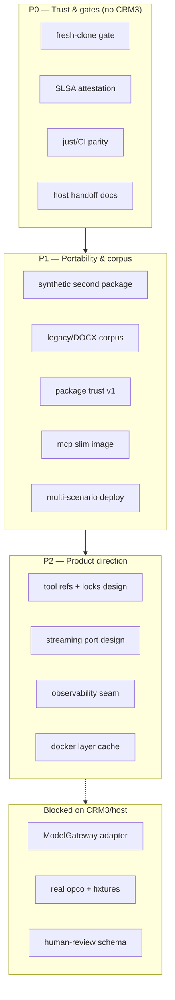

# Production readiness without CRM3

## Summary

**NL:** Pre-CRM3 readiness staat op ~99% voor standalone werk (79× gereed, 0× wip, 1× post-CRM3 in `docs/specs/pre-crm3-readiness-docker-kubernetes.html`). P0–P2 units zijn gesloten: supply-chain attestatie, fresh-clone reproduceerbaarheid, CI/`just`-pariteit, host-handoffdocumentatie, synthetische portability- en legacy-corpusuitbreiding, package-trust design, en P2 product-direction ADRs — **zonder** te wachten op CRM3 ModelGateway, tenant/auth of echte opco-data.

**EN:** Pre-CRM3 readiness is ~99% complete for standalone work (79× done, 0× wip, 1× post-CRM3 in `docs/specs/pre-crm3-readiness-docker-kubernetes.html`). P0–P2 units are closed: supply-chain attestation, fresh-clone reproducibility, CI/`just` parity, host handoff docs, synthetic portability and legacy corpus expansion, package-trust design, and P2 product-direction ADRs (tool-contract refs, streaming port, observability seam) — **without** waiting for CRM3 ModelGateway, tenant/auth, or real opco data.

**Estimated scope:** 8 implementation units across ~25–35 touched files · **Complexity: MEDIUM–HIGH**

---

## Problem Frame

Templiqx has proven the AI-contract compiler POC and nearly all pre-CRM3 deployment readiness (scripted mocks, CRM3 synthetic scenarios, Docker/Compose, Helm/kind, SBOM/Grype, boundary enforcement). What remains blocks **production confidence** and **opco portability** but does not require a live Basenet host:

| Gap category | Current state | Why it matters |
|--------------|---------------|----------------|
| Supply chain | SBOM + Grype + pinned digests; **no SLSA attestation** | Downstream consumers cannot verify build provenance |
| Reproducibility | CI `--no-cache` image build only; **no fresh-clone gate** | Hidden local-cache dependencies can break clean checkouts |
| Verification entrypoints | `just verify` omits `qlty` and `check-ci-gates.sh` | Local and CI gates diverge |
| Handoff | Ownership matrix lives in HTML spec only | Host teams lack a navigable integration guide |
| Portability | Single CRM3-shaped synthetic package; second opco **explicitly post-CRM3** | Cannot prove multi-opco adoption without host data |
| Package trust | Deterministic hashes only (R18 POC gate met); **no signing** | Publication and tamper-evidence remain unproven |
| Legacy/DOCX | One V5 fixture class; V1/V2 detected not migrated | Production document breadth unproven |
| Language surface | No tool refs, dependency locks, streaming port | Product direction deferred from brainstorm |

CRM3 host integration (ModelGateway adapter, sanitized production fixtures, tenant retrieval, approval persistence) remains **out of scope** and is tracked separately.

---

## Requirements

| ID | Requirement | Priority | CRM3 blocked? |
|----|-------------|----------|---------------|
| **R1** | Fresh-clone verification: empty Cargo and Docker cache, full `just verify` + deploy smokes pass | P0 | No |
| **R2** | SLSA/build-provenance attestation generated in CI and verified by supply-chain smoke | P0 | No |
| **R3** | `just verify` and `just verify-deploy` align with CI policy gates (`qlty`, `check-ci-gates.sh`) | P0 | No |
| **R4** | Host handoff guide in `docs/guides/` covering ownership matrix, ModelGateway consumer contract, fixture replacement | P0 | No |
| **R5** | Synthetic second-opco package under `examples/packages/` with parameterized conformance runner | P1 | No |
| **R6** | Legacy/DOCX corpus expansion: synthetic V1/V2 fixtures + additional V5 edge cases with migration reports and OOXML parity tests | P1 | No |
| **R7** | Package trust v1: ADR + manifest signature field + `validate_package` verification stub (cosign-compatible design) | P1 | No |
| **R8** | Optional slim MCP OCI stage with dedicated smoke check | P1 | No |
| **R9** | Multi-scenario Helm/Compose conformance (not only `intake-document-01`) | P1 | No |
| **R10** | Observability seam: structured diagnostic export contract documented; optional Langfuse adapter merged boundary-safe | P2 | Partially (live traces need host) |
| **R11** | Schema evolution design for tool-contract refs and package dependency locks (additive v1alpha1) | P2 | No |
| **R12** | Streaming `RuntimeAdapter` port extension designed; mock event aggregation preserved | P2 | Partially (live streaming proof needs host) |
| **R13** | Real second Blinqx opco package selected and conformance-gated | P2 | **Yes** |
| **R14** | CRM3 ModelGateway adapter executes same scenario suite with request fingerprint parity | — | **Yes** (host repo) |
| **R15** | Human-review extraction outcome as schema-valid “review required” (not only `runtime_failure`) | P2 | **Yes** (needs host consumer + `bli-61` schema agreement) |

Traceability: R1–R4 close `docs/specs/pre-crm3-readiness-docker-kubernetes.html` phase 6 wip/open items. R5–R9 advance brainstorm post-POC hypotheses (R17–R18, second opco) synthetically. R10–R12 are product-direction items explicitly deferred in the brainstorm scope boundaries.

---

## Key Technical Decisions

| KTD | Decision | Rationale |
|-----|----------|-----------|
| **KTD1** | Close standalone gaps **before** CRM3 host adapter work | Reduces integration risk; host team consumes stable artifacts and docs |
| **KTD2** | Fresh-clone gate runs in CI as an isolated job with `CARGO_HOME`/`target` wiped and Docker `--no-cache` | Matches spec intent (L471); complements existing supply-chain job |
| **KTD3** | SLSA via BuildKit provenance + cosign sign/verify in `supply-chain` CI job | Aligns with OCI labels already in `Dockerfile`; extends `scripts/supply-chain-smoke.sh` assertions |
| **KTD4** | Second opco = **synthetic** package (e.g. `examples/packages/synthetic-opco/`), not real Blinqx domain | Proves format portability without CRM3 data; real opco selection stays R13/host-blocked |
| **KTD5** | Package signing: manifest-level detached signature (Sigstore/cosign keyless in CI); verification in `validate_package` returns diagnostic, does not block unsigned packages in dev | Matches R18 “signing follows core format”; backward compatible |
| **KTD6** | Legacy corpus uses **synthetic** DOCX fixtures with expected migration reports, not production templates | No customer data; expands `adapters/templiqx-docx-v5` test surface |
| **KTD7** | MCP slim image = separate `Dockerfile` target copying only `templiqx-mcp` binary | Optional; main CLI image remains conformance superset |
| **KTD8** | Do not change `bli-61` output schema for human-review semantics until host agrees | Spec amendment documents current `runtime_failure` approach; R15 deferred |

---

## High-Level Technical Design

### Phased roadmap

### Dependency: templiqx vs host

| Workstream | Owner | Can start now? |
|------------|-------|----------------|
| Contract compiler, mocks, conformance | Templiqx repo | Yes |
| OCI images, Helm, supply chain | Templiqx repo | Yes |
| Package signing verify | Templiqx repo | Yes (design + stub) |
| ModelGateway `RuntimeAdapter` | Basenet host | No |
| Tenant/auth/approval/retrieval | Basenet host | No |
| Sanitized production fixtures | Basenet + legal | No |
| Real second opco selection | Blinqx product | No |

---

## Scope Boundaries

### In scope (this plan)

- Hardening, observability seams, security, supply chain (R1–R4)
- Package trust design + verification stub (R7)
- Synthetic portability and legacy corpus (R5–R6)
- Documentation and handoff extraction (R4)
- CI/CD gaps: fresh-clone, SLSA, `just` parity (R1–R3)
- MCP/Docker production polish — optional slim stage (R8)
- Multi-scenario deployment conformance (R9)
- Schema/streaming **design** documents (R11–R12)

### Out of scope — requires CRM3/Basenet host

- Real ModelGateway adapter (R14)
- Live provider calls in production graph
- Tenant/auth/approval/retrieval workflows
- Replacing synthetic CRM3 fixtures with production data
- Real second opco package gate (R13)
- Schema-valid human-review extraction without host agreement (R15)

### Deferred to follow-up work

- ODT dialect support (brainstorm R24)
- Full package dependency resolver implementation
- WASM / incremental rendering optimizations
- Multi-arch image publication claim (arm64 matrix is prep only)
- HTML/PDF render adapters beyond DOCX V5 slice
- i18n and production caching layers

---

## Phased Delivery

| Phase | Units | Effort | Exit signal |
|-------|-------|--------|-------------|
| **P0** | U1–U4 | M | Fresh-clone + SLSA green in CI; `just verify` matches CI policy |
| **P1** | U5–U8 | L | Synthetic opco + expanded DOCX corpus pass conformance; signing stub verifies in tests |
| **P2** | Design spikes + optional U9 | M | ADRs merged; streaming/tool-ref designs reviewed; Langfuse adapter boundary-clean |

**Effort key:** S = 1–2 days · M = 3–5 days · L = 1–2 weeks

---

## Implementation Units

### U1. Fresh-clone reproducibility gate

**Goal:** Prove a clean checkout with empty caches passes all verification gates.

**Requirements:** R1

**Dependencies:** None

**Files:**
- `scripts/fresh-clone-verify.sh` (new)
- `.github/workflows/ci.yml`
- `justfile`
- `docs/guides/pre-crm3-readiness.md`

**Approach:** Script clones to temp dir (or uses `git worktree`), unsets/wipes `CARGO_HOME` target cache, runs `cargo fetch`, `just verify`, and optionally `just verify-deploy` when Docker available. CI job runs on `ubuntu-latest` with Docker; fails with artifact upload on mismatch.

**Test scenarios:**
- Happy path: script exits 0 on current `main`/branch
- Simulated drift: temp patch to `Cargo.lock` without update fails fetch/build
- CI uploads `artifacts/fresh-clone/` logs on failure

**Verification:** `scripts/fresh-clone-verify.sh` exits 0 locally and in CI; spec item L471 marked complete in HTML spec amendment.

---

### U2. SLSA build provenance attestation

**Goal:** Attach and verify build provenance for release images.

**Requirements:** R2

**Dependencies:** U1 (optional sequencing; can parallel)

**Files:**
- `Dockerfile`
- `.github/workflows/ci.yml`
- `scripts/supply-chain-smoke.sh`
- `docs/architecture/deployment.md`
- `docs/specs/pre-crm3-readiness-docker-kubernetes.html` (status update)

**Approach:** Enable BuildKit provenance in CI docker build; sign with cosign (keyless OIDC in GitHub Actions); extend `supply-chain-smoke.sh` to assert attestation/SBOM digest linkage. Document verification steps for consumers.

**Test scenarios:**
- CI produces `artifacts/supply-chain/provenance.json` (or intoto bundle)
- Smoke script fails when attestation missing in CI mode
- Smoke script `SKIP_ENV` when cosign unavailable locally (non-CI)

**Verification:** Phase 4.1 build-provenance item moves from `[wip]` to `[x]` in HTML spec.

---

### U3. `just verify` / CI policy parity

**Goal:** Single local entrypoint matches CI enforcement.

**Requirements:** R3

**Dependencies:** None

**Files:**
- `justfile`
- `scripts/check-ci-gates.sh`
- `CLAUDE.md`
- `docs/guides/pre-crm3-readiness.md`

**Approach:** Add `qlty check --level=low` and `./scripts/check-ci-gates.sh` to `verify` or new `verify-ci` target documented as PR gate. Keep `verify-deploy` for Docker-dependent jobs.

**Test scenarios:**
- `just verify` fails when `#[ignore]` test added without marker
- `just verify` fails when golden changes lack `GOLDEN_REVIEW` marker
- Documented command list matches `.github/workflows/ci.yml` jobs

**Verification:** README/CLAUDE quick start lists one command set; no undocumented CI-only gate.

---

### U4. Host handoff documentation

**Goal:** Extract integration guidance from HTML spec into navigable docs.

**Requirements:** R4

**Dependencies:** None

**Files:**
- `docs/guides/host-integration.md` (new)
- `docs/guides/pre-crm3-readiness.md`
- `docs/README.md`
- `docs/architecture/deployment.md`

**Approach:** Port ownership matrix, ModelGateway consumer test procedure (run `examples/crm3/scenarios/**` against host adapter), fixture replacement checklist, and explicit “synthetic proof ≠ production validation” warnings. Link to `tools/templiqx-http-conformance` and scenario inventory.

**Test scenarios:**
- Doc review: every row in HTML ownership table (L545–556) appears in guide
- Doc links resolve to existing scripts and scenario paths

**Verification:** `docs/README.md` links guide; host team can follow without opening HTML spec.

---

### U5. Synthetic second-opco portability package

**Goal:** Prove package format works for a non-CRM3-shaped synthetic opco.

**Requirements:** R5

**Dependencies:** U4 (handoff patterns)

**Files:**
- `examples/packages/synthetic-opco/` (new)
- `crates/templiqx-conformance/tests/portability.rs` (new)
- `crates/templiqx-conformance/src/lib.rs`
- `examples/crm3/scenarios/inventory.json` (reference pattern)

**Approach:** Minimal package: 1–2 contracts, eval fixtures, manifest — different domain labels, same interaction patterns (extract → validate). Parameterized test runner accepts `--package-root`. Reuse mock scenarios where possible or add 2 opco-specific scenarios.

**Test scenarios:**
- `cargo test -p templiqx-conformance --test portability` — discover, validate, compile, execute with identical envelope shapes
- Boundary check: no CRM3/Basenet imports in new package
- Fingerprint determinism: two runs produce identical receipt

**Verification:** Second package passes same application capabilities as `examples/crm3` for its scope.

---

### U6. Legacy/DOCX corpus expansion

**Goal:** Grow measured compatibility coverage beyond single V5 fixture.

**Requirements:** R6

**Dependencies:** None

**Files:**
- `examples/legacy-corpus/` (new synthetic fixtures)
- `adapters/templiqx-docx-v5/src/lib.rs`
- `crates/templiqx-conformance/tests/crm3.rs`
- `examples/crm3/scenarios/docx-unresolved-reference/`
- `adapters/templiqx-docx-v5/README.md`

**Approach:** Add synthetic DOCX files exercising: extra merge-field aliases, nested tables, header/footer edge cases, V1 BeanShell detection (report-only), V2 unsupported markers. Each fixture gets expected migration report JSON and, where applicable, OOXML parity baseline.

**Test scenarios:**
- Migration report categories: `migrated`, `approximated`, `unsupported`, `unsafe` asserted per fixture
- V1/V2 fixtures: render blocked with explicit diagnostics; no BeanShell execution
- Existing `crm3.rs` OOXML parity remains green

**Verification:** Corpus README lists coverage matrix; `cargo test -p templiqx-docx-v5` and conformance tests pass.

---

### U7. Package trust v1 (design + verification stub)

**Goal:** Establish signing model and verify signed packages in `validate_package`.

**Requirements:** R7 · (see origin R18)

**Dependencies:** U2 (cosign tooling alignment)

**Files:**
- `docs/architecture/adr-package-trust.md` (new)
- `crates/templiqx-contracts/src/lib.rs`
- `crates/templiqx-application/src/lib.rs`
- `crates/templiqx-application/tests/` (new signing tests)
- `.github/workflows/ci.yml` (sign example package in CI)

**Approach:** ADR chooses manifest-level signature (detached, cosign/Sigstore). Add optional `signatures` block to package manifest schema (strict: unknown fields still rejected elsewhere). `validate_package` verifies signature when present; emits `TQX_PACKAGE_SIGNATURE_INVALID` when bad; unsigned packages warn in strict mode only if env set.

**Test scenarios:**
- Valid signed synthetic package: `validate_package` ok
- Tampered manifest byte: verification fails with stable diagnostic
- Unsigned package: passes default validation (backward compatible)

**Verification:** ADR approved; signing round-trip tested in CI without blocking dev workflows.

---

### U8. Deployment polish: MCP image + multi-scenario conformance

**Goal:** Optional slim MCP image and broader Helm/Compose scenario coverage.

**Requirements:** R8, R9

**Dependencies:** U2

**Files:**
- `Dockerfile`
- `scripts/docker-smoke.sh`
- `deploy/compose.yml`
- `charts/templiqx/templates/conformance-job.yaml`
- `charts/templiqx/values-mock.yaml`
- `scripts/kind-smoke.sh`

**Approach:** Add `templiqx-mcp` runtime stage (~scratch or distroless). Extend conformance Job/Compose to run scenario matrix (`intake-document-01`, `draft-with-citations`, `invalid-output-schema`) via values list. MCP smoke: stdio initialize + one catalog tool call in slim image.

**Test scenarios:**
- `docker build --target templiqx-mcp` succeeds; image smaller than CLI target
- kind Job completes for ≥3 scenarios with golden fingerprint match
- Compose profile runs matrix without manual scenario edits

**Verification:** Docker and kind smokes pass; HTML spec optional MCP stage item resolved or explicitly declined in ADR.

---

### U9. Product-direction design spikes (P2)

**Goal:** Document additive evolution for tools, locks, streaming, observability — no breaking POC semantics.

**Requirements:** R10–R12

**Dependencies:** U4

**Files:**
- `docs/architecture/adr-tool-contract-refs.md` (new)
- `docs/architecture/adr-streaming-runtime-port.md` (new)
- `docs/architecture/observability.md` (new)
- `adapters/templiqx-runtime-langfuse/` (merge if branch ready; boundary check)

**Approach:** ADRs specify additive YAML fields, port traits, and host ownership. Langfuse adapter lands in `adapters/` only if `check-boundaries.sh` passes. No runtime behavior change in default composition.

**Test scenarios:**
- Boundary script passes with Langfuse adapter present
- ADR review: explicit “no change to deterministic fake receipts”

**Verification:** Designs merged; implementation scheduled post-P1 unless Langfuse merge is trivial.

---

## Risks & Dependencies

| Risk | Mitigation |
|------|------------|
| SLSA/cosign tooling churn | Pin action versions; smoke script abstracts attestation format |
| Fresh-clone CI flakiness / duration | Cache only registry pulls; parallelize rust vs docker jobs |
| Signing schema locks format early | Optional field; unsigned packages remain valid in dev |
| Synthetic opco misleads as “production ready” | Docs state synthetic proof; R13 remains host-gated |
| Legacy corpus creates false “full V5 support” claim | README scoped to fixture list (brainstorm R24 pattern) |
| Langfuse adapter violates boundaries | Mandatory `check-boundaries.sh` in U9 |

**Upstream prerequisites:** None blocking P0. P1 corpus benefits from legal review of synthetic fixture shapes only (no customer data).

---

## System-Wide Impact

- **CI duration:** Fresh-clone and attestation jobs add ~10–20 min; acceptable for main/PR gating
- **Consumers:** Host teams gain `docs/guides/host-integration.md`; image consumers gain provenance verify path
- **Boundaries:** All new adapters stay out of default CLI/MCP graph per `scripts/check-boundaries.sh`
- **CRM3 conformance:** Existing grounded-evidence checks must remain green when expanding corpus

---

## Open Questions

| Question | Blocks | Owner |
|----------|--------|-------|
| Cosign keyless vs org key for package signing? | U7 implementation | Templiqx + platform |
| Which synthetic domain for second opco package (HR, finance, generic)? | U5 content only | Product |
| ~~Merge `feature/langfuse-runtime-adapter` now or defer to P2?~~ | U9 scope | **Resolved 2026-07-12: merged (`6da11b2`) — clean rebase onto post-P1 `main`, boundaries/clippy/build clean** |
| arm64 supply-chain matrix before or after SLSA? | U2 follow-up | Infra |

---

## Sources & Research

| Source | Use |
|--------|-----|
| `docs/specs/pre-crm3-readiness-docker-kubernetes.html` | ~98% status; deferred item: tweede opco-package (L465) |
| `docs/brainstorms/2026-07-11-templiqx-ai-native-template-engine-poc-requirements.md` | R17–R18, post-POC hypotheses, scope boundaries |
| `docs/guides/pre-crm3-readiness.md` | Workspace contract, failure semantics, verify commands |
| `docs/architecture/deployment.md` | Core boundary, host ownership |
| `.github/workflows/ci.yml` | Current CI job split |
| `scripts/supply-chain-smoke.sh` | SBOM/Grype baseline to extend |
| `scripts/check-ci-gates.sh` | Golden review + ignore enforcement |
| `examples/crm3/scenarios/inventory.json` | Scenario matrix pattern |
| `adapters/templiqx-docx-v5/README.md` | V5 subset claim scope |

---

## Acceptance Checklist (plan-level)

- [x] P0: R1–R4 complete; HTML spec phase 6 wip items closed except post-CRM3 markers
- [x] P1: R5–R9 complete; synthetic portability and corpus measurable
- [x] P2: R10–R12 designs merged (`adr-tool-contract-refs.md`, `adr-streaming-runtime-port.md`, `observability.md`); Langfuse adapter merged (`6da11b2`); R13–R15 explicitly remain host-blocked with documented handoff
- [x] `just verify` and CI gates aligned throughout
- [x] No regression in CRM3 grounded-evidence conformance
- [x] `./scripts/check-boundaries.sh` passes after all units

## Completion log (2026-07-12)

| Unit | Status | Evidence |
|------|--------|----------|
| U1 Fresh-clone gate | Done | `scripts/fresh-clone-verify.sh`, CI `fresh-clone` job |
| U2 SLSA attestation | Done | BuildKit provenance + `scripts/supply-chain-smoke.sh` |
| U3 `just verify` parity | Done | `justfile` includes qlty + `check-ci-gates.sh` |
| U4 Host handoff | Done | `docs/guides/host-integration.md` |
| U5 Synthetic opco | Done | `examples/packages/synthetic-opco/`, portability tests |
| U6 Legacy/DOCX corpus | Done | `examples/legacy-corpus/`, expanded docx-v5 tests |
| U7 Package trust v1 | Done | `docs/architecture/adr-package-trust.md`, signing stub |
| U8 MCP + multi-scenario deploy | Done | `templiqx-mcp` Dockerfile target, scenario matrix |
| U9 P2 design spikes | Done | Tool-ref/streaming/observability ADRs; Langfuse merged |

**Host-blocked (unchanged):** R13 real second opco, R14 ModelGateway adapter, R15 human-review schema.
