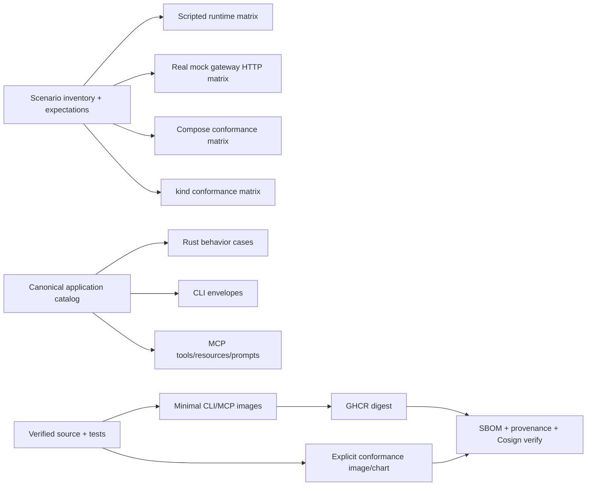

# Complete Templiqx-owned production release and conformance

## Overview

Move Templiqx from a strong pre-CRM3 proof into a releasable, independently verifiable standalone compiler and conformance product. This plan closes every production-readiness gap owned by this repository: release artifact separation and publication, signed supply-chain evidence, complete inventory-driven mock verification, safe package/workspace lifecycle operations, MCP workspace/discovery parity, reproducible document fixtures, production-adapter contract tests, and truthful operational documentation.

Real CRM3 ModelGateway wiring, tenant/auth/retrieval/approval policy, sanitized production data, and final opco acceptance remain host-owned. Completion therefore means **Templiqx-owned release ready**, not “CRM3 is production ready.”

## Problem Frame

The current workspace is healthy and its exact `99e116a` CI run is green, but several evidence gaps invalidate a broad production claim:

- all eight scenarios run in-process, while HTTP, Compose, and kind cover subsets;
- the HTTP conformance runner treats a schema-invalid receipt as success;
- the nominal CLI OCI image also ships MCP and mock/conformance binaries;
- there is no tag-driven release, published digest, external signature, or GitHub release;
- the fresh-clone workflow has not completed a recorded run;
- package signing is a tested local keyed-hash stub, not a coherent operator or release flow;
- the legacy corpus documentation promises fixtures that are not present;
- package/workspace lifecycle and full cross-surface behavior parity remain incomplete;
- README/release metadata lag the actual capability catalog.

The plan preserves the product decisions in the origin requirements: one actor-neutral `TempliqxService`, provider-neutral core, host-owned authority and live runtime, no unsafe legacy execution, and measured compatibility claims only.

## Requirements Trace

- **R1 — Product/conformance separation.** Publishable CLI and MCP images contain only their intended binaries and no mock gateway, HTTP conformance tool, or synthetic package corpus. Mock tooling ships only in an explicitly named conformance image/profile.
- **R2 — Complete mock verification.** Every scenario in `examples/crm3/scenarios/inventory.json` is expectation-aware and verified through the scripted runtime, actual gateway/HTTP transport, Docker Compose, and kind, with payload-free typed receipts.
- **R3 — Transport hardening.** Gateway and HTTP runner reject unknown scenarios, malformed/oversized requests, invalid paths/methods, and incorrect schema/failure expectations deterministically.
- **R4 — Safe lifecycle completeness.** Package metadata update, package deletion, and workspace artifact deletion are CAS-protected, path-confined, dependency-aware, and exposed through Rust, CLI, and MCP.
- **R5 — Agent context and behavior parity.** MCP exposes workspace context/resources and prompt templates; a catalog-derived harness proves behavior, failure, and envelope parity across Rust/CLI/MCP for every canonical operation.
- **R6 — Coherent package trust.** Package identity export, local signing/attachment, verification, tamper rejection, and publication-strict mode use one documented format. OCI keyless signing stays distinct and verifies the pulled digest.
- **R7 — Reproducible document corpus.** A deterministic OOXML fixture builder produces checked-in/snapshotted legacy fixtures and exact expected reports/parity assertions for the claimed V1/V2/V5 surface and hostile archive cases.
- **R8 — Production adapter contracts.** The Langfuse runtime adapter has deterministic loopback coverage for request mapping, structured-output validation, timeout/malformed responses, and best-effort trace failure semantics; live-provider ownership remains outside the default graph.
- **R9 — Verifiable release.** A tag-driven workflow builds tested release artifacts, publishes by digest, emits SBOM/provenance/checksums, signs and verifies artifacts, packages the conformance chart, and creates a GitHub release.
- **R10 — Cold and deploy evidence.** `just verify`, deploy smokes, fresh-clone, and release dry-run/live Actions evidence all pass without environment skips in CI.
- **R11 — Truthful documentation.** LICENSE, SECURITY, release/versioning guidance, capability tables, compatibility claims, and readiness status agree with executable gates.
- **R12 — Boundary preservation.** No provider SDK, mock crate/tool, CRM3 domain policy, tenant/auth/retrieval/approval logic, or production payload enters core/default product composition.

## Scope Boundaries

### In scope

- Standalone CLI/MCP release artifacts and conformance-only artifacts.
- Mock/runtime/gateway behavior and deployment tests using synthetic data.
- Repository-owned filesystem package/workspace semantics.
- Package trust format and operator/release verification.
- Deterministic synthetic DOCX/OOXML generation and measured compatibility.
- CI, fresh-clone, security/release metadata, and evidence capture.

### Explicitly host-owned / out of scope

- Real Basenet ModelGateway adapter and provider credentials.
- Tenant authorization, retrieval, approval/audit persistence, durable workflows, and production promotion policy.
- Sanitized customer fixtures, legal sign-off, and real second-opco acceptance.
- A production HTTP/MCP server, hosted registry, marketplace, or multi-tenant control plane.
- Claims of full Word/ODT/Jinja/Handlebars compatibility.

## Context & Research

### Relevant code and patterns

- `crates/templiqx-application/src/lib.rs` owns the canonical catalog and envelopes.
- `crates/templiqx-ports/src/lib.rs` plus `crates/templiqx-local/src/lib.rs` provide the safe storage/workspace seams.
- `crates/templiqx-conformance/tests/` already establishes exact diagnostics, fingerprints, virtual time, actor boundaries, and cross-surface normalization.
- `examples/crm3/scenarios/inventory.json` is the natural single source for the mock matrix.
- `scripts/check-boundaries.sh` enforces that mocks never enter the default product graph.
- `.github/workflows/ci.yml`, `scripts/docker-smoke.sh`, `scripts/kind-smoke.sh`, and `scripts/supply-chain-smoke.sh` are the existing gate style to extend.

### Institutional learnings

- No `docs/solutions/` knowledge base exists in this repo. The most important local lesson is the conflict between the completed readiness plan and `docs/plans/2026-07-13-deferred-work-log.md`; executable evidence must win over status prose.
- Golden scenario changes remain explicitly review-gated. New inventory coverage must not create a second hard-coded scenario list.
- Synthetic proof must never be described as production validation, and mocks must remain conformance-only even when their verification becomes exhaustive.

### External research decision

No additional external research is required for planning. Docker BuildKit, GHCR, Cosign, Helm/kind, MCP stdio, Rust ports, and conformance patterns are already established locally. Implementation may consult official action/Cosign schemas when writing the release workflow.

## Key Technical Decisions

1. **Inventory drives every mock layer.** Scenario ids, expected outcome kind, diagnostic code, schema-validity, and receipt fingerprint expectations come from one checked-in contract, not shell lists.
2. **Product images and conformance images are different artifacts.** CLI and MCP release images are minimal; the mock gateway, HTTP runner, and synthetic fixtures exist only in an explicitly labeled conformance target.
3. **Destructive operations require CAS.** Package/artifact delete fails on stale fingerprint, symlink escape, dependency use, untracked content, or absent target; no recursive force default exists.
4. **Package update is narrow.** Only package metadata/version changes are allowed, lock/inventory consistency is revalidated, and prior signatures are invalidated.
5. **Package trust and OCI trust are separate.** Templiqx package identity/signature metadata is verified by Templiqx. Release images/charts are signed by Cosign and verified from registry by immutable digest.
6. **Unsigned development remains allowed; publication mode fails closed.** One canonical strict-trust setting is documented and tested.
7. **Release verification pulls what was published.** Local pre-push tags are insufficient evidence. No multi-arch claim is made unless both architectures are built and tested.
8. **DOCX fixtures are generated, not hand-authored.** The generator and expected reports are deterministic; compatibility scope remains corpus-bound.
9. **MCP gets an explicit writable workspace.** Read-only package roots and writable artifact roots are separate in local/container composition and visible through `templiqx://workspace`.
10. **No production-host expansion.** Better Langfuse/stream contract tests do not move model routing, secrets, retry policy, or tracing authority into core/default binaries.

## High-Level Technical Design

> *This illustrates the intended approach and is directional guidance for review, not implementation specification. The implementing agents should treat it as context, not code to reproduce.*

## Implementation Units

- [x] **U1: Establish release truth and artifact separation**

**Goal:** Remove mock/conformance tooling from product images and make intended artifact contents machine-verifiable.

**Requirements:** R1, R12

**Dependencies:** None

**Files:**
- Modify: `Dockerfile`, `.dockerignore`, `deploy/compose.yml`
- Modify: `scripts/docker-smoke.sh`, `scripts/check-boundaries.sh`
- Modify: `charts/templiqx/Chart.yaml`, `charts/templiqx/README.md`
- Test: `scripts/docker-smoke.sh`, `scripts/check-boundaries.sh`

**Approach:** Build minimal CLI and MCP targets, plus a clearly named conformance target containing mock gateway/runner/fixtures. Assert required binaries work and forbidden binaries/files are absent from product images. Correct OCI source/version/revision labels without turning the chart into a production server chart.

**Test scenarios:** CLI and MCP initialization work in minimal images; mock binaries and `/packages` fixtures are absent; conformance image runs the reference matrix; non-root/read-only/cap-drop invariants remain enforced.

**Verification:** Container inspection and smokes prove the artifact split and boundary checks reject regressions.

- [x] **U2: Make the eight-scenario mock matrix expectation-aware**

**Goal:** Test every registered mock scenario correctly through each supported layer.

**Requirements:** R2, R3, R10

**Dependencies:** U1 for final container naming; core Rust work can begin independently.

**Files:**
- Modify: `examples/crm3/scenarios/inventory.json`, `docs/contracts/mock-scenarios-v1alpha1.md`
- Modify: `tools/templiqx-http-conformance/src/main.rs`, `tools/templiqx-mock-gateway/src/main.rs`
- Modify: `crates/templiqx-conformance/tests/http_gateway.rs`, `crates/templiqx-conformance/tests/crm3_failures.rs`
- Modify: `scripts/docker-smoke.sh`, `scripts/kind-smoke.sh`, `deploy/compose.yml`
- Modify: `charts/templiqx/values-mock.yaml`, `charts/templiqx/templates/conformance-job.yaml`
- Create/modify tests under: `tools/templiqx-http-conformance/`, `tools/templiqx-mock-gateway/`, `crates/templiqx-conformance/tests/`
- Modify goldens under: `scripts/golden/` only with explicit golden review evidence

**Approach:** Extend the inventory with explicit expectations or add a versioned expectation companion referenced by it. The runner validates success/failure, diagnostic, schema-validity, and receipt fingerprint instead of accepting any receipt. Docker and kind iterate the same inventory and retain one payload-free receipt/log per case.

**Test scenarios:** All eight happy/failure scenarios; unknown id; bad method/path; malformed/oversized body; missing/duplicate/unlisted manifest; path/symlink escape; concurrent requests; readiness race; timeout/unavailable/gateway-down; strict stream event ordering.

**Verification:** The same scenario count and ids pass in-process, real HTTP, Compose, and kind; intentionally wrong expectations fail.

- [x] **U3: Complete safe package and artifact lifecycle operations**

**Goal:** Close repo-owned CRUD gaps without adding host policy.

**Requirements:** R4, R5, R12

**Dependencies:** None

**Files:**
- Modify: `crates/templiqx-contracts/src/lib.rs`, `crates/templiqx-ports/src/lib.rs`
- Modify: `crates/templiqx-application/src/lib.rs`, `crates/templiqx-local/src/lib.rs`
- Modify: `crates/templiqx-cli/src/main.rs`, `crates/templiqx-mcp/src/lib.rs`
- Test: `crates/templiqx-local/tests/service.rs`, `crates/templiqx-cli/tests/workspace.rs`, `crates/templiqx-mcp/tests/workspace.rs`, `crates/templiqx-conformance/tests/agent_native.rs`

**Approach:** Add narrow package metadata/version update, CAS-safe package deletion, and CAS-safe artifact deletion. Block deletion when dependency locks reference the package or when untracked content would be lost. Reuse confinement/symlink patterns and stable diagnostic envelopes. Invalidate signatures on package mutation.

**Test scenarios:** happy path, stale CAS, missing target, traversal/absolute/backslash/symlink escape, dependent package, untracked content, lock/signature mutation, read-only package root with writable workspace, CLI/MCP/Rust envelope equivalence.

**Verification:** Catalog, ports, service, CLI, and MCP expose identical lifecycle outcomes and boundaries remain green.

- [x] **U4: Finish MCP workspace context and full catalog behavior parity**

**Goal:** Make the agent surface operationally complete and prove all canonical operations across transports.

**Requirements:** R5, R10

**Dependencies:** U3

**Files:**
- Modify: `crates/templiqx-mcp/src/main.rs`, `crates/templiqx-mcp/src/lib.rs`
- Modify: `crates/templiqx-cli/src/main.rs`, `docs/guides/cli.md`, `docs/architecture/capability-map.md`
- Test: `crates/templiqx-mcp/tests/stdio.rs`, `crates/templiqx-mcp/tests/workspace.rs`, `crates/templiqx-conformance/tests/agent_native.rs`
- Modify: `scripts/docker-smoke.sh`

**Approach:** Support an explicit workspace argument/environment setting, expose `templiqx://workspace` and package summaries, add bootstrap/run-eval prompt templates, and state safe defaults in instructions. Build a catalog-derived case matrix that executes every operation through Rust, CLI, and in-memory/stdin MCP, normalizing only documented path differences.

**Test scenarios:** read-only packages plus writable workspace; resources/list/read; prompts/list/get; initialize/catalog/discover/render/list/read/delete; all operation successes and representative CAS/path/schema failures; catalog additions fail CI until behavior cases exist.

**Verification:** Every catalog operation has a behavior case and produces semantically equivalent structured envelopes across all three surfaces.

- [x] **U5: Reconcile package trust and add an operator round trip**

**Goal:** Turn the tested signature stub into a coherent, usable package publication gate.

**Requirements:** R6, R9, R10

**Dependencies:** U3 package mutation semantics

**Files:**
- Modify: `crates/templiqx-contracts/src/lib.rs`, `crates/templiqx-application/src/lib.rs`
- Modify: `crates/templiqx-cli/src/main.rs`, optionally `crates/templiqx-mcp/src/lib.rs` only for actor-neutral package operations
- Modify: `docs/architecture/adr-package-trust.md`, `docs/guides/host-integration.md`
- Test: `crates/templiqx-application/tests/package_signing.rs`, CLI/MCP conformance tests
- Create/modify: a package trust smoke under `scripts/`

**Approach:** Define canonical identity export and detached signature attachment/verification semantics. Retain the current development algorithm only if it is honestly labeled and suitable; keep Sigstore/Cosign release bundles separate. Publication-strict mode fails closed while default local validation remains backward compatible.

**Test scenarios:** valid, wrong key, tampered bytes, missing/added/reordered inventory, malformed/duplicate/unsupported signature, lock/version mutation, signature replay across package/version, unsigned dev vs strict publication.

**Verification:** A local operator can export identity, sign/attach, validate, and observe tamper rejection; CI exercises the same flow and never describes keyed SHA as a Cosign signature.

- [x] **U6: Build a deterministic legacy DOCX corpus**

**Goal:** Replace stale compatibility claims with generated, measurable evidence.

**Requirements:** R7, R11

**Dependencies:** None

**Files:**
- Create: deterministic fixture builder under `tools/` or `scripts/`
- Modify/create: `examples/legacy-corpus/fixtures/**`, `examples/legacy-corpus/README.md`
- Modify/test: `adapters/templiqx-docx-v5/src/lib.rs`, `adapters/templiqx-docx-v5/README.md`, `crates/templiqx-conformance/tests/crm3.rs`

**Approach:** Generate valid minimal OOXML ZIPs with stable bytes and explicit expected migration reports. Cover nested tables, headers/footers, aliases/collisions, missing fields, V1 BeanShell detection, V2 unsupported markers, corrupt/oversized/traversal archives, and canonical OOXML parity where supported.

**Test scenarios:** regenerate-without-diff; exact report equality; supported render parity; unsafe/unsupported fail closed; archive limit/traversal enforcement; no arbitrary legacy execution.

**Verification:** Every documented fixture exists, is generator-reproducible, and has a directly asserted report/parity result.

- [x] **U7: Harden production-adapter and stream contract tests**

**Goal:** Prove host-adapter behavior that can be verified locally without claiming live-provider readiness.

**Requirements:** R8, R12

**Dependencies:** U2 expectation semantics for shared receipts

**Files:**
- Modify/test: `adapters/templiqx-runtime-langfuse/src/lib.rs`, `adapters/templiqx-runtime-langfuse/src/tests.rs`
- Modify/test: `crates/templiqx-conformance/tests/streaming.rs`
- Modify: `docs/architecture/observability.md`, `docs/architecture/adr-streaming-runtime-port.md`

**Approach:** Use a deterministic loopback server to assert request shape, output schema validation, timeout/malformed response mapping, trace failure non-fatality, credential redaction, and terminal streaming fallback. Implement live SSE only if it can remain provider-neutral and fully testable; otherwise retain the documented port boundary.

**Test scenarios:** success, 429/Retry-After edges, 5xx, timeout, malformed/oversized response, trace endpoint failure, secret-free diagnostics, every stream event variant and invalid ordering, streaming/non-streaming fingerprint parity.

**Verification:** Adapter tests make no external calls, all sensitive output remains redacted, and default graph boundaries still pass.

- [x] **U8: Publish and verify signed release artifacts**

**Goal:** Add a tag-driven release pipeline with immutable, externally verifiable artifacts.

**Requirements:** R1, R6, R9, R10

**Dependencies:** U1, U2, U4, U5, U6, U7

**Files:**
- Create: `.github/workflows/release.yml`
- Modify: `.github/workflows/ci.yml`, `.github/workflows/fresh-clone.yml`
- Modify/create: release/supply-chain scripts under `scripts/`
- Modify: `Dockerfile`, `charts/templiqx/Chart.yaml`, `Cargo.toml`

**Approach:** On a validated version tag, run all gates, build the declared platform matrix, publish minimal CLI/MCP and explicit conformance images to GHCR, record digests, generate SBOM/provenance/checksums, Cosign-sign and verify pulled digests, package/sign the Helm chart or attach it with checksums, and create a GitHub release. Pin actions/tools and verify downloaded tool checksums where practical.

**Test scenarios:** version/tag mismatch, dirty/generated drift, missing OIDC permission, signature verification failure, digest/tag mismatch, artifact checksum failure, unsigned package in publication mode, architecture claim mismatch.

**Verification:** A release workflow dry run validates configuration; a real candidate tag or dedicated workflow path produces pullable digest-addressed artifacts whose signatures and checksums verify externally.

- [x] **U9: Close cold-start, security, documentation, and release evidence**

**Goal:** Produce truthful final readiness evidence and remove stale claims.

**Requirements:** R10, R11, R12

**Dependencies:** U1–U8

**Files:**
- Create: `LICENSE`, `SECURITY.md`, `CHANGELOG.md` or release guidance as appropriate
- Modify: `README.md`, `docs/README.md`, `docs/guides/pre-crm3-readiness.md`, `docs/guides/host-integration.md`, `docs/architecture/deployment.md`
- Modify: `docs/audits/2026-07-13-agent-native-architecture-review-v2.md`, `docs/plans/2026-07-13-deferred-work-log.md`
- Modify: `justfile`, CI/release evidence docs if needed

**Approach:** Align versions, license, reporting policy, capability catalog, artifact names, trust model, compatibility corpus, and readiness language. Dispatch and verify fresh-clone plus final CI/release workflows. Record URLs/digests without turning time-sensitive status into architecture truth.

**Test scenarios:** docs/catalog drift check, license/security presence, no stale 9/20 table, no mock-as-production wording, no unsupported compatibility or multi-arch claim, no skipped CI deploy gate.

**Verification:** Local/full deploy gates pass; fresh-clone and final CI/release evidence are green; documentation distinguishes Templiqx-owned release readiness from CRM3 host readiness.

### Closeout evidence — 2026-07-13

- Local repository gates passed: `just verify`, `just verify-deploy`, `qlty fmt`, and `qlty check --fix --level=low`. Compose and kind each exercised all 8 inventory scenarios; the supply-chain scan found 0 vulnerabilities.
- The mutable Rust/CLI/MCP parity test passed 10 consecutive concurrent full-test iterations after package-local scratch directories were excluded from fixture copies. The canonical catalog remains 26/26 behavior-covered and the agent-native audit remains 94/100.
- Final PR CI is green across boundaries, qlty, Rust, Docker, Helm/kind, and supply-chain: <https://github.com/RyanLisse/templiqx/actions/runs/29260040887>.
- The release dry-run source, version, test, and boundary gate is green: <https://github.com/RyanLisse/templiqx/actions/runs/29260042334/job/86850531785>. Its three downstream image jobs were prevented from starting by GitHub's account billing/spending limit, before checkout or build execution; local multi-artifact/deploy evidence remains green and the workflow can be re-run unchanged after that external limit is cleared.
- At the owner's request, the manual fresh-clone rerun was cancelled to avoid duplicating the already-green gates. The pinned weekly `fresh-clone` schedule remains the recurring cold-start proof; its missing Syft/Grype bootstrap found during this closeout is fixed in the workflow.
- Scope remains explicit: this closes Templiqx-owned standalone release and synthetic-conformance readiness. Real CRM3 ModelGateway wiring, tenant/auth/retrieval/approval/audit policy, customer-data acceptance, and the production host/control plane remain host-owned.

## System-Wide Impact

- **Interaction graph:** lifecycle additions flow from ports → application catalog → local adapter → CLI/MCP; release separation affects Docker, Compose, chart, and scripts together.
- **Error propagation:** all product failures remain stable structured diagnostics; transport/process failures remain nonzero operational errors. Expected mock failures must not be converted into a successful product receipt.
- **State lifecycle risks:** package/artifact mutation can lose data or invalidate trust. CAS, dependency checks, untracked-content checks, and signature invalidation are mandatory.
- **API surface parity:** every new lifecycle capability lands atomically across Rust/CLI/MCP and in the catalog-derived behavior harness.
- **Integration coverage:** unit tests alone cannot prove artifact contents, read-only mounts, real HTTP framing, network policy, registry signature verification, or cold-clone reproducibility; deployment/Actions evidence is required.

## Phased Delivery

1. **Foundation:** U1 artifact split and U2 mock expectation matrix.
2. **Parallel core lanes:** U3/U4 lifecycle and parity; U5 trust; U6 corpus; U7 adapter contracts.
3. **Release integration:** U8 publication/signatures after all product semantics stabilize.
4. **Evidence and truth:** U9 full verification, fresh-clone/release Actions, docs and audit closeout.

## Risks & Mitigations

- **Release credentials/OIDC only work in Actions:** implement locally testable validation and require a real Actions run before completion.
- **All-scenario kind runs increase CI duration:** derive the matrix from inventory, retain deterministic virtual time, set explicit Job deadlines, and upload per-scenario logs.
- **Destructive CRUD expands blast radius:** fail closed, require CAS, prohibit force-by-default, and test symlink/dependency/untracked-content cases.
- **Package trust formats can become bespoke:** keep canonical package identity stable and separate it from standard OCI/Sigstore verification.
- **Binary DOCX fixtures can drift opaquely:** generate them deterministically and make regeneration/no-diff a gate.
- **Release workflow could overclaim multi-arch support:** publish only architectures actually built and tested.
- **Scope could leak into CRM3 host ownership:** boundary checks and docs explicitly forbid auth/tenant/retrieval/approval/model-routing logic in this repo.

## Open Questions

### Resolved during planning

- **What does production-ready mean here?** Templiqx-owned compiler/release/conformance readiness, not live CRM3 production.
- **Should every mock run at every layer?** Yes, all eight registered scenarios run through HTTP/Compose/kind; protocol-pathology cases stay at unit/integration level where sufficient.
- **Should delete be idempotent or forced?** Missing/stale/destructive ambiguity fails explicitly; no blind force default.
- **Should mocks ship with product images?** No; only an explicit conformance artifact may contain them.
- **How are release signatures verified?** By immutable pulled digest for OCI; package signatures use the Templiqx package identity contract.

### Deferred to implementation

- Exact MCP prompt API types supported by the pinned `rmcp` version.
- Whether release publication initially covers one or two tested Linux architectures.
- Whether the current keyed package signature remains as a development algorithm or is renamed/deprecated behind a verifier abstraction.
- Whether provider-neutral SSE can be implemented without coupling; if not, only the port/fallback contract is verified here.

## Success Metrics

- 8/8 inventory scenarios pass through scripted, real HTTP, Compose, and kind matrices with correct expected outcomes.
- 100% of `CAPABILITY_CATALOG` operations have Rust/CLI/MCP behavior cases.
- Product CLI/MCP images contain zero mock/conformance binaries or synthetic packages.
- Package identity/sign/verify/tamper and publication-strict cases pass locally and in CI.
- Published release digests, signatures, SBOM, provenance, chart/binary checksums verify after pull/download.
- Fresh-clone, `just verify`, deploy smokes, final CI, and release workflow complete without CI skips.
- DOCX corpus claims map one-to-one to generated fixtures and assertions.
- Boundary checks prove mocks/provider/CRM3 host policy remain outside core/default product composition.

## Documentation and Operational Notes

- Preserve `openwiki/` as generated output; update source docs and let OpenWiki refresh later.
- Golden scenario/receipt changes require the repository’s explicit golden review marker.
- Store workflow URLs and release digests in closeout evidence, but keep architecture docs independent of one run.
- The final release notes must state that production host wiring and real customer-data validation remain outstanding outside this repository.

## Sources & References

- Origin requirements: `docs/brainstorms/2026-07-11-templiqx-ai-native-template-engine-poc-requirements.md`
- Gap analysis: `docs/brainstorms/2026-07-12-templiqx-best-in-class-template-engine-gap-analysis.md`
- Prior readiness plan: `docs/plans/2026-07-12-templiqx-production-readiness-without-crm3.md`
- Deferred evidence: `docs/plans/2026-07-13-deferred-work-log.md`
- Agent-native audit: `docs/audits/2026-07-13-agent-native-architecture-review-v2.md`
- Host boundary: `docs/guides/host-integration.md`
- Release/deployment patterns: `.github/workflows/ci.yml`, `Dockerfile`, `scripts/supply-chain-smoke.sh`
