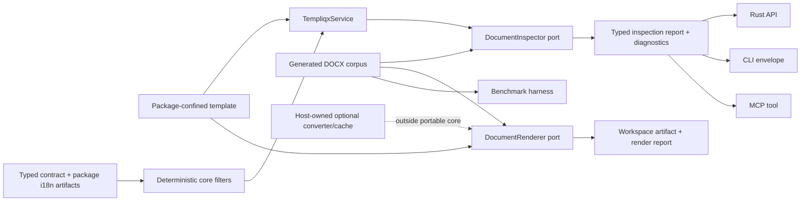

# Stage safe document-template capabilities

## Overview

Advance Templiqx's document-template surface without turning it into an
executable general-purpose template engine. The first delivery wave makes the
existing DOCX V5 adapter inspectable on every actor surface, expands only
fixture-proven DOCX constructs, establishes a performance/security baseline,
and adds portable deterministic formatting and package translation bundles.

PDF conversion, compiled-artifact caching, editor integrations, named layouts,
legacy Handlebars/Carbone importers, and a Rust authoring facade remain
intentional follow-on work. They have concrete entry criteria here so they do
not become unbounded backlog items or silently broaden the portable core.

## Problem Frame

Templiqx already provides a portable, typed AI-contract compiler with bounded
content nodes, fixed deterministic filters, package composition, a measured
DOCX V5 compatibility slice, and actor-neutral Rust/CLI/MCP operations. It
does not yet expose the DOCX adapter's read-only analysis through that common
surface, cannot give document authors a preflight report before rendering, and
has no benchmark evidence to justify caching or broader render optimization.

The research direction is to adopt the useful properties of document and
template systems—native-document inspection, measured rendering, compiler
diagnostics, deterministic formatting, and evidence-based performance—without
adopting arbitrary helpers, embedded JavaScript/Rust, dynamic partial lookup,
or host-owned converter operations. This preserves the origin document's
portable, declarative and non-executable contract model (see origin:
`docs/brainstorms/2026-07-11-templiqx-ai-native-template-engine-poc-requirements.md`).

## Requirements Trace

- **D1 — Document preflight parity:** A package-confined document template can
  be inspected without mutation through Rust, CLI, and MCP, with equivalent
  typed results and stable diagnostics.
- **D2 — Measured DOCX growth:** New DOCX behavior is supported only when a
  deterministic fixture, expected analysis/render report, and normalized OOXML
  parity assertion define the claim.
- **D3 — Evidence before optimization:** Compile and document-render baselines
  cover latency, allocation/peak memory where practical, output size,
  determinism, and hostile input limits before a cache is designed.
- **D4 — Safe portable formatting and translation:** New formatting and i18n
  features are typed, deterministic, package-versioned, fail-closed on unknown
  keys/types, and do not execute host code.
- **D5 — Boundary preservation:** Converter processes, retry/queue policy,
  tenant translation policy, provider SDKs, credentials, approval, and durable
  caches remain outside `templiqx-core` and default local composition.
- **D6 — Actor and evidence parity:** New product operations retain the
  canonical `TempliqxService` route, structured envelopes, stable diagnostics,
  fingerprints, package/workspace confinement, and CRM3 conformance coverage.

These advance origin R1, R3–R5, R11–R18 and R20–R25, while preserving R28–R30
for the CRM3 document scenario.

## Scope Boundaries

### In scope for this plan

- A typed, non-mutating `DocumentInspector` port and `inspect_document`
  capability, initially backed by the existing DOCX V5 analysis primitive.
- Fixture-first expansion of the DOCX V5 subset, beginning only with constructs
  that can be represented and asserted safely in OOXML.
- A checked-in benchmark harness and corpus for contract compile/render and
  document inspect/render behavior.
- Additive deterministic formatter and package translation-bundle design and
  implementation.
- ADRs and explicit decision gates for the later capability wave.

### Explicitly out of scope

- Any arbitrary JavaScript, Rust, shell, BeanShell, Handlebars helper,
  decorator, prototype traversal, or dynamic template execution.
- A generic template-language syntax, unbounded inheritance, visual editor,
  hosted registry, agent/workflow orchestrator, or core-owned converter daemon.
- Full DOCX/ODT/XLSX/PPTX compatibility, pixel-perfect rendering, or a claim
  that all Office files are supported.
- A default CLI/MCP PDF renderer, tenant translation policy, provider/runtime
  integration, or host authorization/approval wiring.

## Context & Research

### Relevant code and patterns

- `adapters/templiqx-docx-v5/src/lib.rs` already has
  `DocxV5Adapter::analyze`, `compare_normalized`, archive limits, atomic output
  writes, and typed compatibility/render reports. The method is presently an
  adapter-only primitive, not an application capability.
- `crates/templiqx-ports/src/lib.rs` keeps `LegacyImportAdapter` and
  `DocumentRenderer` host-facing; a new inspection seam should follow this
  separation rather than adding document I/O to core.
- `crates/templiqx-application/src/lib.rs` is the only canonical capability
  catalog and owns package/workspace confinement before invoking an adapter.
- `crates/templiqx-cli/src/main.rs`, `crates/templiqx-mcp/src/lib.rs`, and
  `docs/architecture/capability-map.md` are the established parity surfaces.
- `crates/templiqx-core/src/lib.rs` implements the existing fixed filters;
  `crates/templiqx-core/tests/filters.rs` is the direct pattern for deterministic
  locale-sensitive behavior.
- `examples/legacy-corpus/` and
  `tools/templiqx-legacy-docx-fixtures/` are the fixture-generation and claim
  boundary for DOCX V5. `crates/templiqx-conformance/tests/crm3.rs` proves the
  migration-to-render CRM3 flow.
- `adapters/templiqx-html-plain/` plus
  `crates/templiqx-conformance/tests/html_render.rs` show how an optional
  document adapter remains outside default composition.

### Institutional learnings

- The completed template-engine parity plan already delivered includes,
  dependencies, tool references, streaming, `format_date`/`format_number`, a
  minimal HTML adapter, and basic explain hints. This plan is additive, not a
  reimplementation of those units.
- The synthetic DOCX corpus is deliberately a measured compatibility surface;
  executable evidence and fixtures outrank broad status claims.
- ODT is detect-only by accepted ADR. Any future format support must be
  adapter-owned and corpus-backed.

### External references

- [Carbone README](https://github.com/carboneio/carbone/blob/1df45b5e8826b0eacb26cb6197e831a5a8357a64/README.md)
  informs document-template preflight, repeat/conditional reporting, and
  converter operational boundaries; its code/license is not adopted.
- [Handlebars partials](https://handlebarsjs.com/guide/partials.html) and
  [runtime options](https://handlebarsjs.com/api-reference/runtime-options.html)
  inform composition and fail-closed extension constraints, not a compatibility
  target.
- [Maud](https://maud.lambda.xyz/) and
  [Sailfish](https://rust-sailfish.github.io/sailfish/) inform escaped-by-default
  output, compiler diagnostics, and benchmark discipline only.

## Key Technical Decisions

1. **Inspection is a separate host-facing port.** `DocumentRenderer` continues
   to model a mutation that produces an artifact. A `DocumentInspector` returns
   a typed, read-only report; it must not be simulated by rendering into a temp
   workspace.
2. **The application resolves paths; adapters inspect bytes/files.** The
   service retains package confinement and envelope semantics, while adapters
   own format-specific analysis. Adapter-reported support/capability facts are
   data, never an excuse for core machine probing.
3. **HTTP remains a transport, not a fourth actor model.** When a canonical
   operation is exposed by `templiqx-http`, it receives the same typed request,
   envelope and route coverage as the other transports. Rust/CLI/MCP remain the
   required actor-parity proof from the origin document.
4. **DOCX capability claims are fixture IDs, not broad feature labels.** Each
   supported construct gets a corpus fixture and expected report before docs
   call it supported. Repeated table rows and conditional regions are separate
   feasibility gates; images, page breaks, charts, and barcodes do not inherit
   support automatically.
5. **Format-aware escaping stays with render adapters.** HTML, OOXML/XML, CSV,
   Markdown, and prompt text have different safety rules. The portable core
   cannot correctly apply one global escaping policy.
6. **Built-ins and static package artifacts only.** Formatter additions and
   translation bundles resolve through typed, versioned package data and
   deterministic core functions. No runtime helper registry or host-code
   callback is admitted to canonical contracts.
7. **Benchmark first, cache second.** A cache is only planned after a baseline
   identifies a material bottleneck. If justified, it is a host/store-backed
   artifact keyed by relevant fingerprints, not mutable core state.
8. **PDF conversion remains a later optional adapter.** It requires a dedicated
   ADR, converter identity/environment reporting, controlled subprocess tests,
   and a corpus. Its queue, retry, quota and process-isolation policy are host
   concerns.

## Open Questions

### Resolved During Planning

- **Should preflight be a DOCX-only special command?** No. It is a generic
  adapter port and actor-neutral capability, initially implemented by DOCX V5.
  This keeps future renderer types additive without putting document syntax in
  `templiqx-core`.
- **Should this add a generic helper/filter plugin system?** No. The existing
  fixed filter model is extended only with declared deterministic semantics.
- **Should caching be implemented with this first wave?** No. Baseline evidence
  is a prerequisite, because the current compile path is stateless and has no
  cache port or measured bottleneck.

### Deferred to Implementation

- **Exact first DOCX constructs:** Confirm repeated table rows and conditional
  regions can be represented without a hidden executable language. If either
  cannot, record it as unsupported and advance the next fixture candidate.
- **Formatter names and translation reference syntax:** Final names must follow
  the current strict YAML/schema conventions and be validated against the
  bounded schema model during implementation.
- **Benchmark framework and thresholds:** Select the smallest Rust-compatible
  harness after confirming workspace toolchain compatibility; CI thresholds
  should be set from recorded baselines rather than guessed in this plan.

## High-Level Technical Design

> *This illustrates the intended approach and is directional guidance for
> review, not implementation specification. The implementing agent should
> treat it as context, not code to reproduce.*

## Implementation Units

- [ ] **Unit 1: Add actor-neutral document inspection**

**Goal:** Expose safe, non-mutating document-template preflight through the
same canonical service, CLI, and MCP catalog that already serves render and
migration operations.

**Requirements:** D1, D5, D6; origin R11–R15 and R20–R25.

**Dependencies:** None.

**Files:**
- Modify: `crates/templiqx-ports/src/lib.rs`
- Modify: `crates/templiqx-application/src/lib.rs`
- Modify: `crates/templiqx-local/src/lib.rs`
- Modify: `crates/templiqx-cli/src/main.rs`
- Modify: `crates/templiqx-mcp/src/lib.rs`
- Modify: `crates/templiqx-http/src/lib.rs`
- Modify: `docs/architecture/capability-map.md`
- Create: `docs/contracts/document-inspection-v1alpha1.md`
- Modify: `adapters/templiqx-docx-v5/src/lib.rs`
- Test: `crates/templiqx-local/tests/service.rs`
- Create test: `crates/templiqx-application/tests/document_inspection.rs`
- Test: `crates/templiqx-cli/tests/workspace.rs`
- Test: `crates/templiqx-mcp/tests/workspace.rs`
- Modify test: `crates/templiqx-http/tests/http_routes.rs`
- Create test: `crates/templiqx-conformance/tests/document_inspection.rs`

**Approach:** Define portable inspection request/result/report contracts and a
separate `DocumentInspector` port. The service resolves the package-relative
template path, calls the inspector, preserves stable port diagnostics, and
returns an envelope without a workspace lease or artifact write. Adapt the
existing DOCX V5 analysis result rather than duplicating XML inspection. Add
`inspect_document` to the canonical catalog and map the same request/result
shape through CLI, MCP, and the existing HTTP operations/routes layer. HTTP
coverage proves transport mapping only; the Rust/CLI/MCP conformance case is
the actor-parity proof.

**Patterns to follow:** `migrate_legacy` and `render_document` in
`crates/templiqx-application/src/lib.rs`; workspace/path rejection coverage in
the local, CLI, MCP, and CRM3 tests; `DocxV5Adapter::analyze` for format logic.

**Test scenarios:** supported V5 fields and merge fields; unresolved values or
unsupported constructs reported without a write; missing template; absolute,
traversal, backslash and symlink paths; malformed/oversized archive; unknown
adapter capability; direct application no-write/port-error envelope behavior;
normalized Rust/CLI/MCP success and failure envelopes; HTTP request/response
and route registration for the same typed envelope.

**Verification:** The operation appears in the catalog/capability map and all
three actor surfaces return the same typed report/diagnostic semantics without
creating a workspace artifact, and the HTTP transport maps the registered
operation without inventing different semantics.

- [ ] **Unit 2: Grow the DOCX V5 subset through fixture gates**

**Goal:** Add the first high-value document constructs only when their
inspection, rendering and normalized OOXML parity can be specified precisely.

**Requirements:** D1, D2, D5, D6; origin R20–R25 and R28–R30.

**Dependencies:** Unit 1 for user-visible preflight; existing corpus generator
and adapter tests remain the baseline.

**Files:**
- Modify: `adapters/templiqx-docx-v5/src/lib.rs`
- Modify: `adapters/templiqx-docx-v5/README.md`
- Modify: `tools/templiqx-legacy-docx-fixtures/src/main.rs`
- Create/modify: `examples/legacy-corpus/fixtures/**`
- Modify: `examples/legacy-corpus/README.md`
- Modify: `crates/templiqx-conformance/tests/crm3.rs`
- Create/modify test: `crates/templiqx-conformance/tests/document_inspection.rs`

**Approach:** Establish a construct rubric in the corpus README, then add
fixtures one construct at a time. Start with repeated table rows and
conditional document regions only if each has a bounded declarative data shape
and expected analysis/render behavior. Keep images, page breaks, charts and
barcodes out of the claimed subset until separate fixtures prove them. Preserve
archive limits, non-story-part byte preservation, unresolved-reference
reporting, atomic writes and no-execution migration behavior.

**Execution note:** Start with characterization fixtures and expected reports
before modifying the OOXML analyzer or renderer.

**Patterns to follow:** existing `v5-nested-table`, `v5-header-footer`, and
alias/missing-data fixtures; `compare_normalized`; hostile archive fixtures.

**Test scenarios:** each supported construct with complete and missing data;
unsupported representation reported instead of approximated silently; split
runs; headers/footers and nested tables remain unchanged; deterministic fixture
regeneration; normalized output parity; unsafe/oversized/traversal archives
continue to fail closed.

**Verification:** Every newly documented construct maps to a fixture ID,
expected report and parity assertion. The CRM3 document scenario stays green
with unchanged evidence/fingerprint semantics.

- [ ] **Unit 3: Establish a compiler and document benchmark baseline**

**Goal:** Record reproducible performance and safety evidence before deciding
whether compiled-artifact caching or render-level optimization is warranted.

**Requirements:** D3, D5, D6; origin R5, R14 and R18.

**Dependencies:** Unit 2 supplies a representative expanded fixture corpus;
the harness may start with the existing corpus while that unit progresses.

**Files:**
- Create: `tools/templiqx-bench/Cargo.toml`
- Create: `tools/templiqx-bench/src/main.rs`
- Create: `tools/templiqx-bench/README.md`
- Create: `tools/templiqx-bench/fixtures/**`
- Modify: root `Cargo.toml`
- Modify: `docs/guides/pre-crm3-readiness.md`
- Modify: `docs/architecture/capability-map.md` only if a benchmark artifact is
  intentionally surfaced; otherwise keep it tooling-only
- Test: `tools/templiqx-bench/src/main.rs` unit tests and fixture integrity
  checks

**Approach:** Build a deterministic, local-only harness around representative
contract validation/compile/render and document inspect/render paths. Capture
machine-readable samples for cold/warm operation latency, output size,
repeatability, and bounded large-input behavior. Keep benchmark data out of
package identity and production receipts. Use hostile archive fixtures to
record rejection cost without treating successful rendering as a security test.

**Patterns to follow:** the deterministic fixture generator under
`tools/templiqx-legacy-docx-fixtures`; `just verify` documentation posture;
the contract and adapter test corpus.

**Test scenarios:** stable fixture discovery; repeated deterministic runs have
the same functional fingerprints; malformed/oversized inputs terminate with
the expected error class; benchmark report schema remains backward compatible;
missing fixture fails loudly.

**Verification:** A documented local benchmark produces a versioned,
machine-readable baseline without requiring network access, production
credentials, or cache state.

- [ ] **Unit 4: Add deterministic formatter extensions and translation bundles**

**Goal:** Make common document/prompt formatting and reusable translations
portable without admitting a dynamic helper runtime.

**Requirements:** D4, D5, D6; origin R1–R5, R16–R19 and R23.

**Dependencies:** Unit 3 provides a baseline for any performance-sensitive
formatter work; it does not block contract/schema design.

**Files:**
- Modify: `crates/templiqx-contracts/src/lib.rs`
- Modify: `crates/templiqx-core/src/lib.rs`
- Modify: `crates/templiqx-application/src/lib.rs`
- Modify: `crates/templiqx-local/src/lib.rs`
- Modify: `docs/contracts/v1alpha1.md`
- Create: `docs/contracts/package-translations-v1alpha1.md`
- Modify: `examples/packages/demo/templiqx.yaml`
- Create/modify: `examples/packages/demo/translations/**`
- Modify: `crates/templiqx-core/tests/filters.rs`
- Modify: `crates/templiqx-application/tests/package_dependencies.rs`
- Modify: `crates/templiqx-conformance/tests/portability.rs`

**Approach:** Extend the closed `Filter`/typed-expression model with a small
allowlisted set whose input/output types and locale/timezone behavior are
specified in the portable format. Add static package translation artifacts that
are manifest-listed, included in package identity, resolved deterministically
from explicit locale/fallback inputs, and produce stable missing-key/type
diagnostics. Keep tenant selection, external localization services and
translation editing policy host-owned.

**Patterns to follow:** `Filter`, `apply_filter`, `format_date`, and
`format_number` in the core; manifest/lock/identity validation in the
application/local store; existing filter and portability tests.

**Test scenarios:** valid currency/rounding/date/array/string operations;
wrong input type and unknown formatter; locale fallback and explicitly missing
translation key; malformed/unlisted translation artifact; translation content
changes package identity; two identical packages resolve identical output;
cross-surface validation/compile parity.

**Verification:** All added behavior is deterministic, schema-validated and
content-addressed. No package can supply executable formatter code, and no
host policy value is serialized into the portable package.

- [ ] **Unit 5: Record evidence gates for the optional next capability wave**

**Goal:** Turn the remaining researched opportunities into explicit, reviewable
entry criteria rather than implicitly expanding scope after the first wave.

**Requirements:** D2, D3, D5; origin R1, R4, R5, R16–R18 and R20–R25.

**Dependencies:** Units 1–4 provide the inspection, fixture and benchmark
evidence that these decisions require.

**Files:**
- Create: `docs/adr/document-conversion.md`
- Create: `docs/adr/compiled-artifact-cache.md`
- Create: `docs/adr/legacy-template-import.md`
- Modify: `docs/adr/overview.md`
- Modify: `docs/plans/2026-07-13-deferred-work-log.md`
- Modify: `docs/guides/host-integration.md`

**Approach:** Record separate decisions for: (a) a host-constructed PDF
conversion adapter with converter/font/environment identity and controlled
subprocess test requirements; (b) a cache only if Unit 3 identifies a material
bottleneck, keyed by package/contract/input/context/capability/compiler
fingerprints and stored outside core; and (c) safe-subset legacy imports that
classify helpers, decorators, dynamic partials and executable behavior as
unsupported. Document named slots/layouts, a YAML-aware LSP, and a Rust
authoring facade as subsequent proposals with prerequisites, not as hidden
extensions to the current syntax.

**Patterns to follow:** `docs/adr/odt-compatibility.md` for measured
format-support decisions; the optional HTML adapter for host-constructed
renderers; `LegacyImportAdapter` for explicit dialect selection and reports.

**Verification:** Each deferred capability has an owner boundary, entry
criterion, fixture/benchmark/ADR prerequisite, and an honest public status.
No new optional adapter, cache, syntax or migration dialect is claimed as
implemented by this unit.

## System-Wide Impact

- **Interaction graph:** `inspect_document` adds a catalog operation and must
  travel through the same application → CLI/MCP mapping as existing operations;
  render and migrate semantics must not be forked.
- **Error propagation:** Adapter errors become stable operation diagnostics;
  unsupported document constructs are reportable results, while confinement,
  malformed archive and invalid data failures remain explicit errors.
- **State lifecycle risks:** Inspection has no artifact write. Rendering retains
  workspace leases and atomic adapter writes. Package translation artifacts
  affect identity and must participate in CAS/signature invalidation rules.
- **API surface parity:** Rust, CLI and MCP require equivalent request/result
  schemas, catalog registration, instructions and conformance cases.
- **Integration coverage:** CRM3 migration → render → normalized parity stays
  the end-to-end document proof; adapter unit tests alone are insufficient.

## Risks & Dependencies

- **OOXML semantics:** Word structures can split markers across runs and place
  repetitions/conditions in structurally complex regions. Mitigate with one
  fixture gate per construct and fail-closed unsupported reporting.
- **Over-broad portability claim:** New Office formats or PDF conversion could
  be mistaken for generic compatibility. Mitigate with adapter-specific docs,
  converter identity in reports, and no claims beyond fixtures.
- **Performance noise:** Benchmark numbers vary by machine. Preserve raw
  metadata, use trends/budgets only after repeatable local baselines, and avoid
  correctness decisions based on a single run.
- **Translation identity drift:** Missing manifest inventory could let text
  change without changing package identity. Require manifest listing and
  identity coverage before exposing bundles.
- **License/implementation contamination:** Carbone is research inspiration,
  not a code dependency. Reimplement only independently reviewed ideas.

## Phased Delivery

### Phase 1 — Inspect and prove

Complete Units 1–2. The release claim is a wider, still-measured DOCX V5
inspection/render surface, not a general Office engine.

### Phase 2 — Measure and make portable

Complete Units 3–4. The release claim is a reproducible baseline plus safe
formatting/translation artifacts; caching is still not implied.

### Phase 3 — Decide optional extensions

Complete Unit 5. Begin a separate implementation plan only when its ADR entry
criteria are satisfied for PDF conversion, caching, editor protocol, layouts,
legacy import, or Rust authoring.

## Documentation / Operational Notes

- Keep `docs/contracts/v1alpha1.md`, the capability map, CLI guide, adapter
README and legacy corpus matrix synchronized with executable behavior.
- Report converter availability/version/font details only from a future adapter;
  the portable core must not inspect host installations.
- Run the repository's normal verification gates during execution, including
  boundary validation. This plan intentionally does not prescribe command
  choreography.
- Do not use synthetic conformance or optional adapter tests as proof of a real
  CRM3 host integration.

## Sources & References

- **Origin:** `docs/brainstorms/2026-07-11-templiqx-ai-native-template-engine-poc-requirements.md`
- **Completed precedent:** `docs/plans/2026-07-12-001-feat-template-engine-parity-plan.md`
- **Current deferred/host boundary:** `docs/plans/2026-07-13-deferred-work-log.md`
- **DOCX scope decision:** `docs/adr/odt-compatibility.md`
- **External research:** [Carbone](https://github.com/carboneio/carbone/blob/1df45b5e8826b0eacb26cb6197e831a5a8357a64/README.md), [Handlebars](https://handlebarsjs.com/guide/), [Maud](https://maud.lambda.xyz/), [Sailfish](https://rust-sailfish.github.io/sailfish/)
