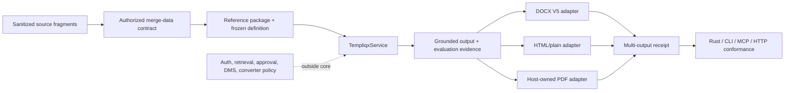

# Prove cross-opco document breadth

## Overview

Build three package-driven reference proofs around one shared Templiqx contract
model: Legal/Basenet, regulated advice, and Simplicate-style project-to-invoice
workflow. Extend the Legal proof to a bounded DOCX floor and a host-owned,
reproducible PDF route without turning the portable core into a general-purpose
template engine.

## Problem Frame

Templiqx already proves typed AI interactions, evidence grounding, deterministic
contracts, package evaluation, and a measured DOCX V5 slice. The current proof
does not yet establish that one contract/data model can serve the document and
communication families visible in Basenet and other Blinqx products.

Basenet's legacy reporting surface is broader than the safe CRM3 merge engine,
while the new product direction explicitly rejects reflective query-anything
and arbitrary template code. The plan therefore treats rich document behavior
as fixture-gated adapter capability and treats authorization, retrieval, DMS,
approval, and delivery as host-owned seams (see origin:
`docs/brainstorms/2026-07-15-templiqx-cross-opco-breadth-requirements.md`).

## Requirements Trace

### Reference packages and contract portability

- R1. The repository contains three sanitized, manifest-valid reference
  packages: Legal/Basenet, regulated advice (Finly/Finteqx-shaped), and
  Simplicate-shaped project-to-invoice workflow.
- R2. Each package uses the canonical service and existing package operations
  for discovery, validation, compilation, execution, evaluation, and at least
  one document or communication output. Across the three packages, the
  channel matrix covers safe HTML/plain email, memo, SMS, report, invoice,
  DOCX, and PDF using the same approved merge-data semantics.
- R3. Package fixtures keep source fragments, approved facts, merge data,
  output expectations, and evaluation evidence separate from host policy and
  credentials.

### Legal document floor

- R4. The Legal package supports grounded matter/party/custom-field data,
  financials, department stationery, headers/footers, tables, optional
  clauses, attachments, signatures, cover/page regions, locale-aware values,
  and unresolved-field diagnostics.
- R5. DOCX repeats and conditional regions are supported only as bounded,
  declarative constructs with fixture-specific reports and normalized OOXML
  parity; a bounded signature slot, named layouts/branding, pagination, and
  unsupported shapes are fixture-gated and fail closed. Binary image insertion
  remains detect-only until a separate fixture proves safe media handling.
- R6. The same approved Legal input can produce an email draft, DOCX artifact,
  and PDF artifact while preserving output-specific escaping and evidence.

### Host boundary and reproducibility

- R7. PDF conversion is represented by a host-owned adapter/port with explicit
  renderer identity, version, environment identity, output size, and hash; it
  is not added as a default `TempliqxService` format selector.
- R8. Conformance receipts can carry multiple document outputs without breaking
  existing CRM3 DOCX receipt or golden-file compatibility.
- R9. Authorization, tenant/matter retrieval, query/introspection, DMS
  versioning, Word co-editing, approval, send/publish, metering, and audit
  persistence remain outside the portable core.
- R10. Basenet template codes, aliases, and unsupported constructs are
  inspectable and migratable through preview, unresolved-field diagnostics,
  version/diff metadata, approval-state handoff, and a measurable
  compatibility report; documentation and capability claims distinguish
  measured DOCX/HTML/PDF support from deferred legacy formats and arbitrary
  template behavior.

The implementation units trace these requirements as follows: U1 covers R1-R3
and the channel/domain matrices; U2 covers the Legal document floor in R4-R5;
U3 covers the host-owned PDF and renderer evidence in R6-R7; U4 covers
multi-output receipts, authorization context, and actor parity in R2, R6, and
R8; U5 covers preflight, migration, compatibility reporting, and measured
claims in R5, R7, and R10.

## Success Criteria

- The three packages pass package-driven conformance through the same
  `TempliqxService` semantics and preserve Rust/CLI/MCP/HTTP parity where a
  surface is exposed.
- The Legal fixture contains at least two parties, three repeated claim or
  line items, two optional clauses, department branding, and an
  attachment/signature slot.
- The Legal proof produces grounded email and DOCX outputs through the canonical
  service and a recorded/host-side PDF output through the typed conversion seam;
  missing or unauthorized facts produce a fail-closed diagnostic rather than a
  guessed value.
- DOCX and PDF output receipts retain package, contract, input, evidence,
  output, renderer, environment, byte-size, and hash identity without storing
  sensitive payloads.
- Re-running the frozen Legal definition in the same declared renderer
  environment yields byte-stable outputs, or an explicit reproducibility
  diagnostic when the host converter cannot make that claim.
- Existing CRM3 grounded-evidence, package portability, boundary, and HTTP
  conformance remain green; no mock gateway enters the default product graph.
- Documentation can name the supported construct/fixture IDs and the explicit
  20% escape hatch without claiming general Office or HTML compatibility.

### Reference coverage matrix

| Package | Domain evidence | Required channel/output proof |
|---|---|---|
| Legal/Basenet | matter, parties, custom fields, financials, evidence | letter, safe email, DOCX, host PDF |
| Finly/Finteqx-shaped | regulated advice facts and suitability evidence | advice memo/report and safe email |
| Simplicate-shaped | project, hours, rates, invoice lines | invoice, report, safe email, and SMS notification |

This matrix is the breadth claim for this plan. Insurance/mortgage, HR, and
pure accountancy variants remain unrepresented reference domains and are not
claimed as independently proven until a later package is added.

## Context & Research

### Relevant Code and Patterns

- Package identity, evals, migrations, and payload-free receipts follow
  `examples/crm3/`, `examples/packages/`, and
  `crates/templiqx-conformance/tests/portability.rs`.
- DOCX inspection, archive safety, aliases, headers/footers, and normalized
  OOXML follow `adapters/templiqx-docx-v5/` and the existing CRM3 conformance
  tests; repeat/conditional support is promoted only from current detect-only
  fixtures.
- Host-owned conversion follows `crates/templiqx-ports/src/lib.rs`,
  `adapters/templiqx-html-plain/`, and `docs/adr/document-conversion.md`.

### Evidence and Constraints

- Basenet evidence (BLI-11, BLI-34, BLI-36, BLI-61, BLI-62, BLI-230 and the
  cited report/template files) establishes the document, email, memo, SMS,
  report, invoice, branding, and migration families that the Legal proof must
  represent.
- Cross-opco repository evidence establishes Finly/Finteqx-shaped regulated
  advice and Simplicate-shaped project-to-invoice workflows as sanitized
  reference candidates; domain ownership remains an explicit sign-off
  dependency.
- The prior safe-document plan constrains arbitrary template code, reflective
  query-anything, and broad format-compatibility claims.

## Actors and System-Wide Impact

- **Contract author:** authors package contracts, merge-data schemas, aliases,
  fixtures, and expected diagnostics.
- **Host integrator:** supplies authorized data, approval policy, DMS lifecycle,
  and the optional PDF converter; no host policy is embedded in package code.
- **Agent/operator:** discovers, validates, explains, evaluates, and renders
  through the existing capability catalog.
- **Conformance harness:** proves grounded evidence, deterministic identities,
  unsupported-shape behavior, and cross-package portability.

The change affects package identity, conformance receipts, document adapter
reports, documentation claims, and optional host integration. It must not add a
second semantic path for CLI, MCP, HTTP, or a host adapter.

### Interaction graph

- `TempliqxService` remains the only semantic entry point; CLI, MCP, and HTTP
  expose the same capability catalog and receipt normalization.
- The host injects authorized merge data and optional conversion policy through
  typed ports; fixtures never call host retrieval, DMS, approval, or delivery
  APIs directly.

### Error propagation and lifecycle

- Missing, unauthorized, stale, or unsupported inputs stop before artifact
  publication and return stable diagnostics; no partial receipt may claim
  approval-ready output.
- Renderer failures, non-reproducible environments, and hash mismatches remain
  visible in evidence without mutating DMS or approval state in core.
- Multi-output receipts are additive and payload-free so existing CRM3 golden
  artifacts remain readable and deterministic.

### Security and data handling

- Fixtures contain sanitized source fragments and approved facts only; secrets,
  tenant policy, authorization decisions, and production payloads remain in
  the host.
- Artifact receipts record fingerprints and renderer metadata, never document
  bodies or sensitive merge data.

### Integration coverage

- Cross-package tests cover direct service plus CLI/MCP/HTTP parity where a
  surface exists, and boundary checks reject mock gateways or host policy in
  the default graph.

## High-Level Technical Design

> This diagram illustrates the intended approach and is directional guidance
> for review, not implementation specification. The implementing agent should
> treat it as context rather than code to reproduce.

The default local composition continues to use the existing DOCX adapter. A
host-composed PDF adapter consumes the same approved merge data and returns
renderer metadata through the document evidence seam. Package-driven tests
exercise each output independently and then compare the combined receipt; they
do not add a runtime format selector to the canonical service.

## Key Technical Decisions

- KTD1. Extend existing package and conformance patterns rather than inventing
  a second reference-package format; `examples/packages/*` and portability
  tests already define manifest, eval, and identity behavior.
- KTD2. Keep bounded DOCX composition in the adapter and fixture corpus; do not
  translate core `when`/`for_each` nodes into DOCX behavior without a measured
  mapping and fail-closed unsupported report.
- KTD3. Model PDF as a host-owned optional renderer with explicit converter
  identity and environment metadata; keep default local composition DOCX and
  avoid a format-selector expansion in `DocumentRenderRequest`.
- KTD4. Additive multi-output evidence preserves existing CRM3 receipt fields
  and golden artifacts instead of rewriting the DOCX-only proof.
- KTD5. Use a frozen, human-approved definition plus deterministic render
  receipts for recurring legal output; arbitrary agent-generated query or
  template code remains a host/product concern.
- KTD6. Choose Simplicate-shaped workflow for the third package because its
  project-to-hours-to-invoice path exercises structured data and artifact
  handoff more broadly than the chat-oriented HoorayHR option.
- KTD7. Bind rendering and evaluation to a host-supplied authorized merge
  context containing tenant/matter scope, policy decision/version, evidence
  provenance, and freshness. The host owns policy decisions; the portable core
  requires the context, fingerprints it, and fails closed when it is absent,
  mismatched, expired, or redacted.
- KTD8. Keep PDF conversion implementation outside this repository's default
  graph. Conformance uses a deterministic recorded source-to-PDF conversion
  fixture through the narrow port; Basenet or another host supplies the
  sandboxed converter implementation and lifecycle policy.
- KTD9. The first DOCX composition shape is single-level and same-part: the
  existing `${#...}` marker family denotes a whole-table-row repeat and the
  existing `${?...}` family denotes a whole-paragraph conditional. Nested,
  cross-part, split-region, and binary-image shapes remain detect-only; the
  Legal proof uses a typed signature-slot placeholder rather than arbitrary
  media injection.

## Alternatives Considered

- **Full HTML/Jinja-compatible engine:** rejected because it would turn
  arbitrary code, reflective query behavior, and pixel-perfect layout into
  portable-core commitments rather than proving the bounded 80/20 floor.
- **Repository-owned PDF converter adapter:** rejected because the existing
  document-conversion ADR reserves converter selection, process isolation, and
  fonts for the host; the plan proves the seam and receipt, not a second
  converter product.
- **HoorayHR as the third package:** deferred in favor of Simplicate because
  project-to-hours-to-invoice exercises more structured data and artifact
  handoff; HoorayHR remains a follow-on HR-domain proof.

## Scope Boundaries

### In scope

- Three sanitized reference packages and package-driven conformance.
- Legal DOCX bounded repeats/conditions, tables, branding, attachments, and
  signature slots when fixture gates prove them.
- A typed host-owned PDF conversion seam and multi-output renderer evidence.
- Alias migration, preflight, unresolved-field diagnostics, and measured claim
  documentation.
- Typed authorization/provenance context, payload-free receipts, and
  host-owned artifact lifecycle requirements for rendered outputs.

### Deferred for later

- Full DOCX/ODT/XLSX/PPTX compatibility, pixel-perfect layout, and PDF/A.
- Visual editor, Word add-in, WOPI/co-editing, hosted registry, and editor UX.
- Additional opco packages beyond the three reference proofs.
- Benchmark-driven caching, queue/retry policy, and converter scaling policy.

### Outside this product's identity

- Jinja/Handlebars/Velocity/Blade compatibility and arbitrary code execution.
- Reflective query-anything, CRUD from templates, tax-filing execution, and
  tenant-blind retrieval.
- XLSX chart/report engine, RTF renderer, delivery/metering/charging, and
  Basenet authorization or DMS ownership.

## Acceptance Examples

- AE1. Given the Legal package and an authorized merge-data fixture, when the
  frozen definition renders, then the email, DOCX, and host PDF outputs all
  reference the same approved evidence identities.
- AE2. Given three claim rows and two optional clauses, when the Legal DOCX
  renders, then repeated rows and conditional regions match their expected
  report and normalized OOXML baseline.
- AE3. Given a missing or unauthorized party field, when rendering or
  evaluating the Legal package, then the operation returns a stable diagnostic
  and emits no guessed value or approval-ready artifact.
- AE4. Given the deterministic recorded source-to-PDF fixture and declared
  renderer/environment metadata, when the same frozen definition is evaluated
  twice, then the receipt records matching renderer metadata and output hashes;
  host conversion remains a separate acceptance of the same seam and reports a
  reproducibility failure when its environment cannot make that claim.
- AE5. Given the regulated-advice and Simplicate packages, when package-driven
  conformance runs, then each passes discovery, validation, evaluation, and its
  declared output without importing host policy or provider credentials.
- AE6. Given a legacy alias or unsupported repeat/conditional shape, when
  preflight runs, then the report identifies the alias/unsupported construct and
  does not silently approximate it.
- AE7. Given a Basenet template version and a migrated definition, when
  compatibility preflight runs, then the payload-free report records the source
  version, alias/construct findings, unresolved fields, diff fingerprints,
  output matrix, renderer identity, and host-owned approval handoff; a missing
  or stale authorized context blocks the report from becoming production-ready.

## Implementation Units

- [ ] **U1. Freeze the three reference packages and authorized data fixtures**

**Goal:** Create manifest-valid packages that prove cross-opco contract
portability without embedding host policy.

**Requirements:** R1, R2, R3, R9; success criteria for three package-driven
proofs and grounded evidence.

**Dependencies:** None.

**Files:**

- Create: `examples/packages/basenet-legal/templiqx.yaml`
- Create: `examples/packages/basenet-legal/contracts/**`
- Create: `examples/packages/basenet-legal/evals/**`
- Create: `examples/packages/basenet-legal/templates/**`
- Create: `examples/packages/basenet-legal/fixtures/**`
- Create: `examples/packages/finly-advice/templiqx.yaml`
- Create: `examples/packages/finly-advice/contracts/**`
- Create: `examples/packages/finly-advice/evals/**`
- Create: `examples/packages/finly-advice/fixtures/**`
- Create: `examples/packages/simplicate-workflow/templiqx.yaml`
- Create: `examples/packages/simplicate-workflow/contracts/**`
- Create: `examples/packages/simplicate-workflow/evals/**`
- Create: `examples/packages/simplicate-workflow/fixtures/**`
- Create: `crates/templiqx-conformance/tests/cross_opco_packages.rs`
- Modify: `crates/templiqx-conformance/tests/portability.rs`
- Modify: `crates/templiqx-contracts/src/lib.rs`
- Modify: `crates/templiqx-application/src/lib.rs`
- Create/modify: `crates/templiqx-application/tests/authorized_context.rs`

**Approach:** Reuse the package manifest, contract, eval, migration, and
fixture conventions from `examples/crm3`, `examples/packages/demo`, and
`examples/packages/synthetic-opco`. Keep source fragments, approved facts,
merge data, and expected outputs sanitized and package-local. Use a dedicated
parameterized conformance test rather than hardcoding CRM3-only identifiers.
The Legal package is the only package that initially requires rich DOCX/PDF
artifacts; the other two prove the channel matrix with the smallest
representative memo/report, invoice, email, and SMS outputs. Every package
declares its domain provenance and receives the same shape of host-supplied
authorized merge context without embedding policy or credentials.
Executable eval cases must remain inline under each contract's `evals:` entries,
because the current package service enumerates those entries; the package
`evals/**` directories are supplemental request/output evidence and claim
fixtures, not an implicit new loader.

The contract/application boundary carries an opaque, typed
`AuthorizedMergeContext` envelope. The host validator supplies scope,
decision/version, provenance, redaction, and freshness; the application checks
presence and fingerprint binding but does not interpret tenant policy.

**Patterns to follow:** `examples/crm3/templiqx.yaml`,
`examples/packages/synthetic-opco/templiqx.yaml`,
`crates/templiqx-conformance/tests/portability.rs`, and the existing eval
request/output pairs.

**Test scenarios:**

- Happy path: discover and validate each manifest, compile its declared
  contracts, and run every listed eval with deterministic fake adapters.
- Edge case: empty optional evidence, locale changes, aliases, and optional
  channels remain valid when a manifest declares only its communication
  outputs; unrepresented domains are not silently counted as covered.
- Error path: missing fixture, malformed contract, unlisted artifact, and
  undeclared host policy fail with stable diagnostics and no package identity
  drift. Missing, mismatched, expired, or redacted authorized context fails
  before evaluation or rendering.
- Integration: the same package-driven cases produce normalized equivalent
  envelopes through direct service, CLI, MCP, and HTTP surfaces where routes
  exist.

**Verification:** The test discovers all three packages from their manifests,
asserts expected eval/output identities against the coverage matrix, and proves
no package imports a mock gateway, credentials, tenant policy, or host-only
query implementation. It also proves that every output is bound to the same
authorized-context and evidence fingerprints.

- [ ] **U2. Extend the Legal DOCX floor through fixture gates**

**Goal:** Make the Legal package's repeats, conditional regions, tables,
branding, attachments, and signature slots measurable DOCX capabilities.

**Requirements:** R4, R5, R8, R10; AE2 and AE6.

**Dependencies:** U1.

**Files:**

- Modify: `adapters/templiqx-docx-v5/src/lib.rs`
- Modify: `adapters/templiqx-docx-v5/README.md`
- Modify: `tools/templiqx-legacy-docx-fixtures/src/main.rs`
- Create/modify: `examples/legacy-corpus/fixtures/v5-legal-repeat-rendered/**`
- Create/modify: `examples/legacy-corpus/fixtures/v5-legal-conditional-rendered/**`
- Create/modify: `examples/legacy-corpus/fixtures/v5-legal-branding/**`
- Create/modify: `examples/legacy-corpus/README.md`
- Create: `crates/templiqx-conformance/tests/legal_docx.rs`
- Modify: `crates/templiqx-conformance/tests/document_inspection.rs`

**Execution note:** Start with characterization assertions for the current
detect-only repeat/conditional fixtures. Promote a construct to render support
only after its bounded data shape, split-run behavior, missing-data behavior,
and normalized OOXML baseline are specified.

**Approach:** Keep format parsing and OOXML mutation in the DOCX adapter. Map
only declared, package-confined data shapes to repeat/conditional regions.
Preserve archive limits, atomic output, alias handling, non-story part safety,
unresolved references, and existing header/footer behavior. Treat images,
signatures, page breaks, and pagination as independent fixture gates rather
than inheriting support from ordinary placeholders.

**Patterns to follow:** `DocxV5Adapter::analyze`, `render_document`,
`compare_normalized`, existing `v5-header-footer` and `v5-nested-table`
fixtures, and the CRM3 normalized-OOXML proof.

**Test scenarios:**

- Happy path: render three repeated rows, two optional clauses, headers,
  footers, department branding, financial fields, cover/page regions, locale
  formatting, and an attachment/signature slot from typed merge data;
  normalized OOXML matches the approved baseline.
- Edge case: split placeholders across OOXML runs, empty arrays, absent optional
  clauses, nested tables, typed signature slots, pagination markers, and
  locale-formatted values produce the declared report without corrupting the
  archive; binary image markers remain detect-only.
- Error path: unsupported nesting, arbitrary helper syntax, traversal,
  malformed ZIP, oversized entry, missing required field, and unauthorized
  field fail closed without writing an approval-ready artifact.
- Integration: Legal extraction evidence flows into the draft contract and
  then into DOCX render evidence with matching input, template, and artifact
  fingerprints.

**Verification:** Every newly supported construct (including the signature
slot, cover, pagination, locale formatting, and financials) has a fixture ID,
expected inspection report, expected render report, normalized OOXML assertion,
and documentation entry; binary image and other unsupported fixtures remain
detect-only.

- [ ] **U3. Establish the host-owned PDF conversion and renderer-evidence seam**

**Goal:** Prove PDF output and reproducibility without putting converter
  selection, process policy, or PDF parsing in the portable core.

**Requirements:** R6, R7, R8, R9; AE1 and AE4.

**Dependencies:** U1; U2 supplies the Legal DOCX input and acceptance corpus.

**Files:**

- Modify: `crates/templiqx-ports/src/lib.rs`
- Modify: `crates/templiqx-conformance/src/lib.rs`
- Modify: `docs/adr/document-conversion.md`
- Modify: `docs/guides/host-integration.md`
- Create: `crates/templiqx-conformance/tests/pdf_render.rs`
- Create: `examples/packages/basenet-legal/fixtures/pdf-renderer-manifest.json`

**Approach:** Add a narrow host-facing conversion/evidence seam that accepts a
  rendered source artifact and returns artifact metadata plus converter
  identity. Keep converter implementation optional and outside `templiqx-local`
  and this repository's default graph. Conformance uses a deterministic
  recorded source-to-PDF fixture so it has no converter
  dependency; Basenet hosts supply the real converter, process isolation,
  queue, retry, timeout, font, retention, and access policy. Do not add a
  format selector to the canonical `DocumentRenderRequest` in this unit.

The host invokes this seam after the existing DOCX `DocumentRenderResult` and
passes a workspace artifact identity (confined source path, source hash, and
declared output identity). PDF conversion is therefore a host-side operation,
not a new `TempliqxService` operation or a claim that the default CLI/MCP/HTTP
surfaces can render PDF without host wiring.

The minimum host contract declares confined input/output paths, no-network
execution, least-privilege filesystem access, resource limits, source-hash
binding, output size/type checks, and cleanup. Missing declarations are a
diagnostic, not a successful conversion claim.

**Patterns to follow:** The host-owned `DocumentRenderer` boundary in
`crates/templiqx-ports/src/lib.rs`, optional `adapters/templiqx-html-plain`,
`docs/adr/document-conversion.md`, and payload-free `DocumentEvidence` in
`crates/templiqx-conformance/src/lib.rs`.

**Test scenarios:**

- Happy path: the recorded conversion fixture (and a host integration contract
  test) records renderer ID, version, environment identity, byte size, and
  hash for the frozen Legal source artifact.
- Edge case: same source and converter metadata produce stable output hashes;
  a changed font/environment identity is visible in the receipt.
- Error path: converter timeout, non-zero conversion result, empty output,
  mismatched hash, undeclared identity/isolation, output traversal, and
  missing cleanup fail without a success receipt or approval transition; logs
  contain no document bytes, secrets, or sensitive converter paths.
- Integration: the host-side combined Legal receipt keeps existing DOCX
  evidence and adds recorded PDF evidence without changing the CRM3 DOCX
  golden shape; direct service/CLI/MCP/HTTP tests prove the DOCX path only
  unless a host transport explicitly mounts the conversion seam.

**Verification:** PDF conversion is demonstrable through the recorded
  conformance corpus and typed host seam, while the default CLI/MCP/local
  product graph remains DOCX-only, the existing ADR remains truthful, and
  boundary checks reject converter policy or a repository-owned converter
  implementation in core crates. Host integration documentation requires an
  ephemeral confined workspace, size/type limits, cleanup on every outcome,
  and host-owned encrypted persistence/retention/access controls.

- [ ] **U4. Add multi-output evidence and cross-surface conformance**

**Goal:** Make the three-package and Legal multi-output proofs observable and
  equivalent across the canonical actor surfaces.

**Requirements:** R2, R6, R8, R10; AE1, AE3, AE5.

**Dependencies:** U1, U2, U3.

**Files:**

- Modify: `crates/templiqx-conformance/src/lib.rs`
- Modify: `crates/templiqx-conformance/tests/crm3.rs`
- Modify: `crates/templiqx-conformance/tests/http_gateway.rs` (mock-runtime
  failure scenarios only)
- Modify: `crates/templiqx-conformance/tests/agent_native.rs`
- Create: `crates/templiqx-conformance/tests/cross_opco_outputs.rs`
- Modify: `crates/templiqx-http/tests/http_parity.rs`
- Modify: `crates/templiqx-http/tests/http_routes.rs`
- Modify: `docs/architecture/capability-map.md`
- Modify: `docs/contracts/document-inspection-v1alpha1.md`

**Approach:** Add multi-output evidence additively, preserving existing CRM3
  fields and normalization. Drive the tests from package manifests and
  scenario inventories. Assert grounded evidence, fail-closed diagnostics,
  artifact identity, and actor parity; require every exposed transport to
  receive and validate the same authorized merge context. Direct/local CLI
  fixtures are explicitly non-production unless a host supplies that context;
  do not add a fourth semantic route for HTTP or a separate MCP document path.

Receipt policy is additive: existing CRM3 fields and normalization remain
unchanged; new multi-output fields are introduced under an explicit receipt
schema version. Keep the existing DOCX `document` field unchanged, add an
optional/defaulted multi-output collection with deterministic ordering and omit
it when empty, and require any golden update to include a compatibility note
plus a read-old/write-new assertion.

**Patterns to follow:** `ConformanceTraceReceipt`, `DocumentEvidence`,
`rust_cli_and_in_memory_mcp_have_crm3_capability_parity`,
`crates/templiqx-conformance/tests/portability.rs`, and HTTP gateway golden
  receipts.

**Test scenarios:**

- Happy path: each package's declared output and eval envelope normalizes to
  the same service semantics across direct, CLI, MCP, and HTTP paths.
- Edge case: package-specific optional outputs, locale changes, and multiple
  artifacts preserve stable ordering and do not alter unrelated CRM3 fields.
- Error path: unauthorized evidence, missing approval metadata, unsupported
  document shape, missing/mismatched/expired authorized context, stale artifact
  fingerprint, and host adapter failure retain stable diagnostic codes and no
  partial success claim. HTTP/MCP/CLI paths must reject raw merge data without
  host authorization context.
- Integration: the eight existing CRM3 scenarios and the three new package
  proofs run together without mock adapters entering default composition.

**Verification:** Conformance reports identify which output/fixture proved each
  claim and remain payload-free; existing CRM3 normalized receipts remain
  byte-compatible unless an additive field is explicitly versioned.

- [ ] **U5. Close preflight, migration, and claim documentation**

**Goal:** Make authors and host integrators able to discover the supported
  floor, inspect legacy templates, and understand the 20% escape hatch.

**Requirements:** R5, R7, R10; AE6 and all documentation-related success
criteria.

**Dependencies:** U2, U3, U4.

**Files:**

- Modify: `docs/contracts/document-inspection-v1alpha1.md`
- Modify: `docs/guides/host-integration.md`
- Modify: `docs/architecture/capability-map.md`
- Modify: `adapters/templiqx-docx-v5/README.md`
- Modify: `adapters/templiqx-html-plain/README.md`
- Modify: `examples/crm3/README.md`
- Modify: `examples/legacy-corpus/README.md`
- Modify: `README.md`
- Create: `docs/contracts/cross-opco-reference-packages-v1alpha1.md`
- Create: `docs/contracts/template-compatibility-report-v1alpha1.md`
- Create: `crates/templiqx-conformance/tests/reference_package_claims.rs`

**Approach:** Document support by fixture ID and adapter identity, not broad
  format labels. Define a payload-free compatibility report containing source
  template/version, alias and construct findings, unresolved fields,
  supported-output matrix, renderer identity, diff/fingerprint, and a host-owned
  approval-state handoff. Explain Basenet alias migration, unresolved-field
  preflight, unsupported repeats/conditions, host-owned PDF policy, artifact
  lifecycle controls, and the distinction between synthetic package proof and
  real Basenet production acceptance. Keep HTML claims limited to escaped fields
  and bounded iteration; list XLSX/RTF, arbitrary helpers, and reflective
  reporting as explicit escape-hatch work.

**Patterns to follow:** Existing document inspection contract, `README` claim
  boundaries, `docs/guides/host-integration.md`, and deferred-work log wording.

**Test scenarios:**

- Happy path: claim documentation references every supported Legal fixture and
  each reference package has a discoverable manifest and expected output.
- Edge case: alias-only migration, unknown alias, unsupported repeat marker,
  version drift, diff-only changes, and optional adapter absence produce
  distinct preflight guidance and compatibility-report status.
- Error path: documentation claim test fails when a claimed fixture, adapter,
  or expected report is missing from the repository.
- Integration: a fresh package author can discover, validate, inspect, evaluate,
  and render the documented reference flow without production credentials.

**Verification:** The documentation and executable claim tests agree on the
  supported DOCX/HTML/PDF surface, channel/domain matrix, host-blocked items,
  deferred formats, and compatibility-report fields; no generated OpenWiki
  page is hand-edited.

## Phased Delivery

### Gate A — Legal vertical slice

Land U1 and the first U2 fixtures for grounded Legal merge data, financials,
email, DOCX, bounded repeats/conditions, and payload-free evidence. This gate
must be independently verifiable before broadening the package matrix.

### Gate B — Host PDF seam

Land U3 with the recorded conversion fixture, authorization/provenance binding,
renderer metadata, artifact lifecycle controls, and an ADR-consistent host
integration contract. No repository-owned converter ships in this gate.

### Gate C — Cross-opco breadth

Complete the Finly/Finteqx-shaped and Simplicate-shaped packages and their
declared memo/report/invoice/email/SMS outputs through U1 and U4.

### Gate D — Transport parity and claims

Finish U4/U5 for only the CLI, MCP, and HTTP routes actually exposed by the
host, then publish the compatibility matrix and migration/preflight contract.
Unexposed surfaces remain explicitly untested rather than inferred from direct
service tests.

## Risks & Dependencies

- **OOXML complexity:** split runs, nested regions, and Word-specific layout
  behavior can make a construct unsafe. Mitigation: characterize existing
  detect-only fixtures and promote one bounded shape at a time.
- **PDF nondeterminism:** fonts, converter versions, and environment drift can
  invalidate byte-level claims. Mitigation: record environment identity and
  make reproducibility a declared result, not an assumption.
- **Host-boundary leakage:** a convenient fixture may smuggle retrieval or
  authorization into a package. Mitigation: keep host data as injected,
  sanitized context and enforce boundary checks.
- **Receipt compatibility:** changing DOCX evidence can break CRM3 golden
  artifacts. Mitigation: add multi-output evidence additively, version the
  receipt schema explicitly, and preserve existing normalization.
- **Artifact exposure:** DOCX/PDF, attachments, and signatures are sensitive
  even when receipts are payload-free. Mitigation: require host-owned confined
  workspaces, no-sensitive-logging, cleanup, encrypted persistence, retention,
  and access controls as part of the renderer seam.
- **Overclaiming breadth:** a working fixture can be mistaken for general Office
  support. Mitigation: fixture IDs, explicit unsupported reports, and claim
  tests are release gates.
- **Reference-package ownership:** Finly/Finteqx and Simplicate evidence may be
  draft or archetypal. Mitigation: mark package provenance and require a
  domain-owner confirmation before calling a package production evidence.

## Documentation / Operational Notes

- The Templiqx docs site should publish the three reference-package flows and a
  measured compatibility matrix.
- Basenet host integration remains a separate workstream for real authorized
  retrieval, approval, DMS persistence, and converter operations.
- The host PDF integration must document converter process isolation, timeout,
  retry, font, queue, workspace, retention, and access ownership without moving
  those policies into core.
- New fixtures and package artifacts must remain sanitized, deterministic, and
  free of production credentials or customer payloads.

## Open Questions

### Deferred to Implementation

- Which concrete bounded DOCX representation safely supports the first repeat,
  conditional, image, and signature fixtures after characterization?
- Which host converter and pinned environment satisfy the Legal PDF corpus
  without adding an unapproved dependency to the portable product graph?
- Does the Basenet host expose custom fields and evidence through one typed
  merge-data contract or through separate authorized context sections?
- Which exact authorized-context fields (scope, policy decision/version,
  evidence provenance, redaction, freshness) are required before a render or
  compatibility report may be considered production-ready?
- Which host owns artifact persistence, download authorization, retention, and
  deletion for DOCX/PDF/attachment/signature bytes, and how are converter logs
  redacted?
- Which domain owner signs off the Finly/Finteqx and Simplicate-shaped package
  provenance before those packages are used as portfolio evidence?

## Sources & Research

- Origin requirements: `docs/brainstorms/2026-07-15-templiqx-cross-opco-breadth-requirements.md`.
- Existing safe-document decisions: `docs/plans/2026-07-14-001-feat-safe-document-template-capabilities-plan.md` and `docs/plans/2026-07-13-deferred-work-log.md`.
- Current package and conformance patterns: `examples/crm3/`,
  `examples/packages/`, `crates/templiqx-conformance/tests/portability.rs`,
  `crates/templiqx-conformance/tests/crm3.rs`, and
  `crates/templiqx-conformance/src/lib.rs`.
- Current adapter boundaries: `adapters/templiqx-docx-v5/`,
  `adapters/templiqx-html-plain/`, `crates/templiqx-ports/src/lib.rs`, and
  `docs/adr/document-conversion.md`.
- Basenet evidence: BLI-11, BLI-34, BLI-36, BLI-61, BLI-62, BLI-230;
  `docs/research/bli-230-report-engine.md`,
  `docs/decisions/proposed/0019-report-generation-engine.md`, and
  `packages/domain/src/templates/index.ts` in `basenet-rebuild-poc`.
- Cross-opco evidence: `blinqx-hq/tmp-finly-next`,
  `blinqx-hq/salesoptimizer`, and `blinqx-hq/qore-architecture`.
