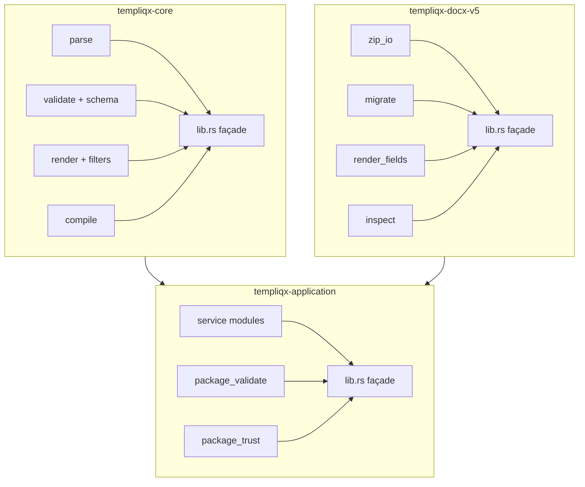

# Qlty smells refactor and optimize plan

> **Phase 0 landed 2026-07-16 (PR #15).** `.qlty/qlty.toml` now excludes
> `**/.worktrees/**` and `**/Generated/**` — verified `qlty smells --all`
> duplication findings 131 → 0. **Split waves 1–4 (templiqx-core, application/
> `validate_package`, docx-v5, secondary crates) remain deferred** — start on a
> clean `main` now that the SDK + breadth PRs have merged; one crate per PR,
> keeping docx-v5 dialect/capability claims byte-identical.

## Overview

Turn the 2026-07-15 `qlty smells --all` audit into a sequenced, behavior-preserving
cleanup: first make the smell signal trustworthy, then split the highest-complexity
monoliths, then tackle nested/parameter-heavy helpers. **Plan only — do not
implement until this plan is accepted.**

## Problem Frame

`qlty smells --all` currently reports hundreds of findings, but ~half are
worktree clones under `.worktrees/`, and generated .NET OpenAPI client code
dominates the complexity chart. The remaining signal is real: several portable
crates keep 1.1k–2.0k-line `lib.rs` files with validation/render functions above
complexity 30–50, which fights the repo’s modularity and file-size discipline
and slows review of CRM3-critical paths.

## Requirements Trace

| ID | Requirement | Plan coverage |
|----|-------------|---------------|
| R1 | Smell reports must not treat git worktrees as duplicate product sources | Phase 0 |
| R2 | Generated SDK sources must not drive refactor work | Phase 0 |
| R3 | Portable core validation/render complexity must be decomposable without behavior change | Phase 1 |
| R4 | Application `validate_package` and service surface must be modular | Phase 2 |
| R5 | DOCX V5 adapter must stay fixture-gated; splits must not widen dialect claims | Phase 3 |
| R6 | Secondary crates (local/mock/http/mcp) follow the same pattern after P0 | Phase 4 |
| R7 | CRM3 grounding and boundary scripts remain green | Validation |
| R8 | No silent relaxation of `templiqx/v1alpha1` fail-closed rules | Non-goals + Phase 1 |

## Non-goals

- Changing contract semantics, diagnostics codes, or capability profiles.
- Broad DOCX / PDF / legacy-import feature work (owned by other plans).
- Hand-editing `sdk/dotnet/**/Generated/**`.
- Micro-optimizing hot paths without `tools/templiqx-bench` evidence.
- Fixing every SDK client “many parameters” mirror of the HTTP API in wave 1.
- Deleting `.worktrees/` (exclude only; worktrees remain a local workflow).

## Key decisions

| Decision | Choice | Rejected alternative |
|----------|--------|----------------------|
| First change | Config excludes before code moves | Fixing “duplication” by editing product code |
| Split style | Mechanical `mod` extraction + `pub use` façade | Rewrite algorithms while splitting |
| Complexity target | Product fn complexity ≤ ~25 after P0 waves; justify exceptions | Blindly inlining to silence qlty |
| SDK params | Defer request-DTO wave | Breaking public SDK signatures now |
| Tests | Move `#[cfg(test)]` modules with the code they cover | Leaving all tests in giant `lib.rs` |

## Existing patterns to follow

- Crate layout and boundaries: `CLAUDE.md`, `scripts/check-boundaries.sh`.
- Fail-closed validation: `docs/contracts/v1alpha1.md`.
- DOCX scope: narrow V5 compat only — `adapters/templiqx-docx-v5`.
- Verify: `just verify`; CRM3: `cargo test -p templiqx-conformance --test crm3`.
- Format/lint: `qlty fmt`, `qlty check --fix --level=low`.

## Architecture (target module maps)



Prose summary: keep public crate roots as thin façades; push validation,
rendering, and DOCX OOXML walks into named modules so qlty complexity and human
review scope shrink together without changing `TempliqxService` capability names.

## Phase 0 — Make smells trustworthy (½ day)

**Files:** `.qlty/qlty.toml`

Add excludes (exact globs may follow qlty docs):

```toml
exclude_patterns = [
  # ... existing ...
  "**/.worktrees/**",
  ".worktrees/**",
  "sdk/dotnet/**/Generated/**",
]
```

Optional: document in `docs/guides/` or CLAUDE.md that `qlty smells --all`
should be run from the primary worktree, not inside a nested checkout.

**Done when:** Re-run `qlty smells --all` shows **0** duplication hits that
only mirror `.worktrees/…`, and `OperationsV1.cs` is absent from the report.

## Phase 1 — Split `templiqx-core` (1–2 days)

**Primary file:** `crates/templiqx-core/src/lib.rs` (~2007 lines, complexity 309)

Suggested modules (adjust names to match natural clusters already in-file):

| Module | Move |
|--------|------|
| `parse.rs` | `parse_contract`, tool-ref resolve entry |
| `validate.rs` | `validate_contract`, `validate_nodes`, cycles, exprs |
| `schema.rs` | `validate_bounded_schema`, instance/format helpers, `valid_date*` |
| `render.rs` | `render_nodes`, `eval`, `resolve`, filters |
| `compile.rs` | `compile`, `validate_values`, `validate_output` |
| `lib.rs` | `pub use` of public API only |

**Smell targets to clear or halve:**

- `validate_nodes` (47), `validate_bounded_schema` (43), `validate_contract` (33)
- Deep nesting sites inside node/schema walks
- `valid_date_time` many-returns → table/match helpers

**Tests:** Existing `crates/templiqx-core/tests/*` + any in-module tests must
still pass: `cargo test -p templiqx-core --all-features`.

**Optimize angle:** Prefer extracting pure helpers over changing algorithms;
no parser relaxation.

## Phase 2 — Split `templiqx-application` (1–2 days)

**Primary file:** `crates/templiqx-application/src/lib.rs` (~1721 lines, complexity 185)

Suggested layout:

| Module | Move |
|--------|------|
| `service/mod.rs` | `TempliqxService` struct + `new` |
| `service/package.rs` | discover/create/update/delete/sign/verify |
| `service/contract.rs` | put/inspect/validate/compile/render/execute/diff/explain |
| `service/document.rs` | migrate/render/inspect document |
| `service/workspace.rs` | artifacts |
| `service/eval.rs` | list/run eval, test_package |
| `package_validate.rs` | **`validate_package` decomposition** (complexity 50 → orchestrator + checks) |
| `trust.rs` | identity sign/verify helpers |
| `catalog.rs` | capability catalog list |

**Smell targets:**

- `validate_package` (50) — highest single function in the repo
- Deep nesting in package validation
- Consider a small `ExecuteContractParams` / builder only if it clarifies
  without widening the public MCP/CLI contract surface

**Tests:** `cargo test -p templiqx-application --all-features` plus
conformance package paths that call the service.

## Phase 3 — Split `templiqx-docx-v5` (1–2 days)

**Primary file:** `adapters/templiqx-docx-v5/src/lib.rs` (~1862 lines, complexity 239)

Suggested modules:

| Module | Move |
|--------|------|
| `limits.rs` / `types.rs` | `Limits`, reports, findings |
| `zip_io.rs` | `read_package` / `write_package` |
| `xml_util.rs` | local_name, text helpers, normalize |
| `migrate.rs` | alias migration, split aliases, instruction rewrite |
| `render.rs` | `render_*_fields`, `apply_field`, text groups |
| `inspect.rs` | `semantic_sources`, composition markers |
| `adapter.rs` | `DocxV5Adapter` port impl |

**Smell targets:**

- `semantic_sources` (28), `render_complex_fields` (25), `migrate_split_aliases` (21)
- Nesting at instruction attribute parse
- `apply_field` / `render_text_group` parameter structs
- Complex boolean on `func.` / `v2:` / `#` prefixes → named predicate

**Constraint:** Keep dialect claims identical; fixture suite under
`examples/legacy-corpus/` and adapter unit tests must stay green. Do not
“simplify” by accepting more OOXML shapes.

**Optimize angle:** Shared forward-scan visitor for migrate vs render event
loops (optional second PR after mechanical split).

## Phase 4 — Secondary crates and tools (1 day, after P0–P3)

| Target | Focus |
|--------|-------|
| `crates/templiqx-local/src/lib.rs` | Split storage vs `put_contract` path safety (returns=9, complexity 21) |
| `crates/templiqx-mock/src/lib.rs` | Split `validate` / `load_inventory` / stream validators |
| `crates/templiqx-http/src/lib.rs` | Route modules if still &gt;800 lines after app split |
| `crates/templiqx-mcp/src/lib.rs` | Tool dispatch modules; leave stdio test complexity unless flaky |
| `tools/templiqx-http-conformance` | Simplify `run` (24) |
| `tools/templiqx-mock-gateway` | Path-id sanitization predicate; early-return style OK |
| `scripts/bump-engine-version.mjs` | Extract helpers / reduce boolean soup (lower priority) |

## Phase 5 — Optional SDK ergonomics (parked)

Only if OpenAPI/request modeling work is already scheduled:

- Introduce shared request objects so Python/.NET/TS clients stop growing
  6–9-arg methods.
- Keep generated C# excluded from smells forever.

## Implementation units and tests

| Unit | Primary paths | Verification |
|------|---------------|--------------|
| U0 excludes | `.qlty/qlty.toml` | `qlty smells --all` inventory |
| U1 core split | `crates/templiqx-core/src/**` | `cargo test -p templiqx-core --all-features` |
| U2 app split | `crates/templiqx-application/src/**` | `cargo test -p templiqx-application --all-features` |
| U3 docx split | `adapters/templiqx-docx-v5/src/**` | adapter tests + legacy corpus as today |
| U4 secondary | local/mock/http/mcp/tools | package-scoped tests |
| U5 gate | workspace | `just verify` + `cargo test -p templiqx-conformance --test crm3` |

### Test scenarios (must remain true)

1. Valid CRM3 package still validates, compiles, executes, and grounds draft
   output in source fragments.
2. Unsupported DOCX markers still fail closed / detect-only as before.
3. Unknown contract fields still rejected (`TQX_*` diagnostics unchanged).
4. `./scripts/check-boundaries.sh` still passes after any `Cargo.toml` touch
   (expect none in pure module splits).
5. CLI/MCP capability catalog names unchanged (transport parity).

## Sequencing and dependencies

```text
Phase 0 (excludes)
    │
    ├─► Phase 1 (core) ──► Phase 2 (application)
    │                         │
    └─► Phase 3 (docx) ───────┴─► Phase 4 (secondary)
                                      │
                                      └─► Phase 5 (optional SDK)
```

Phases 1 and 3 can proceed in parallel after Phase 0. Phase 2 prefers Phase 1
merged first so application tests compile against a stable core façade.

## Risks and assumptions

| Risk | Mitigation |
|------|------------|
| Module split churn conflicts with in-flight feature branches | Land Phase 0 immediately; schedule splits on a quiet window / rebase often |
| Accidental behavior drift in validators | No logic edits in move commits; follow-up commit only for complexity helpers with golden tests |
| qlty exclude glob syntax differs | Verify with one `qlty smells --all` after Phase 0 before large moves |
| Worktree still checked in CI somehow | Hosted CI is minimal; local `just verify` users should update excludes |

**Assumption:** Local `.worktrees/` remains present on developer machines; excludes
are the durable fix.

## Validation commands

```bash
# After Phase 0
qlty smells --all --no-snippets

# After each split wave
qlty fmt
qlty check --fix --level=low
cargo test -p templiqx-core --all-features
cargo test -p templiqx-application --all-features
cargo test -p templiqx-docx-v5 --all-features   # if package name differs, use workspace -p
cargo test -p templiqx-conformance --test crm3
./scripts/check-boundaries.sh
just verify   # before PR
```

## Success criteria

1. Findings audit’s noise classes no longer dominate `qlty smells --all`.
2. `templiqx-core`, `templiqx-application`, and `templiqx-docx-v5` each have a
   thin `lib.rs` and modules under the line-budget spirit (~≤500–600 per file,
   tracked exceptions only).
3. Top function complexities (`validate_package`, `validate_nodes`,
   `validate_bounded_schema`, DOCX render/migrate) drop below ~25 or are
   explicitly justified.
4. No CRM3 grounding regression; `just verify` green.
5. This plan marked `status: completed` with a short evidence note linking the
   PR(s).

## Handoff

**Next action:** Review and accept this plan (especially Phase 0 excludes and
module maps). Then implement Phase 0 alone as a tiny PR, re-baseline smells,
and only then start Phase 1 or 3.

**Do not start code splits until Phase 0 is merged** — otherwise reviews will
keep drowning in worktree duplication noise.
