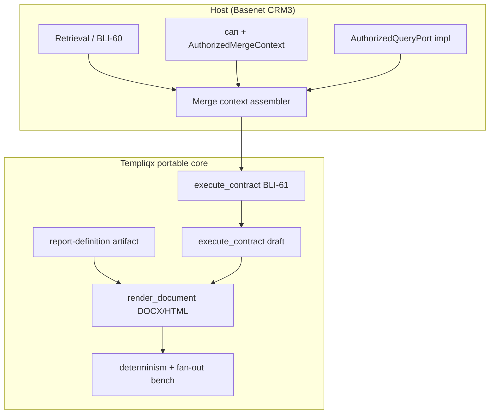

# Close BLI-230 report-engine gaps in Templiqx

## Goal Capsule

Close the portable-core gaps between Basenet BLI-230 / ADR-0019 research and what
Templiqx can prove today: versioned report definitions, evidence and custom-field
merge contracts, deterministic measurement harnesses, and typed host data ports —
without pulling OData, retrieval, DMS, or legacy XLSX/RTF engines into core.

**Authority hierarchy:** Basenet research (`bli-230-report-engine.md`, ADR-0019) →
existing Templiqx boundaries (`docs/guides/host-integration.md`, cross-opco breadth
plan) → this plan.

**Stop conditions:** Host-owned query execution, production CRM3 fixtures, and PDF
converter wiring remain host work; this plan is complete when portable specs,
fixtures, benches, and ports are green under `just verify`.

---

## Product Contract

### Problem Frame

BLI-230 decides to replace legacy v5 with AI-authored, host-authorized report
capability. Templiqx already proves the safe direction (typed contracts →
`merge_data` → deterministic render) via CRM3 and cross-opco packages, but research
and gap analysis show missing pieces before the host can run the full PoC:

- no first-class **report definition** artifact (version, approval, diff)
- no portable **customFields** merge namespace or preflight
- no **evidence fragment** contract linking retrieval (BLI-60) to contracts (BLI-61)
- no **BLI-230 measurement harness** (determinism, fan-out, blast-radius framing)
- **query/introspect** ports underspecified for host OData integration

### Requirements

| ID | Requirement | Source |
|----|-------------|--------|
| R1 | Publish `evidence-fragment/v1alpha1` contract documenting fragment identity, offsets, `quote_sha256`, optional revision checksum | BLI-60, BLI-68, BLI-61 |
| R2 | Add `customFields` namespace to merge-data schemas; preflight unknown placeholders in compatibility reports | BLI-65 |
| R3 | Introduce `report-definition/v1alpha1` package artifact (query binding, field map, layout, format, approval state) | BLI-230 §3 Option B/hybrid |
| R4 | Determinism bench: 100× render of frozen `basenet-legal` DOCX yields one byte-distinct output | BLI-230 §3.5 |
| R5 | Fan-out bench: 1,000-record renderer loop (no model) completes with valid DOCX validity rate recorded | BLI-230 §3.5 |
| R6 | Typed `DataIntrospectPort` and `AuthorizedQueryPort` in `templiqx-ports` with synthetic fixtures only | BLI-230 §4, BLI-66 |
| R7 | Compatibility matrix mapping v5 powers to Templiqx fixture IDs and explicit non-claims | BLI-230 §1–2 |
| R8 | Host integration doc updated for evidence assembler, customFields resolution, and query port handoff | BLI-66, host-integration |
| R9 | Ship format-renderer adapters behind the conversion seam — **Typst** (stylized reports + native charts + pagination → PDF), **XLSX** (`rust_xlsxwriter`, native Excel charts), **CSV/XML** (thin); each emits renderer-identity + fingerprint evidence; core gains no format selector | BLI-230 §1 (v5 8-format), ADR-0019 §22 |
| R10 | The templiqx receipt fingerprint **is** the host `document_version.checksum` (SHA-256) — generated reports land in the existing document-store model, one row per version, no separate report-receipt table | BLI-68 |
| R11 | Provide **locale/number/date value formatting** in the render layer (close the BLI-65 custom-fields formatting gap; shares the BLI-256 locale work) rather than inheriting it as a host gap | BLI-65, BLI-256 |
| R12 | Document the host-side **prerequisites/blockers** the engine depends on: authorized `query` needs `compileToFilter` (ADR-0002, **unbuilt**) for row-level `can()`; the `document_version` write race (`documents.ts:133`) must be fixed before templiqx writes versions | ADR-0002, BLI-68, security-audit |

### Actors

| ID | Actor | Role |
|----|-------|------|
| A1 | Contract author | Defines specs, package artifacts, eval fixtures |
| A2 | Host integrator | Supplies authorized data, query port impl, DMS revision identity |
| A3 | Conformance harness | Proves determinism, fan-out, and boundary checks |

### Scope Boundaries

**In scope:** portable contracts, fixtures, benches, port traits, docs, conformance tests;
**format-renderer adapters — Typst, XLSX (`rust_xlsxwriter`), CSV/XML — behind the
conversion seam** with renderer-identity + fingerprint evidence.

**Gated on measured legacy need:** RTF (`scrivener-rtf`) — build only if legacy usage is
real (see U10); do not build speculatively.

**Dropped (no demonstrated demand in mining/PRD):** a standalone chart engine — charts are
**native** to Typst and `rust_xlsxwriter`, never a separate "power"; and **v5 report-XML
output** — the only live XML need is accounting export (Exact/Twinfield), a separate
connector with a different data shape, not this engine.

**Out of scope (host-owned):** authorized `query`/`introspect` **execution** and
`compileToFilter` (ADR-0002, **unbuilt — a hard prerequisite**), OpenSearch retrieval,
Docling OCR, approval workflow, send/publish, `document_version` persistence + its
write-race fix, legacy v5 migration at scale, and the **AI authoring agent + hybrid loop +
A/B routing** (host component; templiqx supplies its guardrails via `validate`/`compile`/
`explain`/`diff`, not the agent itself).

**Deferred for later:** conversational hybrid authoring UI; Option A direct-emit production
path; promote-one-off-to-definition workflow in host UI.

### Success Criteria

- New specs and ports pass `just verify` with targeted conformance tests.
- `basenet-legal` fixture includes `customFields` with text + relation_link shapes.
- 100× DOCX render produces exactly one distinct SHA-256 in bench output.
- 1,000-record fan-out records validity rate and wall-clock in bench receipt.
- Documentation distinguishes measured support from deferred legacy formats.

---

## Planning Contract

### Key Technical Decisions

| Decision | Rationale | Rejected alternative |
|----------|-----------|-------------------|
| Report definition as package artifact, not DB entity | Matches Templiqx package model; host owns persistence | Basenet `reports.reporttemplate` port |
| `customFields` resolved before render | BLI-65: pure template engine stays IO-free | Resolver inside DOCX adapter |
| Query ports are traits + fixtures only | Preserves boundary; host implements OData | OData crate in portable core |
| Benches in `tools/templiqx-bench` | Existing perf baseline location | New top-level binary |
| Option A measured as anti-pattern fixture | BLI-230 requires both ends of routing decision | Skip Option A entirely |
| Contract-as-AST + per-format adapters (keep) | The "one internal AST → many renderers" shape IS templiqx today (contract → compile → docx/html/typst/xlsx); the crate research validates the direction | A parallel new report-engine crate stack |
| **Typst** as first-class report render target | Native charts + pagination + PDF in one deterministic Rust path; leapfrogs deferred DOCX-floor (cover/pagination/locale) for *report-style* output | Extend `docx-v5` to cover all report layout |
| **XLSX** via `rust_xlsxwriter` (native charts) | Pure-Rust, low-mem, deterministic; model never emits binary at fan-out | LLM-emitted xlsx (corrupt at scale) |
| Aggregation in the query layer; billing math upstream | Legacy reports are flat grid exports; VAT/interest/legal-aid math has 19 golden tests owned by the billing domain — templiqx renders pre-computed values | Aggregation/expression engine in portable core |
| Receipt fingerprint **is** the doc-store checksum | One SHA-256 integrity concept for uploaded + generated docs (BLI-68) | Separate report-receipt table |
| Reject compile-time DOCX templating for the core | templiqx definitions are runtime data authored by an AI agent, not compile-time Rust structs — a `generate_templates!` macro cannot render a dynamically-authored definition | `docxide-template` as the docx engine |
| `docx-rust` as an *option* to harden `docx-v5` | Library OOXML read/write could replace hand-rolled run-splitting and cut `docx-v5` complexity (qlty: 1862 LoC / cx 239); tie to BLI-256, not urgent | Rewrite `docx-v5` from scratch |

### High-Level Technical Design



Host assembles authorized merge data (including `customFields` and evidence fragments);
Templiqx validates, executes contracts, renders from frozen definitions, and benches
prove determinism without model calls on the render path.

### Assumptions

- Cross-opco packages (`basenet-legal`, etc.) remain the Legal reference proof.
- Host will implement OData-shaped query behind `AuthorizedQueryPort` (research default).
- No production customer data in new fixtures.

---

## Implementation Units

### U1. Evidence fragment contract

**Goal:** Document the portable evidence fragment shape linking retrieval to BLI-61.

**Requirements:** R1

**Files:**
- `docs/contracts/evidence-fragment-v1alpha1.md` (new)
- `docs/README.md` (link)
- `examples/crm3/contracts/bli-61-date-term-extraction.yaml` (cross-reference comment only if needed)

**Approach:** Specify required fields (`document_id`, `fragment_id`, `start_offset`,
`end_offset`, `quote_sha256`), optional `content_sha256`, and host scope metadata.
Align with existing CRM3 schema; add revision checksum as optional extension from BLI-68.

**Test scenarios:**
- Doc build includes new page without broken links (`just docs-build`)
- CRM3 conformance still passes unchanged (`cargo test -p templiqx-conformance --test crm3`)

**Verification:** Spec published; CRM3 tests green.

---

### U2. CustomFields merge namespace

**Goal:** Portable `customFields` in merge-data and compatibility preflight.

**Requirements:** R2

**Dependencies:** U1 (evidence doc informs assembler handoff)

**Files:**
- `docs/contracts/merge-data-v1alpha1.md` (new or extend cross-opco doc)
- `examples/packages/basenet-legal/contracts/legal-document-drafting.yaml`
- `examples/packages/basenet-legal/fixtures/merge-data.json`
- `examples/packages/basenet-legal/evals/legal-draft-output.json`
- `docs/contracts/template-compatibility-report-v1alpha1.md`
- `crates/templiqx-conformance/tests/reference_package_claims.rs`

**Approach:** Add `merge_data.customFields` object schema; extend legal fixture with
`text` and `relation_link` (display name pre-resolved in fixture). Extend compatibility
report to flag unknown `customFields.*` placeholders.

**Test scenarios:**
- Legal package eval validates with new `customFields` keys
- Compatibility report emits diagnostic for unknown custom field placeholder
- `cargo test -p templiqx-conformance --test cross_opco_outputs`

**Verification:** Cross-opco outputs test green; new fixture fields in golden evals.

---

### U3. Report definition artifact spec

**Goal:** First-class versioned report definition for Option B/hybrid.

**Requirements:** R3

**Files:**
- `docs/contracts/report-definition-v1alpha1.md` (new)
- `examples/packages/basenet-legal/definitions/dunning-letter-v1.yaml` (new synthetic)
- `templiqx-contracts` types if needed for inspect/validate (minimal)

**Approach:** YAML artifact: `id`, `version`, `query_binding` (opaque host ref),
`field_map`, `template_ref`, `target_format`, `approval` block (`status`, `approved_by`,
`approved_at`). Package manifest may list definition paths. No host approval workflow.

**Test scenarios:**
- Example definition validates against published schema/fixture
- `inspect` or `validate` operation returns stable fingerprint for definition

**Verification:** Definition fixture checked in; schema documented.

---

### U4. Determinism bench

**Goal:** Prove 100× identical render → one byte-distinct output.

**Requirements:** R4

**Dependencies:** U2 (uses `basenet-legal` merge fixture)

**Files:**
- `tools/templiqx-bench/src/report_determinism.rs` (new module)
- `tools/templiqx-bench/src/main.rs`
- `crates/templiqx-conformance/tests/report_bench.rs` (new, optional thin wrapper)

**Approach:** Loop `render_document` 100× on frozen `basenet-legal` DOCX; collect
SHA-256 set; assert `len == 1`. Write JSON receipt with hashes and timing.

**Test scenarios:**
- 100 renders → exactly 1 distinct hash
- Changing one merge field → hash changes (proves sensitivity)

**Verification:** Bench command exits 0; receipt documents single hash.

---

### U5. Fan-out bench

**Goal:** Simulate 1,000-record mailing render without model.

**Requirements:** R5

**Dependencies:** U4

**Files:**
- `tools/templiqx-bench/src/report_fanout.rs`
- `examples/packages/basenet-legal/fixtures/fanout-records.json` (1000 synthetic rows)

**Approach:** Map records through same template renderer; validate ZIP/XML well-formed;
record corrupt count, wall-clock, throughput. Cap at adapter limits (DOCX 1000 item guard).

**Test scenarios:**
- 1000 records → 0 corrupt DOCX per validator
- Bench completes under documented timeout

**Verification:** Fan-out receipt with validity rate and timing.

---

### U6. Host data ports

**Goal:** Typed introspect/query ports with fixture-only proof.

**Requirements:** R6

**Files:**
- `crates/templiqx-ports/src/data_access.rs` (new)
- `crates/templiqx-ports/src/lib.rs`
- `examples/packages/basenet-legal/fixtures/authorized-query-response.json`
- `crates/templiqx-local/src/fake_data_access.rs` (deterministic fake)
- `scripts/check-boundaries.sh` (if new deps)

**Approach:** `DataIntrospectPort::describe_schema(actor)` → shape metadata only;
`AuthorizedQueryPort::query(actor, request)` → authorized rows. Fake impl returns
synthetic OData-shaped JSON. Not wired into default CLI/MCP graph beyond local compose.

**Test scenarios:**
- Fake port returns schema without entity data for introspect
- Query rejects when actor scope missing from fixture context
- Boundary script passes

**Verification:** `cargo test -p templiqx-ports`; `just verify`.

---

### U7. Compatibility matrix and host doc handoff

**Goal:** Publish v5→Templiqx mapping and assembler guidance.

**Requirements:** R7, R8

**Dependencies:** U1, U2, U6

**Files:**
- `docs/guides/report-engine-compatibility.md` (new)
- `docs/guides/host-integration.md`
- `docs/README.md`

**Approach:** Table v5 four powers vs fixture IDs / status (covered, partial, missing).
Document host assembler responsibilities: evidence fragments, customFields resolution,
query port injection, revision checksum on fragments.

**Test scenarios:**
- Docs build succeeds
- Matrix includes explicit non-claims for XLSX/RTF/reflective query

**Verification:** `just docs-build` green.

---

### U8. Typst report render adapter

**Goal:** A deterministic `templiqx contract → Typst markup → PDF` render path for
stylized, chart-bearing, paginated *report-style* output.

**Requirements:** R9, R11

**Dependencies:** conversion seam (shipped); U3 (report-definition)

**Files:**
- `adapters/templiqx-typst/` (new crate — Typst compile of generated markup)
- `crates/templiqx-conformance/tests/typst_render.rs` (new; golden-pinned PDF-metadata)
- `examples/packages/basenet-legal/definitions/dunning-letter-v1.yaml` (target_format: typst)
- `docs/adr/document-conversion.md` (add Typst as a host-composed/adapter render target)

**Approach:** Map the frozen definition + merge data to Typst markup; compile via the
`typst`/`typst-library` crates; emit renderer-identity (typst version, environment) +
artifact fingerprint in the receipt, same shape as the PDF seam. Native charts +
pagination + locale-formatted values (R11). Deterministic; no model on the render path.

**Test scenarios:**
- Frozen definition renders byte-stable PDF (fingerprint pinned)
- A native column chart from tabular merge data appears; re-render byte-stable
- Missing/unauthorized field → fail-closed diagnostic, no guessed value

**Verification:** `cargo test -p templiqx-conformance --test typst_render`; boundaries clean.

---

### U9. XLSX + CSV/XML renderers

**Goal:** Spreadsheet output with native Excel charts, plus thin deterministic CSV/XML.

**Requirements:** R9

**Files:**
- `adapters/templiqx-xlsx/` (new — `rust_xlsxwriter` over structured tabular output)
- `adapters/templiqx-tabular/` or thin CSV/XML emitters (deterministic)
- `crates/templiqx-conformance/tests/xlsx_render.rs`

**Approach:** Consume the frozen definition's tabular binding; `rust_xlsxwriter` emits
`.xlsx` with native charts; renderer-identity + fingerprint evidence. CSV/XML are
straight serializers. Charts are a deterministic function of definition + data (R11) —
never model-emitted.

**Test scenarios:**
- Tabular definition → valid `.xlsx` with a native chart; re-render byte-stable
- CSV/XML output matches golden; no injection from merge values

**Verification:** `cargo test -p templiqx-conformance --test xlsx_render`; boundaries clean.

---

### U10. RTF (gated) + format-scope decision

**Goal:** Decide the real format set from legacy usage; build RTF only if required.

**Requirements:** R9 (gate)

**Approach:** From legacy-mining, measure real RTF/XLS/CSV usage. Build a
`scrivener-rtf` adapter **only** if evidenced; otherwise record it dropped. Reconcile the
tension: ADR-0019 lists DOCX/RTF/XLS/XLSX but drops XML/CSV; v5 had all 8; templiqx now
covers DOCX/HTML/PDF/Typst/XLSX/CSV — confirm the final set and document non-claims.

**Verification:** Decision recorded in `docs/guides/report-engine-compatibility.md`;
adapter built or explicitly dropped with rationale.

---

### Host prerequisites (tracked here, built by the host — not this plan)

These are hard dependencies for the *production* report engine; templiqx ships the
guardrails and ports, the host builds the rest. Surface them so the plan is honest:

- **`compileToFilter(policy, actor, resourceType)` (ADR-0002) is unbuilt** — the row-level
  `can()` enforcement every authorized `query` needs. Blocks R6/U6 from becoming real
  production data access. **Highest-priority host prerequisite.**
- **`document_version` write race** (`documents.ts:133`, version computed before unique
  insert) — must be fixed before templiqx receipts land as `document_version` rows (R10).
- **AI authoring agent + hybrid loop + A/B routing** — host component (BLI-230 §3). templiqx
  supplies `validate`/`compile`/`explain`/`diff` as its tools; the agent, versioning UI, and
  routing are host work.
- **Query interface choice** (OData vs GraphQL vs DSL) — ADR-0019 defers to the PoC; BLI-66
  scopes an OData/Power BI read-model (denormalized, no `$apply` today). Resolve before U6
  hardens.

---

## Verification Contract

```sh
just verify
cargo test -p templiqx-conformance --test crm3 --test cross_opco_outputs
cargo test -p templiqx-application --test authorized_context
cargo run -p templiqx-bench -- report-determinism
cargo run -p templiqx-bench -- report-fanout
just docs-build
```

Golden updates require `GOLDEN_REVIEW:` commit marker or `ALLOW_GOLDEN_UPDATE=1`.

---

## Definition of Done

- [ ] R1–R12 implemented or explicitly documented as host-deferred with port/fixture proof
- [ ] `just verify` and `just docs-build` pass
- [ ] Determinism bench: 1 distinct hash over 100 renders
- [ ] Fan-out bench: validity rate recorded for 1,000 renders
- [ ] Typst adapter: byte-stable PDF with a native chart (golden-pinned)
- [ ] XLSX adapter: valid `.xlsx` with a native chart; CSV/XML golden-pinned
- [ ] Format set + non-claims documented; RTF built or explicitly dropped with rationale
- [ ] Receipt fingerprint == document-store SHA-256 checksum shape documented (R10)
- [ ] Host prerequisites (`compileToFilter`, `document_version` race) recorded as tracked deps
- [ ] No OData/retrieval/DMS/query-execution code in portable core per `check-boundaries.sh`
- [ ] Plan HTML sibling at `docs/specs/bli-230-report-engine-gaps-plan.html` stays in sync

---

## Risks and Dependencies

| Risk | Mitigation |
|------|------------|
| Report-definition scope creep into host workflow | Spec only; approval fields are metadata, not state machine |
| CustomFields preflight false positives | Fixture-gated; start with basenet-legal only |
| Fan-out bench flaky on CI | Local-first; optional CI job with generous timeout |
| Port wiring leaks into default product graph | Fake adapter in `templiqx-local` only; boundary checks |

---

## Sources and Research

- Basenet: `docs/research/bli-230-report-engine.md`, ADR-0019
- Basenet (digested 2026-07-16): `bli-66-public-api-mcp-partner-landscape.md`, `bli-64-crud-list-framework.md`,
  `bli-60-retrieval-index.md`, `bli-63-permission-service.md`, `bli-65-custom-fields.md`,
  `bli-68-document-store-checksums.md`, `legacy-billing-domain-rules.md`, `legacy-email-docs-relations.md`,
  `legacy-permissions-lists-search.md`, `gap-analysis-linear-vs-build.md`, `legacy-prd-gap-analysis.md`,
  `modularity-and-reuse-audit.md`, `openrag-docling-chatsdk-fit.md`, `security-audit-2026-07-10.md`
- Basenet ADRs: 0016 (agent MCP write boundary), 0002 (permission service / `compileToFilter`),
  0007 (retrieval index), 0018 (api-contract + offline generation), 0015 (active documenthub / "productions")
- Templiqx: `docs/plans/2026-07-15-001-feat-cross-opco-document-breadth-plan.md`, `examples/crm3/`, `examples/packages/basenet-legal/`
- Rust format crates: [`typst`/`typst-library`](https://crates.io/crates/typst-library) (reports + charts + PDF),
  [`rust_xlsxwriter`](https://crates.io/crates/rust_xlsxwriter) (XLSX + native charts),
  [`scrivener-rtf`](https://crates.io/crates/scrivener-rtf) (RTF, gated).
  Considered & rejected for the runtime core: [`docxide-template`](https://docs.rs/crate/docxide-template)
  (compile-time macro model conflicts with runtime AI-authored definitions);
  [`docx-rust`](https://github.com/cstkat/docx-rust) noted as an option to harden `docx-v5` (BLI-256).
- Reuse hooks: `@blinqx/application` command surface, `@blinqx/api-contract` (ADR-0018) for the
  report-request/receipt schema, `@blinqx/reports` package carve-out, BLI-220 document write-intent seam.
- HTML plan: `docs/specs/bli-230-report-engine-gaps-plan.html`
