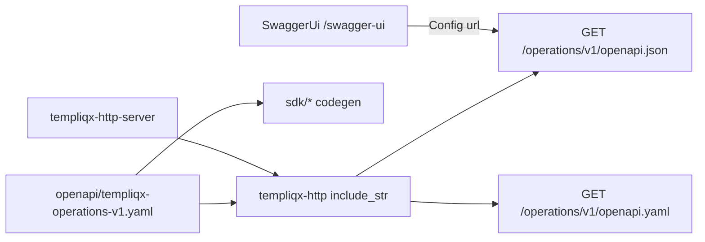

## Summary

Add interactive Swagger UI to the Operations HTTP surface using
[`utoipa-swagger-ui`](https://docs.rs/utoipa-swagger-ui/) (Axum) so local/demo
operators can browse the existing OpenAPI document. Keep
`openapi/templiqx-operations-v1.yaml` as the sole wire-contract source of truth;
do not migrate handlers to utoipa code-first generation in this plan. Wire the
same discovery story into the Blume handbook (`docs/`) and OpenWiki entry
points (`openwiki/` via `docs/wiki`) with cross-links — no hand-edit of
generated wiki pages beyond the maintained entry/workflow docs that already
link outward.

## Problem Frame

`templiqx-http` already serves the checked-in OpenAPI 3.1 document at
`/operations/v1/openapi.yaml` and `/operations/v1/openapi.json`, and SDKs
generate from that YAML. There is no in-process Swagger UI, so operators must
paste the JSON into an external viewer. The user pointed at utoipa +
utoipa-swagger-ui + examples as the integration path for Axum.

Replacing the YAML-first contract with `#[utoipa::path]` / `#[derive(OpenApi)]`
would fork the SDK/codegen/drift pipeline and contradict the Operations API ADR.
The right move is the Swagger UI bridge pointed at the existing JSON route.

## Requirements

- R1. Swagger UI is served from the Operations HTTP router (reachable when
  `templiqx-http-server` or any host binds `templiqx_http::router`).
- R2. The UI loads the same document already served at
  `/operations/v1/openapi.json` (checked-in YAML → JSON), not a second generated
  OpenAPI document.
- R3. Existing OpenAPI drift / validate / SDK generation gates remain green and
  unchanged in meaning.
- R4. Build stays offline-friendly in CI (no network download of Swagger UI
  assets at compile time).
- R5. Docs list the Swagger UI discovery route next to the existing OpenAPI
  endpoints, and restate that the HTTP server is local/demo (unsigned).
- R6. Blume handbook navigation surfaces the Operations API guide (and related
  discovery links) via `docs/guides/meta.ts` / `docs/README.md` so `/swagger-ui`
  is discoverable from the published docs site.
- R7. OpenWiki entry points (`openwiki/quickstart.md`, `openwiki/workflows.mdx`)
  cross-link the handbook Operations API guide and note live Swagger UI /
  OpenAPI routes; prefer handbook as SoT and keep OpenWiki pointers thin
  (do not invent a parallel API reference inside generated wiki pages).

## Key Technical Decisions

- KTD1. YAML remains SoT: `openapi/templiqx-operations-v1.yaml` continues to
  drive SDKs, `scripts/openapi/*`, and `templiqx-http` `include_str!` serving.
  utoipa is used as the Swagger UI integration stack, not as a second OpenAPI
  authoring source. Rationale: ADR Operations HTTP API + existing drift tests.
- KTD2. Point Swagger UI at the existing JSON route via
  `utoipa_swagger_ui::Config::from("/operations/v1/openapi.json")` (and merge
  `SwaggerUi::new("/swagger-ui")` into the Axum router). Do not register a
  parallel `ApiDoc::openapi()` path that could drift from YAML. Prefer
  Config-only (or equivalent “external URL”) wiring from utoipa-swagger-ui docs
  / examples; if the builder requires an OpenAPI value, reuse the same
  `serde_json::Value` already produced for `/operations/v1/openapi.json`
  (`external_url_unchecked`) rather than deriving schemas from handlers.
- KTD3. Mount at `/swagger-ui` on `templiqx_http::router` (not only in the demo
  binary). Same unauthenticated discovery posture as the OpenAPI routes already
  on the library router; hosts that need to strip UI in production can wrap or
  fork composition later.
- KTD4. Depend on `utoipa-swagger-ui` with `axum` + `vendored` features (and
  `utoipa` as required by that stack). Pin compatible versions for workspace
  Axum `0.8.x`. Vendored avoids `SWAGGER_UI_DOWNLOAD_URL` / curl-at-build-time
  in CI and air-gapped builds.
- KTD5. Do not change release artifact status: HTTP server remains local/demo
  unsigned (`docs/adr/http-server-release-artifact.md`).
- KTD6. Blume + OpenWiki: handbook pages under `docs/` are the durable narrative;
  OpenWiki (`docs/wiki` → `openwiki/`) gets thin cross-links from
  `quickstart.md` / `workflows.mdx` only. Do not hand-edit bulk generated
  OpenWiki pages; Blume `title` frontmatter is the page `<h1>` (no duplicate `#`
  heading). Quote YAML titles that contain colons.

## Scope Boundaries

### In scope

- Workspace deps + `templiqx-http` router merge for Swagger UI
- Integration/smoke tests proving UI assets and Config URL
- Blume handbook: `docs/guides/operations-api.md`, ADR cross-links,
  `docs/guides/meta.ts`, `docs/README.md`
- OpenWiki pointers: `openwiki/quickstart.md`, `openwiki/workflows.mdx`

### Out of scope / deferred

- Migrating handlers to `#[utoipa::path]` / code-first OpenAPI generation
- Replacing YAML as the SDK contract source
- Auth / basic-auth gate on Swagger UI (host-owned)
- Promoting `templiqx-http-server` to a signed release
- Redoc / Scalar / RapiDoc alternate UIs
- Full OpenWiki regeneration workflow run (manual dispatch) — thin source
  pointers only in this plan

## High-Level Technical Design

## Assumptions

- A1. Config-from-URL (or external_url against the existing JSON Value) is
  sufficient; full utoipa path annotations are unnecessary for this delivery.
- A2. Axum 0.8 + current utoipa-swagger-ui major (9.x family at plan time) are
  compatible; if cargo resolve fails, pin the latest major that documents Axum
  ≥0.7/0.8 support without downgrading workspace Axum.

## Implementation Units

### U1. Add utoipa / swagger-ui dependencies

**Goal:** Workspace and `templiqx-http` can compile against utoipa-swagger-ui
with Axum + vendored assets.

**Requirements:** R4

**Dependencies:** none

**Files:**
- `Cargo.toml` (workspace deps)
- `crates/templiqx-http/Cargo.toml`
- `Cargo.lock` (via cargo)

**Approach:** Add `utoipa` and `utoipa-swagger-ui` with features `["axum",
"vendored"]` on the swagger-ui crate. Keep versions in workspace deps for
consistency. Do not add these deps to portable core crates.

**Test expectation:** none — dependency scaffolding only; verified by U2 build.

**Verification:** `cargo check -p templiqx-http` resolves and compiles with the
new deps.

---

### U2. Mount Swagger UI on the Operations router

**Goal:** `/swagger-ui` serves interactive UI that fetches
`/operations/v1/openapi.json`.

**Requirements:** R1, R2, R3

**Dependencies:** U1

**Files:**
- `crates/templiqx-http/src/lib.rs`
- `crates/templiqx-http/tests/swagger_ui.rs` (new) or extend an existing HTTP
  integration test module if one already boots a router
- `crates/templiqx-http/tests/openapi_drift.rs` (touch only if route inventory
  assertions need the new discovery path excluded or listed appropriately)

**Approach:**
- Merge `SwaggerUi::new("/swagger-ui").config(Config::from("/operations/v1/openapi.json"))`
  into `router` / `router_from_root`.
- If the builder requires a registered OpenAPI payload, use
  `external_url_unchecked` with the same JSON Value as `openapi_json` — never a
  hand-derived `#[derive(OpenApi)]` schema tree.
- Keep existing OpenAPI YAML/JSON handlers unchanged.
- Ensure openapi drift tests still treat operation routes correctly (Swagger UI
  is discovery chrome, not an Operations envelope route).

**Patterns to follow:** Existing `openapi_yaml` / `openapi_json` handlers and
`tests/openapi_drift.rs` route inventory discipline; Axum example pattern from
[utoipa examples](https://github.com/juhaku/utoipa/tree/master/examples).

**Execution note:** Start with a failing integration test that boots the router
and asserts Swagger UI HTML/asset response plus that the Config URL target
`/operations/v1/openapi.json` still returns the checked-in document.

**Test scenarios:**
- Happy path: `GET /swagger-ui` (or framework redirect to index) returns success
  and Swagger UI HTML/asset content.
- Happy path: `GET /operations/v1/openapi.json` still returns OpenAPI 3.1 with
  expected `info` / path presence after the merge.
- Integration: router serves both UI and JSON without state conflicts.
- Regression: `openapi_drift` (or equivalent) still passes; Swagger UI paths are
  not mistaken for Operations envelope operations.
- Error/edge: unknown path under `/swagger-ui/...` does not panic the process
  (framework 404 is fine).

**Verification:** New swagger UI test + existing `templiqx-http` openapi drift
test pass; `cargo test -p templiqx-http` green.

---

### U3. Blume handbook + ADR discovery docs

**Goal:** Operators discover `/swagger-ui` from the Blume handbook and ADR, and
the Operations guide is reachable in Blume nav.

**Requirements:** R5, R6

**Dependencies:** U2

**Files:**
- `docs/guides/operations-api.md`
- `docs/architecture/adr-operations-http-api.md`
- `docs/guides/meta.ts`
- `docs/README.md`
- Optionally `docs/guides/host-integration.md` if it lists discovery endpoints

**Approach:** Add `GET /swagger-ui` to the discovery table; note it visualizes
`/operations/v1/openapi.json`; link OpenWiki code-docs tab (`/wiki/quickstart`)
from the guide; ensure `operations-api` (and related client guides if already
linked from README) appear in `docs/guides/meta.ts`; ADR gets a short
discovery/Swagger pointer. Restate local/demo HTTP server posture. Honor Blume
`title` frontmatter (no duplicate H1).

**Test expectation:** none — docs/nav only.

**Verification:** Guide + ADR mention `/swagger-ui`; Blume guides meta includes
`operations-api`; README hub stays consistent.

---

### U4. OpenWiki cross-links

**Goal:** OpenWiki entry points point operators at the handbook Operations API
guide and the live Swagger/OpenAPI surface.

**Requirements:** R7

**Dependencies:** U3

**Files:**
- `openwiki/quickstart.md`
- `openwiki/workflows.mdx`

**Approach:** Add a short “Operations HTTP / Swagger UI” bullet in quickstart
and a See-also (or workflow) note in workflows linking
`/guides/operations-api` (Blume handbook path) and naming
`/swagger-ui` + `/operations/v1/openapi.json`. Keep edits thin; do not regenerate
the full wiki set in this unit.

**Test expectation:** none — docs only.

**Verification:** OpenWiki quickstart and workflows mention Operations HTTP /
Swagger and link the handbook guide.

## Risks & Dependencies

| Risk | Mitigation |
| --- | --- |
| Dual OpenAPI sources if someone adds `#[derive(OpenApi)]` later | Plan + docs explicitly forbid; Config points at checked-in JSON only |
| Build-time Swagger UI download in CI | `vendored` feature |
| Axum version mismatch with utoipa-swagger-ui | Pin compatible crate versions; do not downgrade workspace Axum |
| Hosts expose UI in production unintentionally | Document unauthenticated discovery; hosts own auth/TLS wrapping |

## Sources & Research

- [utoipa](https://github.com/juhaku/utoipa) — code-first OpenAPI for Rust
- [utoipa-swagger-ui docs](https://docs.rs/utoipa-swagger-ui/) — Axum
  `SwaggerUi` + `Config::from`
- [utoipa examples](https://github.com/juhaku/utoipa/tree/master/examples)
- Local: `crates/templiqx-http/src/lib.rs` OpenAPI routes;
  `openapi/templiqx-operations-v1.yaml`; `docs/architecture/adr-operations-http-api.md`;
  `docs/adr/http-server-release-artifact.md`
