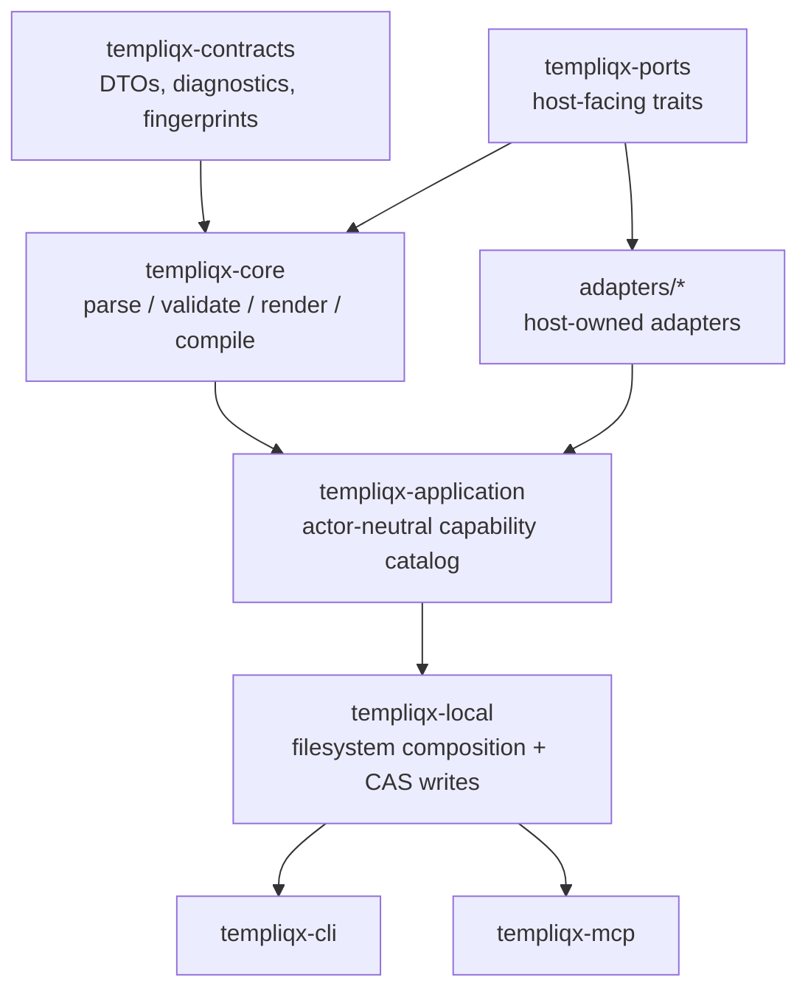

Templiqx is organized around a single canonical application service with thin transport and host adapters around it. The important design choice is that human-facing and agent-facing entrypoints share the same operations, envelopes, diagnostics, and fingerprints.

## Core layering

Source evidence:

- `Cargo.toml` declares the workspace packages and shared dependency set.
- `crates/templiqx-application/src/lib.rs` defines the canonical capability catalog and the `TempliqxService` methods.
- `crates/templiqx-ports/src/lib.rs` defines the host-facing traits for package storage, artifact workspaces, runtime execution, legacy import, and document rendering.
- `crates/templiqx-local/src/lib.rs` composes filesystem-backed implementations and deterministic adapters.
- `crates/templiqx-cli/src/main.rs` and `crates/templiqx-mcp/src/lib.rs` are surfaces over the same operations.

## Why the split exists

The split keeps policy and transport out of the portable core:

- `templiqx-contracts` holds serializable DTOs, diagnostics, fingerprints, and envelopes.
- `templiqx-core` owns parsing, validation, rendering, and compilation logic.
- `templiqx-ports` defines the seams that host code must implement, including `DataIntrospectPort` and `AuthorizedQueryPort` for host-owned query and schema introspection.
- `templiqx-application` exposes actor-neutral operations and catalog introspection.
- `templiqx-local` assembles a concrete local runtime from filesystem-backed and deterministic adapters.
- `templiqx-mock` and `adapters/templiqx-runtime-http-mock` are deterministic/conformance-oriented runtime adapters rather than production policy engines.
- `adapters/templiqx-docx-v5` handles explicit DOCX V5 compatibility for the CRM3 fixture.

This is deliberate: auth, tenant policy, approval, retries, retrieval, workflow, schema/query access, and secrets remain host concerns and are not embedded into the core graph.

## Package and filesystem boundaries

The portable package layout is documented in the architecture docs and enforced in code:

- package roots must be canonical directories under the configured workspace root;
- contract identifiers are single safe segments;
- artifact paths must stay package-relative and cannot use absolute paths, traversal, backslashes, or symlink escapes;
- manifests are explicit inventories, so missing or duplicate listed artifacts invalidate the package;
- contract writes use compare-and-swap with locking and atomic rename.

The filesystem store and workspace implementations in `crates/templiqx-local/src/lib.rs` perform these checks. The ports in `crates/templiqx-ports/src/lib.rs` make the boundary explicit so alternate hosts can implement safer or more constrained storage backends.

## Canonical service and capabilities

`TempliqxService` is the only application surface that matters semantically. Its catalog includes operations such as package discovery, contract inspection and validation, compilation, execution, migration, document rendering, testing, diffing, and explanation.

The CLI and MCP server both map directly to that capability catalog. That means a host can choose a different transport without changing product semantics.

## Deployment and runtime assumptions

The repository ships a local composition path and deterministic smoke/conformance infrastructure rather than a production runtime:

- local composition is filesystem-backed and intended for a trusted package root;
- the fake runtime adapter never calls a network and exists to prove deterministic behavior;
- the CRM3 conformance package is synthetic and only tests the explicit boundary documented in the fixtures;
- the Docker, Helm, and kind assets added in the recent readiness work are for deployment validation and boundary checks, not for moving core semantics into the portable layer.

## When changing architecture

Watch for changes that accidentally move policy into core or create a second code path for humans versus agents. The most important checks when touching this area are:

- workspace compilation and linting;
- boundary checks in `scripts/check-boundaries.sh`;
- conformance tests in `crates/templiqx-conformance`;
- CLI and MCP workspace tests, which verify the surfaces still route through the same service.

## See also

- [Agent-native & AI](/guides/agent-native) — how the shared catalog is exposed to agents over MCP.
- [POC architecture](/architecture/poc) and [capability map](/architecture/capability-map) — the curated Handbook view of the same layering.
