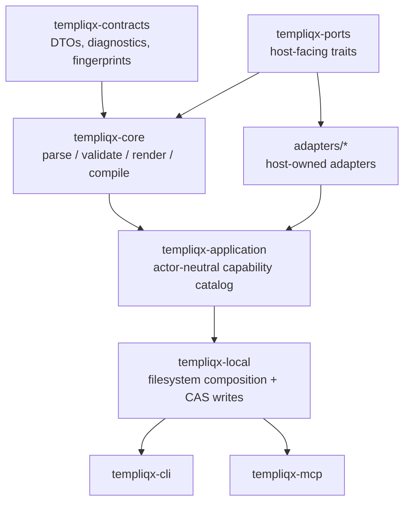

# Templiqx OpenWiki quickstart

Templiqx is a standalone, provider-neutral AI interaction contract compiler. The repository combines a portable contract format, a canonical application service, local filesystem composition, a CLI, an MCP server, deterministic mock/runtime adapters, and a CRM3 conformance package that proves the flows together.

Start here:

- [Architecture overview](architecture.md) — crate layering, adapter boundaries, and deployment assumptions.
- [Domain and contract model](domains.md) — the v1alpha1 contract format, CRM3, and DOCX V5 compatibility scope.
- [Workflows](workflows.md) — how the CLI, MCP, conformance harness, and readiness scripts exercise the system.
- [Testing and verification](testing.md) — the checks that protect boundaries, conformance, and release readiness.

## What this repo is for

The repository exists to keep the Templiqx core provider-neutral while letting hosts supply runtime, legacy-import, and document-rendering adapters. Humans and agents are intentionally routed through the same canonical operations so they observe the same validation, diagnostics, fingerprints, and artifact outputs.

The workspace is a Rust monorepo with supporting docs, examples, Docker/Kubernetes readiness assets, and conformance fixtures. The main packages are declared in the workspace `Cargo.toml` and are organized as:

- `templiqx-contracts` — serializable DTOs, diagnostics, fingerprints, and envelopes.
- `templiqx-ports` — host-facing adapter traits and port errors.
- `templiqx-core` — parsing, validation, rendering, and compilation.
- `templiqx-application` — actor-neutral operations exposed by the canonical service.
- `templiqx-local` — filesystem-backed composition and deterministic adapters.
- `templiqx-mock` — mock runtime support.
- `templiqx-cli` — the user-facing command-line entrypoint.
- `templiqx-mcp` — the MCP server surface over the same operations.
- `templiqx-conformance` — CRM3 trace and boundary verification.
- `adapters/templiqx-docx-v5`, `adapters/templiqx-html-plain`, `adapters/templiqx-runtime-http-mock`, and `adapters/templiqx-runtime-langfuse` — compatibility and runtime adapters.
- `tools/templiqx-mock-gateway`, `tools/templiqx-http-conformance`, and `tools/templiqx-legacy-docx-fixtures` — operational and fixture tooling.

## High-level map

The docs in this wiki intentionally mirror that shape:

- `architecture.md` covers package layering, host policy boundaries, and deployment assumptions.
- `domains.md` covers the portable contract format, CRM3, and document compatibility fixtures.
- `workflows.md` covers how commands and tools use the same application catalog.
- `testing.md` covers the main validation commands and what each suite protects.

## Documentation maintenance

OpenWiki is refreshed on demand by repository automation, which updates the generated `openwiki/` pages and the top-level agent instruction files. Treat these pages as a navigation layer over source and handbook docs: update source or repository docs for normal code changes, then refresh OpenWiki when you need a better map.

## Where to go next

If you are changing core behavior, read the architecture page first. If you are changing contract syntax or examples, read the domain page. If you are changing CLI/MCP behavior, read the workflow page. If you are changing adapter boundaries or package layout, expect the tests and smoke scripts to matter.
