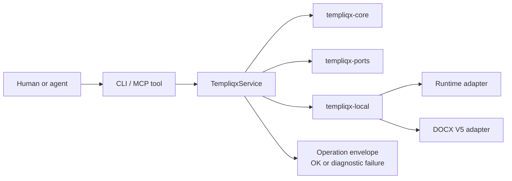

Templiqx workflows are intentionally thin wrappers over the same canonical application service. The CLI, MCP server, and conformance harness all exercise the same core operations.

## Primary operation flow

## CLI workflow

The CLI lives in `crates/templiqx-cli/src/main.rs` and exposes commands for the canonical capability catalog:

- catalog and discovery;
- contract inspection, put, and validation;
- compile, render, execute, and test;
- diff and explain;
- legacy migration and document rendering;
- CRM3 conformance execution.

The CLI prints an operation envelope for both success and product-level failure. Exit codes are distinct:

- `0` for an `ok` envelope;
- `2` for a diagnostic/product failure;
- `1` for CLI or I/O failures before the operation runs.

Portable path handling matters here: source, template, output, and workspace arguments are package-relative or workspace-relative paths, not arbitrary host paths.

## MCP workflow

`crates/templiqx-mcp/src/lib.rs` defines an MCP server over the same capability catalog. The tool names exactly match the application catalog, which keeps the human and agent surfaces aligned.

That alignment is useful for future agents because it means the same operation names can be searched across the CLI, MCP, and service code without translation.

## Local composition workflow

`crates/templiqx-local/src/lib.rs` composes filesystem-backed package storage, workspace resolution, a deterministic fake runtime, and the document/legacy adapters. This is the default way the repository exercises the system in tests and smoke checks.

It is intentionally local and bounded:

- package roots are filesystem directories under a configured workspace;
- package and artifact paths are checked for traversal and symlink escapes;
- runtime execution is deterministic when used with the mock adapter;
- document rendering and legacy migration are host-owned adapter responsibilities.

## CRM3 conformance workflow

The CRM3 conformance test in `crates/templiqx-conformance/tests/crm3.rs` orchestrates the end-to-end scenario:

1. discover the CRM3 package;
2. validate the package and contracts;
3. run BLI-61 extraction;
4. feed schema-valid extraction output into BLI-62 drafting;
5. migrate the DOCX V5 template;
6. render the final document;
7. assemble a trace receipt from the relevant fingerprints and evidence.

This workflow is where the repository proves that multiple operations can be composed without creating a special agent-only path.

## Report-engine assembly workflow

The BLI-230 report-engine docs introduced a separate host-facing assembly path:

1. host code retrieves evidence fragments and binds them into `evidence-fragment-v1alpha1` records;
2. host code resolves `customFields` relation links into `merge-data-v1alpha1` before calling Templiqx;
3. host code supplies report definitions that point at a package-local template and an opaque query binding;
4. `templiqx-ports` provides the `DataIntrospectPort` and `AuthorizedQueryPort` seams for schema discovery and authorized row access;
5. bounded adapters render the selected output format, while the host owns any query execution, storage, or approval workflow.

The recent benchmark entrypoint in `tools/templiqx-bench` exercises two report-engine checks as separate subcommands: `report-determinism` and `report-fanout`. The library surface is split into `report_determinism` and `report_fanout` modules so future changes can reason about deterministic render stability and high-volume render throughput separately.

## Readiness and smoke workflows

Recent readiness work added Docker, Helm, and smoke scripts so the repo can validate deployment assumptions outside the unit tests. The important scripts are:

- `scripts/docker-smoke.sh`
- `scripts/kind-smoke.sh`
- `scripts/supply-chain-smoke.sh`
- `scripts/check-boundaries.sh`

The `justfile` exposes `verify` and `verify-deploy` recipes that chain the normal checks.

## When changing workflows

Prefer adding or adjusting tests before changing command plumbing. The high-risk areas are path handling, transport mapping, and any workflow that could diverge between the CLI and MCP surfaces.

## See also

- [Operations HTTP API](/guides/operations-api) — northbound HTTP over `TempliqxService`, OpenAPI at `/operations/v1/openapi.json`, Swagger UI at `/swagger-ui` (local/demo).
- [Agent-native & AI](/guides/agent-native) — connecting an agent over MCP, deterministic contracts, evals, and observability.
- [Actor-neutral capability map](/architecture/capability-map) — the full CLI ↔ MCP ↔ service operation table.
